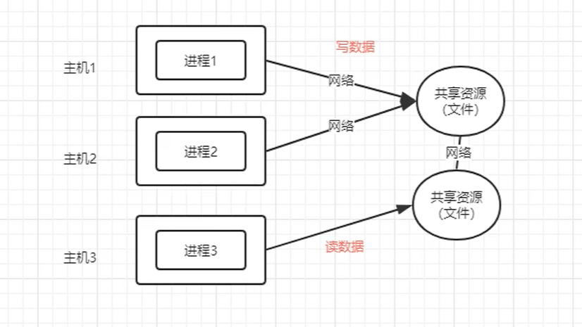
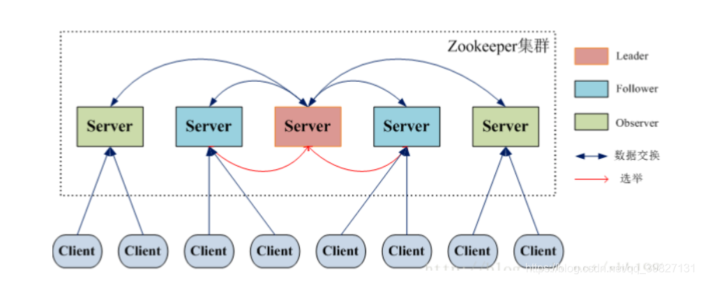
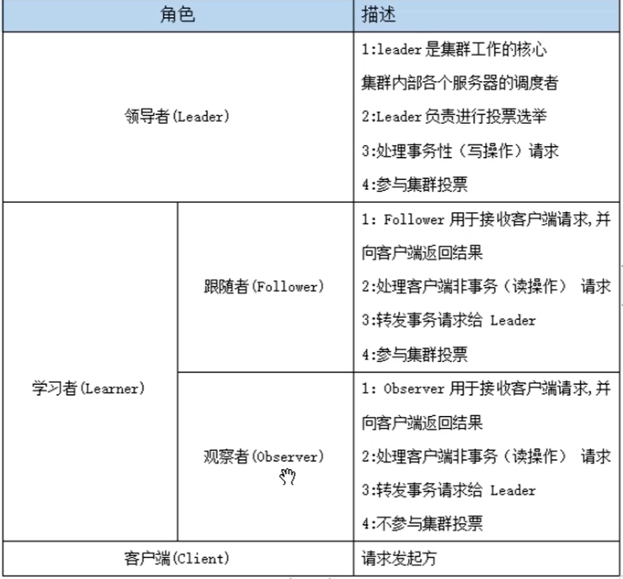
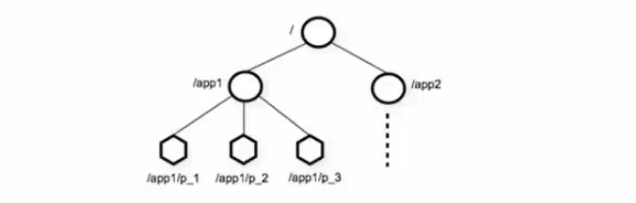

# 一、ZooKeeper简介

### 1.概述

ZooKeeper是一个**开源的分布式**协调服务框架，是一个为分布式应用提供**一致性服务**和**数据管理**的软件，提供的功能包括： 统一命名、配置管理、集群管理、共享锁、队列管理等。 



### 2.特点

**顺序一致性：** 从同一客户端发起的事务请求，最终将会严格地按照顺序被应用到 ZooKeeper 中去

**原子性：** 所有事务请求的处理结果在整个集群中所有机器上的应用情况是一致的

**单一系统映像 ：** 无论客户端连到哪一个 ZooKeeper 服务器上，其看到的服务端数据模型都是一致的。

**可靠性：** 一旦一次更改请求被应用，更改的结果就会被持久化，直到被下一次更改覆盖。

### 3.架构



#### 3.1 角色

##### 3.1.1 Leader

它是Zookeeper集群工作的核心，也是**事务性请求(写操作)**的**唯一调度和处理者**，它保证集群事务处理的顺序性，同时负责进行**投票的发起和决议**，以及更新系统状态。

##### 3.1.2 Follower

它负责处理客户端的**非事务(读操作)请求**，如果接收到客户端发来的事务性请求，则会转发给Leader，让Leader进行处理，同时还负责在Leader**选举过程中参与投票**。

##### 3.1.3 Observer

它负责**观察Zookeeper集群的最新状态的变化**，并且将这些状态进行同步。对于**非事务性请求**可以进行**独立处理**;对于**事务性请求**，则会**转发给Leader**服务器进行处理。它**不会参与任何形式的投票**，只提供非事务性的服务，通常用于在不影响集群事务处理能力的前提下，提升集群的非事务处理能力(提高集群读的能力，也降低了集群选主的复杂程度)。

#### 3.2 角色功能图



### 4.应用场景

| **数据发布与订阅（配置中心）**                               |
| ------------------------------------------------------------ |
| 数据发布/订阅的一个常见的场景是配置中心，发布者把数据发布到 ZooKeeper 的一个或一系列的节点上，供订阅者进行数据订阅，达到**动态获取数据**的目的。 |
| 推: 服务端会推给注册了监控节点的客户端 Wathcer 事件通知 <br>拉: 客户端获得通知后，然后主动到服务端拉取最新的数据 |
| **负载均衡**                                                 |
| 这里说的负载均衡是指软负载均衡。在分布式环境中，为了保证高可用性，通常同一个应用或同一个服务的提供方都会部署多份，达到对等服务。而消费者就须要在这些对等的服务器中选择一个来执行相关的业务逻辑，其中比较典型的是消息中间件中的生产者，消费者负载均衡。 |
| **命名服务(Naming Service)**                                 |
| 命名服务也是分布式系统中比较常见的一类场景。在分布式系统中，通过使用命名服务，客户端应用能够根据指定名字来获取资源或服务的地址，提供者等信息。被命名的实体通常可以是集群中的机器，提供的服务地址，远程对象等等——这些我们都可以统称他们为名字（Name）。其中较为常见的就是一些分布式服务框架中的服务地址列表。通过调用ZK提供的创建节点的API，能够很容易创建一个全局唯一的path，这个path就可以作为一个名称。 |
| **分布式通知/协调**                                          |
| ZooKeeper中特有watcher注册与异步通知机制，能够很好的实现分布式环境下不同系统之间的通知与协调，实现对数据变更的实时处理。使用方法通常是不同系统都对ZK上同一个znode进行注册，监听znode的变化（包括znode本身内容及子节点的），其中一个系统update了znode，那么另一个系统能够收到通知，并作出相应处理 |
| **分布式锁**                                                 |
| 分布式锁主要得益于ZooKeeper保证了数据的强一致性。锁服务可以分为两类，一个是**保持独占**，另一个是**控制时序**。 保持独占，就是所有试图来获取这个锁的客户端，最终只有一个可以成功获得这把锁。通常的做法是把zk上的一个znode看作是一把锁，通过create znode的方式来实现。所有客户端都去创建 /distribute_lock 节点，最终成功创建的那个客户端也即拥有了这把锁。控制时序，就是所有视图获取这个锁的客户端，最终都会被安排执行，只是有个全局时序了。做法和上面基本类似，只是这里 /distribute_lock 已经预先存在，客户端在它下面创建临时有序节点（这个可以通过节点的属性控制：CreateMode.EPHEMERAL_SEQUENTIAL来指定）。Zk的父节点（/distribute_lock）维持一份sequence,保证子节点创建的时序性，从而也形成了每个客户端的全局时序。 |
| 排他锁:<br>如果事务 T1 对数据对象 O1 加上了排他锁，那么加锁期间，只允许事务 T1 对 O1 进行读取和更新操作。**核心是保证当前有且仅有一个事务获得锁**，并且锁释放后，所有正在等待获取锁的事务都能够被通知到。 |
| 共享锁:<br>如果事务 T1 对数据对象 O1 加上了共享锁，那么当前事务 T1 只能对 O1 进行读取操作，其他事务也只能对这个数据对象加共享锁，直到数据对象上的所有共享锁都被释放。 |
| **分布式队列**                                               |
| 队列方面，简单地讲有两种，一种是常规的先进先出队列，另一种是要等到队列成员聚齐之后的才统一按序执行。对于第一种先进先出队列，和分布式锁服务中的控制时序场景基本原理一致，这里不再赘述。 第二种队列其实是在FIFO队列的基础上作了一个增强。通常可以在 /queue 这个znode下预先建立一个/queue/num 节点，并且赋值为n（或者直接给/queue赋值n），表示队列大小，之后每次有队列成员加入后，就判断下是否已经到达队列大小，决定是否可以开始执行了。这种用法的典型场景是，分布式环境中，一个大任务Task A，需要在很多子任务完成（或条件就绪）情况下才能进行。这个时候，凡是其中一个子任务完成（就绪），那么就去 /taskList 下建立自己的临时时序节点（CreateMode.EPHEMERAL_SEQUENTIAL），当 /taskList 发现自己下面的子节点满足指定个数，就可以进行下一步按序进行处理了。 |

### 5.选举机制

假设有五台服务器组成的Zookeeper集群，它们的id从1-5，同时它们都是最新启动的，也就是没有历史数据，在存放数据量这一点上，都是一样的。

假设这些服务器从id1-5，依序启动：

因为一共5台服务器，只有超过半数以上，即最少启动3台服务器，集群才能正常工作。

##### （1）服务器1启动，发起一次选举

​     服务器1投自己一票。此时服务器1票数一票，不够半数以上（3票），选举无法完成

​     服务器1状态保持为LOOKING

##### （2）服务器2启动，再发起一次选举

​     服务器1和2分别投自己一票，此时服务器1发现服务器2的id比自己大，更改选票投给服务器2；

​     此时服务器1票数0票，服务器2票数2票，不够半数以上（3票），选举无法完成；

​     服务器1，2状态保持LOOKING；

##### （3）服务器3启动，发起一次选举

​     与上面过程一样，服务器1和2先投自己一票，然后因为服务器3id最大，两者更改选票投给为服务器3；

​     此次投票结果：服务器1为0票，服务器2为0票，服务器3为3票。此时服务器3的票数已经超过半数（3票），服务器3当选Leader。

​     服务器1，2更改状态为FOLLOWING，服务器3更改状态为LEADING；

##### （4）服务器4启动，发起一次选举

​	此时服务器1，2，3已经不是LOOKING状态，不会更改选票信息。交换选票信息结果：服务器3为3票，服务器4为1票。

​	此时服务器4服从多数，更改选票信息为服务器3；

​    服务器4并更改状态为FOLLOWING；

##### （5）服务器5启动

​	同4一样投票给3此时服务器3一共5票，服务器5为0票

​    服务器5并更改状态为FOLLOWING；

​	最终Leader是服务器3，状态为LEADING；

​	其余服务器是Follower，状态为FOLLOWING。

### 6.数据模型



##### 6.1 概念

 Zookeeper数据模型类似Linux操作系统的文件系统，也是以树的形式来存储。每个节点上都可以存储数据，每个节点还可以拥有N个子结点，最上层是根节点以“/”来代表,ZooKeeper每一个节点被称为Znode

##### 6.2 与linux文件系统不同之处

**(1)Znode兼具文件和目录两种特点:**用户对Znode有增、删、改、查的操作**(要有权限)**

**(2)Znode存储数据大小有限制:**常用来存储配置文件，状态文件等，一般大小不超过1M

**(3)Znode通过路径引用:**类似与Unix的文件，**路径必须是绝对的，唯一的**

**(4)Znode由3部分组成:**状态信息**(stat)**、该Znode关联数据**(data)**、该Zonde下的子节点**(children)**

### 7.节点特征

Znode按其**生命周期**的长短可以分为**持久结点**(PERSISTENT)和**临时结点**(EPHEMERAL)

Znode在**创建时**还可选择是否由Zookeeper服务端在其路径后添加一串序号**(序列化)**用来区分同一个父结点下多个结点创建的先后顺序

- **1.持久结点(PERSISTENT)**
  最常见的Znode类型,一旦创建将在一直存在于服务端,除非客户端通过删除操作进行删除。持久结点下可以创建子结点
- **2.持久顺序结点(PERSISTENT_SEQUENTIAL)**
  在具有持久结点基本特性的基础上,会通过在结点路径后缀一串序号来区分多个子结点创建的先后顺序。这工作由Zookeeper服务端自动给我们做,只要在创建Znode时指定结点类型为该类型
- **3.临时结点(EPHEMERAL)**
  临时结点的生命周期和客户端会话保持一致。客户端段会话存在的话临时结点也存在,客户端会话断开则临时结点会自动被服务端删除。临时结点下不能创建子结点
- **4.临时顺序结点(EPHEMERAL_SEQUENTIAL)**
  具有临时结点的基本特性,又有顺序性

<br>

# 二、ZooKeeper环境搭建

### 1.搭建java环境

##### 1.1 在三台主机创建大数据文件夹和java文件夹

```shell
mkdir /usr/BigData

mkdir /usr/java
```

##### 1.2 三台主机解压jdk

```shell
tar -zxvf jdk-8u45-linux-x64.gz -C /usr/java
```

##### 1.3 三台主机修改权限

```shell
chown -R root:root /usr/java/jdk1.8.0_45
```

##### 1.4 三台主机添加jdk环境变量

```shell
#打开配置文件
vim /etc/profile

#添加环境变量
export JAVA_HOME=/usr/java/jdk1.8.0_45
export PATH=$JAVA_HOME/bin:$PATH

#刷新权限
source /etc/profile
```

##### 1.5 检查安装情况

```shell
#查看java版本
java -version

#查看安装路径
which java
```

### 2.搭建Zookeeper环境

##### 2.1 在node01解压zookeeper

```shell
tar -zxvf zookeeper-3.4.9.tar.gz -C /usr/BigData
```

##### 2.2 修改node01的zoo.cfg文件

```shell
#进入目录
cd /usr/BigData/zookeeper-3.4.9/conf/

#重命名zoo_sample.cfg文件为zoo.cfg
mv zoo_sample.cfg zoo.cfg

#创建zkdatas文件夹
mkdir -p /usr/BigData/zookeeper-3.4.9/zkdatas

#打开zoo.cfg文件
vim zoo.cfg

#配置zoo.cfg文件
dataDir=/usr/BigData/zookeeper-3.4.9/zkdatas #存储目录

autopurge.snapRetainCount=3 #快照数量(默认3份)

autopurge.purgeInterval=1 #日志清理时间(默认1小时)

server.1=node01:2888:3888 #集中服务器地址
server.2=node02:2888:3888
server.3=node03:2888:3888
```

##### 2.3 添加myid配置

```shell
#进入目录
cd /usr/BigData/zookeeper-3.4.9/zkdatas

#创建myid文件
vim myid

#添加myid
1
```

##### 2.4 安装包分发与修改myid值

```shell
#安装包分发
scp -r /usr/BigData/zookeeper-3.4.9/ node02:/usr/BigData/
scp -r /usr/BigData/zookeeper-3.4.9/ node03:/usr/BigData/

#修改node02和node03的myid值
echo 2 > /usr/BigData/zookeeper-3.4.9/zkdatas/myid
```

### 3.启动zookeeper

##### 3.1 启动服务器端(三台主机都要启动)

```shell
#进入目录
cd /usr/BigData/zookeeper-3.4.9/bin/

#启动服务
./zkServer.sh start

#查看进程
jps

#查看角色
./zkServer.sh status
```

**注:如果按node01,node02,node03的方式启动，则node02为leader**

##### 3.2 启动客户端

```shell
#进入目录
cd /usr/BigData/zookeeper-3.4.9/bin/

#启动服务
./zkCli.sh -server node01:2181 #在对应主机启动

#退出服务
quit
```

**注:启动客户端需要先启动服务器端**