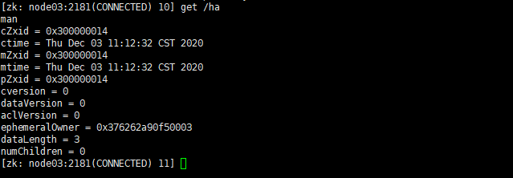
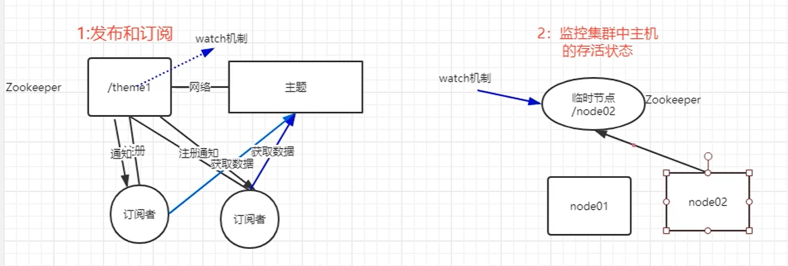
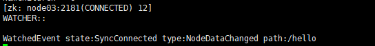

# 一、Zookeeper的shell命令

### 1.登录zookeeper客户端

```shell
./zkCli.sh -server node03:2181 #node03(推荐)

./zkCli.sh #localhost
```

### 2.常用命令表格

| 命令                           | 说明                                             | 参数                                           |
| ------------------------------ | ------------------------------------------------ | ---------------------------------------------- |
| create [-s] [-e] path data acl | 创建Znode                                        | -s:指定是否序列化<br>-e:指定是否为持久节点     |
| ls path [watch]                | 列出path下所有子Znode                            |                                                |
| get path [watch]               | 获取path下对应Znode的数据和属性                  |                                                |
| ls2 path [watch]               | 查看path下所有子Znode以及子<br>Znode的数据和属性 |                                                |
| set path data [version]        | 更新节点                                         | version:数据版本                               |
| delete path [version]          | 删除节点(如果有子节点无法删除)                   | version:数据版本                               |
| rmr path                       | 删除节点(如果有子节点则递归删除)                 |                                                |
| setquota -n \| -b val path     | 修改Znode配额                                    | -n:设置节点最大个数<br>-b:设置节点数据最大长度 |
| history                        | 列出命令历史记录                                 |                                                |

### 3.节点属性

##### 3.1 查看属性命令

```shell
get /ha
```



##### 3.2 节点属性信息解释

| 状态属性       | 说明                                                         |
| :------------- | :----------------------------------------------------------- |
| cZxid          | 节点创建的事务zxid。每次修改ZooKeeper状态都会收到一个zxid形式的时间戳，也就是ZooKeeper事务ID。事务ID是ZooKeeper中所有修改总的次序。每个修改都有唯一的zxid，如果zxid1小于zxid2，那么zxid1在zxid2之前发生。 |
| ctime          | znode的创建时间                                              |
| mZxid          | znode最后修改的zxid                                          |
| mtime          | znode最后修改时间                                            |
| pZxid          | znode最后更新的子节点zxid                                    |
| cversion       | znode子节点变化号，每变化一次就自增1                         |
| dataversion    | znode数据变化号，数据每变化一次就自增1（每次更新读取最新的值，可用于实现类似数据库乐观锁功能） |
| aclVersion     | znode访问控制列表的变化号                                    |
| ephemeralOwner | 如果是临时节点，这个是znode拥有者的session id。如果不是临时节点则是0 |
| dataLength     | znode的数据长度                                              |
| numChildren    | znode子节点数量                                              |

### 4.which机制

##### 4.1 概念

对某个Znode设置Watcher，当Znode发生变化(增、删、改、查)时会调用对应的Watcher并通知

##### 4.2 watcher特点

- **一次性触发**
  一个**watcher**只会触发一次，如果需要继续监听，则需再次添加**watcher**
- **事件封装:**
  watcher得到的事件是封装过的，包括3个内容 **keeperState**、**eventType**、**path**

| KeeperState   | EventType        | 触发条件                                                     | 说明                                                         |
| ------------- | ---------------- | ------------------------------------------------------------ | ------------------------------------------------------------ |
| SyncConnected | None             | 客户端与服务端成功建立连接                                   | 此时客户端和服务器处于连接状态                               |
| SyncConnected | NodeCreated      | Watcher监听的对应数据节点被创建                              | 此时客户端和服务器处于连接状态                               |
| SyncConnected | NodeDeleted      | Watcher监听的对应数据节点被删除                              | 此时客户端和服务器处于连接状态                               |
| SyncConnected | NodeDataChanged  | Watcher监听的对应数据节点的数据内容发生变更                  | 此时客户端和服务器处于连接状态                               |
| SyncConnected | NodeChildChanged | Wather监听的对应数据节点的子节点列表发生变更                 | 此时客户端和服务器处于连接状态                               |
| Disconnected  | None             | 客户端与ZooKeeper服务器断开连接                              | 此时客户端和服务器处于断开连接状态                           |
| Expired       | Node             | 会话超时                                                     | 此时客户端会话失效，通常同时也会受到SessionExpiredException异常 |
| AuthFailed    | None （-1）      | 通常有两种情况，1：使用错误的schema进行权限检查 2：SASL权限检查失败 | 通常同时也会收到AuthFailedException异常                      |

##### 4.3 应用



##### 4.4 实现which操作命令

```shell
#添加which
get /hello watch

#改变数据
set /hello abc
```




由4.2表格可知现在为数据内容被改变，改变路径为/hello

<br>

# 二、JAVA的API操作

### 1.创建工程和导入jar包(Maven配置)

```xml
<?xml version="1.0" encoding="UTF-8"?>
<project xmlns="http://maven.apache.org/POM/4.0.0"
         xmlns:xsi="http://www.w3.org/2001/XMLSchema-instance"
         xsi:schemaLocation="http://maven.apache.org/POM/4.0.0 http://maven.apache.org/xsd/maven-4.0.0.xsd">
    <modelVersion>4.0.0</modelVersion>

    <groupId>cn.wyl</groupId>
    <artifactId>ZooKeeper</artifactId>
    <version>1.0-SNAPSHOT</version>

    <!--<repositories>
            <repostitory>
            <id>cloudera</id>
            <url>https://repository.cloudera.com/artifactory/cloudera-repos/
            </url>
            </repostitory>
    </repositories> -->
    <dependencies>
        <dependency>
            <groupId>org.apache.curator</groupId>
            <artifactId>curator-framework</artifactId>
            <version>2.12.0</version>
        </dependency>
        <dependency>
            <groupId>org.apache.curator</groupId>
            <artifactId>curator-recipes</artifactId>
            <version>2.12.0</version>
        </dependency>
        <dependency>
            <groupId>com.google.collections</groupId>
            <artifactId>google-collections</artifactId>
            <version>1.0</version>
        </dependency>
            <dependency>
                <groupId>junit</groupId>
                <artifactId>junit</artifactId>
                <version>4.11</version>
            </dependency>
        <dependency>
            <groupId>org.slf4j</groupId>
            <artifactId>slf4j-simple</artifactId>
            <version>1.7.25</version>
        </dependency>
    </dependencies>
    <build>
        <plugins>
            <!--java编译插件-->
            <plugin>
                <groupId>org.apache.maven.plugins</groupId>
                <artifactId>maven-compiler-plugin</artifactId>
                <version>3.1</version>
                <configuration>
                    <source>1.8</source>
                    <target>1.8</target>
                    <encoding>UTF-8</encoding>
                </configuration>
            </plugin>
        </plugins>
    </build>
</project>
```

### 2.创造节点与节点其他操作(获取，修改节点数据)

```java
import org.apache.curator.RetryPolicy;
import org.apache.curator.framework.CuratorFramework;
import org.apache.curator.framework.CuratorFrameworkFactory;
import org.apache.curator.retry.ExponentialBackoffRetry;
import org.apache.zookeeper.CreateMode;
import org.junit.Test;

public class ZooKeeperAPITest {
    //一、创造永久性节点
    @Test
    public void createzonde_PERSISTENT() throws Exception {
        //1.定制一个重试策略
        /*
            param1: 重试的时间间隔
            param2: 重试的最大次数
         */
        RetryPolicy retryPolicy = new ExponentialBackoffRetry(1000,1);

        //2.获取一个客户端对象
        /*
            param1:要连接的ZooKeeper服务器列表
            param2:会话的超时时间
            param3:链接超时时间
            param4:重试策略
         */
        String connectionStr = "192.168.146.121:2181,192.168.146.122:2181,192.168.146.123:2181";
        CuratorFramework client = CuratorFrameworkFactory.newClient(connectionStr, 8000, 8000, retryPolicy);

        //3.开启客户端
        client.start();

        //4.创建节点
        client.create().creatingParentsIfNeeded().withMode(CreateMode.PERSISTENT).forPath("/Java_Hello", "world".getBytes());

        //5.关闭客户端
        client.close();
    }

    //二、创造临时性节点
    @Test
    public void createzonde_EPHEMERAL() throws Exception {
        //1.定制一个重试策略
        /*
            param1: 重试的时间间隔
            param2: 重试的最大次数
         */
        RetryPolicy retryPolicy = new ExponentialBackoffRetry(1000,1);

        //2.获取一个客户端对象
        /*
            param1:要连接的ZooKeeper服务器列表
            param2:会话的超时时间
            param3:链接超时时间
            param4:重试策略
         */
        String connectionStr = "192.168.146.121:2181,192.168.146.122:2181,192.168.146.123:2181";
        CuratorFramework client = CuratorFrameworkFactory.newClient(connectionStr, 8000, 8000, retryPolicy);

        //3.开启客户端
        client.start();

        //4.创建节点
        client.create().creatingParentsIfNeeded().withMode(CreateMode.EPHEMERAL).forPath("/Java_Hello2", "world2".getBytes());

        Thread.sleep(10000); //延时

        //5.关闭客户端
        client.close();
    }

    //三、设置节点数据
    @Test
    public void setZondeData() throws Exception {
        //1.定制一个重试策略
        /*
            param1: 重试的时间间隔
            param2: 重试的最大次数
         */
        RetryPolicy retryPolicy = new ExponentialBackoffRetry(1000,1);

        //2.获取一个客户端对象
        /*
            param1:要连接的ZooKeeper服务器列表
            param2:会话的超时时间
            param3:链接超时时间
            param4:重试策略
         */
        String connectionStr = "192.168.146.121:2181,192.168.146.122:2181,192.168.146.123:2181";
        CuratorFramework client = CuratorFrameworkFactory.newClient(connectionStr, 8000, 8000, retryPolicy);

        //3.开启客户端
        client.start();

        //4.创建节点
        client.setData().forPath("/Java_Hello", "zookeeper".getBytes());

        //5.关闭客户端
        client.close();
    }

    //四、获取节点数据
    @Test
    public void getZondeData() throws Exception {
        //1.定制一个重试策略
        /*
            param1: 重试的时间间隔
            param2: 重试的最大次数
         */
        RetryPolicy retryPolicy = new ExponentialBackoffRetry(1000,1);

        //2.获取一个客户端对象
        /*
            param1:要连接的ZooKeeper服务器列表
            param2:会话的超时时间
            param3:链接超时时间
            param4:重试策略
         */
        String connectionStr = "192.168.146.121:2181,192.168.146.122:2181,192.168.146.123:2181";
        CuratorFramework client = CuratorFrameworkFactory.newClient(connectionStr, 8000, 8000, retryPolicy);

        //3.开启客户端
        client.start();

        //4.创建节点
        byte [] bytes = client.getData().forPath("/Java_Hello");
        System.out.println(new String(bytes));

        //5.关闭客户端
        client.close();
    }
}
```

### 3.watch机制

```java
import org.apache.curator.RetryPolicy;
import org.apache.curator.framework.CuratorFramework;
import org.apache.curator.framework.CuratorFrameworkFactory;
import org.apache.curator.framework.recipes.cache.ChildData;
import org.apache.curator.framework.recipes.cache.TreeCache;
import org.apache.curator.framework.recipes.cache.TreeCacheEvent;
import org.apache.curator.framework.recipes.cache.TreeCacheListener;
import org.apache.curator.retry.ExponentialBackoffRetry;
import org.junit.Test;

public class ZooKeeperAPIWatcher {
    /*
    节点的watch机制
     */

    @Test
    public void watchZnode() throws Exception {
        //1.定制重试策略
        RetryPolicy retryPolicy = new ExponentialBackoffRetry(1000,1);

        //2.获取客户端
        String conectionStr = "192.168.146.121:2181,192.168.146.122:2181,192.168.146.123:2181";
        CuratorFramework client = CuratorFrameworkFactory.newClient(conectionStr,8000,8000,retryPolicy);

        //3.启动客户端
        client.start();

        //4.创建TreeCache对象，指定要监控的节点路径
        TreeCache treeCache = new TreeCache(client,"/Java_Hello");

        //5.自定义一个监听器
        treeCache.getListenable().addListener(new TreeCacheListener() {
            @Override
            public void childEvent(CuratorFramework curatorFramework, TreeCacheEvent treeCacheEvent) throws Exception {

                ChildData data = treeCacheEvent.getData();
                if (data != null) {
                    switch (treeCacheEvent.getType()) {
                        case NODE_ADDED:
                            System.out.println("监控到有新增节点");
                            break;
                        case NODE_REMOVED:
                            System.out.println("监控到有节点被移除");
                            break;
                        case NODE_UPDATED:
                            System.out.println("监控到有节点更新");
                            break;
                        default:
                            break;
                    }
                }
            }
        });

        //6.开始监听
        treeCache.start();
        Thread.sleep(200000);
    }
}
```
