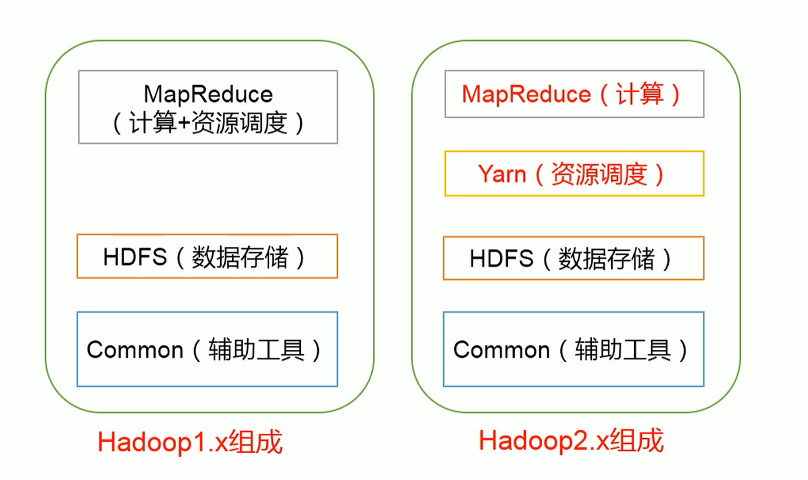
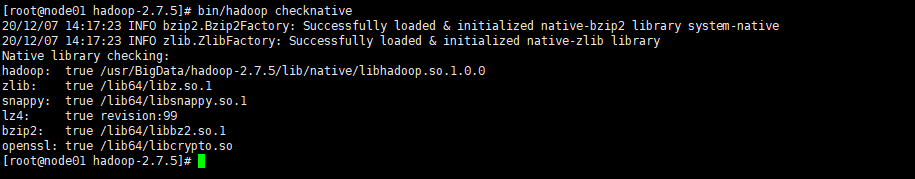

# 一、Hadoop简介

### 1.概念

**Hadoop**是一个由Apache基金会所开发的**分布式系统**基础架构。用户可以在不了解分布式底层细节的情况下，开发分布式程序。充分利用集群的威力进行**高速运算和存储**。Hadoop实现了一个**分布式文件系统**，其中一个组件是**HDFS**。HDFS有**高容错性**的特点，并且设计用来部署在**低廉的硬件**上；而且它提供高吞吐量来访问应用程序的数据，适合那些有着超大数据集的应用程序。HDFS放宽了（relax）POSIX的要求，可以以**流的形式访问**文件系统中的数据。Hadoop的框架最**核心的设计**就是：[HDFS](https://baike.baidu.com/item/HDFS/4836121)和[MapReduce](https://baike.baidu.com/item/MapReduce/133425)。**HDFS**为海量的数据提供了**存储**，而**MapReduce**则为海量的数据提供了**计算**

### 2.狭义上的Hadoop(单独指代Hadoop软件)

- HDFS:分布式文件系统
- MapReduce:分布式计算系统
- Yarn:分布式集群资源管理

### 3.广义上的Hadoop(指定Hadoop生态圈)


**3.1 HDFS（hadoop分布式文件系统）**

是hadoop体系中数据存储管理的基础。他是一个高度容错的系统，能检测和应对硬件故障。

client：切分文件，访问HDFS，与那么弄得交互，获取文件位置信息，与DataNode交互，读取和写入数据。

 namenode：master节点，在hadoop1.x中只有一个，管理HDFS的名称空间和数据块映射信息，配置副本策略，处理客户 端请求。

 DataNode：slave节点，存储实际的数据，汇报存储信息给namenode。

 secondary namenode：辅助namenode，分担其工作量：定期合并fsimage和fsedits，推送给namenode；紧急情况下和辅助恢复namenode，但其并非namenode的热备。

**3.2 mapreduce（分布式计算框架）**

mapreduce是一种计算模型，用于处理大数据量的计算。其中map对应数据集上的独立元素进行指定的操作，生成键-值对形式中间，reduce则对中间结果中相同的键的所有值进行规约，以得到最终结果。

jobtracker：master节点，只有一个，管理所有作业，任务/作业的监控，错误处理等，将任务分解成一系列任务，并分派给tasktracker。

tacktracker：slave节点，运行 map task和reducetask；并与jobtracker交互，汇报任务状态。

map task：解析每条数据记录，传递给用户编写的map（）并执行，将输出结果写入到本地磁盘（如果为map—only作业，则直接写入HDFS）。

reduce task：从map 它深刻地执行结果中，远程读取输入数据，对数据进行排序，将数据分组传递给用户编写的reduce函数执行。

**3.3 hive（基于hadoop的数据仓库）**

由Facebook开源，最初用于解决海量结构化的日志数据统计问题。

hive定于了一种类似sql的查询语言（hql）将sql转化为mapreduce任务在hadoop上执行。

**3.4 hbase（分布式列存数据库）**

hbase是一个针对结构化数据的可伸缩，高可靠，高性能，分布式和面向列的动态模式数据库。和传统关系型数据库不同，hbase采用了bigtable的数据模型：增强了稀疏排序映射表（key/value）。其中，键由行关键字，列关键字和时间戳构成，hbase提供了对大规模数据的随机，实时读写访问，同时，hbase中保存的数据可以使用mapreduce来处理，它将数据存储和并行计算完美结合在一起。

**3.5 zookeeper（分布式协作服务）**

解决分布式环境下的数据管理问题：统一命名，状态同步，集群管理，配置同步等。

**3.6 sqoop（数据同步工具）**

sqoop是sql-to-hadoop的缩写，主要用于传统数据库和hadoop之间传输数据。

数据的导入和导出本质上是mapreduce程序，充分利用了MR的并行化和容错性。

**3.7 pig（基于hadoop的数据流系统）**

定义了一种数据流语言-pig latin，将脚本转换为mapreduce任务在hadoop上执行。

通常用于离线分析。

**3.8 mahout（数据挖掘算法库）**

mahout的主要目标是创建一些可扩展的机器学习领域经典算法的实现，旨在帮助开发人员更加方便快捷地创建只能应用程序。mahout现在已经包含了聚类，分类，推荐引擎（协同过滤）和频繁集挖掘等广泛使用的数据挖掘方法。除了算法是，mahout还包含了数据的输入/输出工具，与其他存储系统（如数据库，mongoDB或Cassandra）集成等数据挖掘支持架构。

**3.9 flume（日志收集工具）**

cloudera开源的日志收集系统，具有分布式，高可靠，高容错，易于定制和扩展的特点。他将数据从产生，传输，处理并写入目标的路径的过程抽象为数据流，在具体的数据流中，数据源支持在flume中定制数据发送方，从而支持收集各种不同协议数据。

**3.10 资源管理器的简单介绍（YARN和mesos）**

随着互联网的高速发展，基于数据 密集型应用 的计算框架不断出现，从支持离线处理的mapreduce，到支持在线处理的storm，从迭代式计算框架到 流式处理框架s4，...，在大部分互联网公司中，这几种框架可能都会采用，比如对于搜索引擎公司，可能的技术方法如下：网页建索引采用mapreduce框架，自然语言处理/数据挖掘采用spark，对性能要求到的数据挖掘算法用mpi等。公司一般将所有的这些框架部署到一个公共的集群中，让它们共享集群的资源，并对资源进行统一使用，这样便诞生了资源统一管理与调度平台，典型的代表是mesos和yarn。

**3.11 cloudrea impala：**

 一个开源的查询引擎。与hive相同的元数据，SQL语法，ODBC驱动程序和用户接口，可以直接在HDFS上提供快速，交互式SQL查询。impala不再使用缓慢的hive+mapreduce批处理，而是通过与商用并行关系数据库中类似的分布式查询引擎。可以直接从HDFS或者Hbase中用select，join和统计函数查询数据，从而大大降低延迟。

**3.12 spark：**

spark是个开源的数据 分析集群计算框架，最初由加州大学伯克利分校AMPLab，建立于HDFS之上。spark与hadoop一样，用于构建大规模，延迟低的数据分析应用。spark采用Scala语言实现，使用Scala作为应用框架。

spark采用基于内存的分布式数据集，优化了迭代式的工作负载以及交互式查询。

与hadoop不同的是，spark与Scala紧密集成，Scala象管理本地collective对象那样管理分布式数据集。spark支持分布式数据集上的迭代式任务，实际上可以在hadoop文件系统上与hadoop一起运行（通过YARN,MESOS等实现）。

**3.13 storm**

storm是一个分布式的，容错的计算系统，storm属于流处理平台，多用于实时计算并更新数据库。storm也可被用于“连续计算”，对数据流做连续查询，在计算时将结果一流的形式输出给用户。他还可被用于“分布式RPC”,以并行的方式运行昂贵的运算。

**3.14 kafka**

 kafka是由Apache软件基金会开发的一个开源流处理平台，由Scala和Java编写。Kafka是一种高吞吐量的分布式发布订阅消息系统，它可以处理消费者规模的网站中的所有动作流数据。 这种动作（网页浏览，搜索和其他用户的行动）是在现代网络上的许多社会功能的一个关键因素。 这些数据通常是由于吞吐量的要求而通过处理日志和日志聚合来解决。 对于像Hadoop的一样的日志数据和离线分析系统，但又要求实时处理的限制，这是一个可行的解决方案。Kafka的目的是通过Hadoop的并行加载机制来统一线上和离线的消息处理，也是为了通过集群来提供实时的消息

### 4.Hadoop优势

**4.1高可靠性**:Hadoop按位存储和处理数据的能力值得人们信赖。

**4.2高扩展性**:Hadoop是在可用的计算机集簇间分配数据并完成计算任务的，这些集簇可以方便地扩展到数以千计的节点中。

**4.3高效性**:Hadoop能够在节点之间动态地移动数据，并保证各个节点的动态平衡，因此处理速度非常快。

**4.4高容错性**:Hadoop能够自动保存数据的多个副本，并且能够自动将失败的任务重新分配。

**4.5低成本**:与一体机、商用数据仓库以及QlikView、Yonghong Z-Suite等数据集市相比，hadoop是开源的，项目的软件成本因此会大大降低。

### 5.Hadoop 1.x 和 Hadoop 2.x的区别



### 6.Hadoop架构

##### 6.1 MapReduce架构概述

- Mapreduce实际上就是将计算过程分类两个阶段：**map和reduce**
  - map阶段：并行处理计算数据
  - reduce阶段：对map结果进行汇总

##### 6.2 HDFS架构概述

`NameNode`

就像一本书的目录。存储文件的元数据:如文件名，文件目录结构，文件属性(创建时间、副本数、文件权限)，以及每个文件的块列表和块所在的dataNode等

`DataNode`

就像一本书的详细类容，在本地文件系统存储文件块数据，以及数据的校验

`SeconddaryNameNode`

辅助namenode工作，定期合并镜像文件和编辑日志，紧急情况下恢复NameNode

##### 6.3 YARN架构概述

**Yarn是管理内存调度和cpu资源分配的**

`NodeManager(NM)`

- 常驻进程，类似于团队里面的码农

- 管理单个节点的资源(看禅道，完成自己每天的工作安排)

- 处理来自ResourceManager的命令(完成技术经理分配的任务)

- 处理来自ApplicationMaster的命令(完成项目组长分配的任务)

`ApplicationMaster(AM)`

- ResourceManager临时启用的一个节点，不是常驻进程，类似于一个技术小组长

- 负责数据的切分，任务的监控与容错(管理组内同事工作)

- 为应用程序申请资源分配给内部任务(向领导为小组申请资源：人力、时间什么的)

`ResourceManager(RM)`

- 常驻进程，一个集群只有一个，用来管理集群调度情况的，就像一个部门的技术经理一样

- 处理客户端请求，进行资源分配与调度(对接产品需求，分给手下的人)

- 监控nodeManager（管理团队成员每天的工作）

- 启动或监控applicationMaster(可能项目太小不想亲自动手，临时任命一个小组长)

`Container`

- 非常驻进程，它是yarn中的资源抽象，他封装了某个节点上的多维度资源，入内存，CPU，磁盘网络等

- Am就运行在这里面，Nm通过打开关闭Container开完成资源的调度

<br>

# 二、Hadoop环境搭建

## 1.编译apache版本的hadoop源码(hadoop-2.7.5-src.tar.gz)

### 1.1 准备虚拟机(centos7 64位)

略

### 1.2 关闭防火墙和selinux

##### 1.2.1 关闭防火墙

```shell
systemctl stop firewalld #停止防火墙

systemctl disable firewalld #禁止防火墙
```

##### 1.2.2 关闭selinux

```shell
vim /etc/selinux/config

SELINUX=disabled
```

### 1.3 配置jdk(使用1.7，不要使用1.8)

##### 1.3.1 创建文件夹

```shell
mkdir /usr/BigData/java
```

##### 1.3.2 解压jdk

```shell
tar -zxvf jdk-7u75-linux-x64.tar.gz -C /usr/BigData/java
```

##### 1.3.3 打开配置文件

```shell
vim /etc/profile
```

##### 1.3.4 配置jdk环境变量

```shell
export JAVA_HOME=/usr/BigData/java/jdk1.7.0_75
export PATH=$JAVA_HOME/bin:$PATH
```

##### 1.3.5 刷新权限

```shell
source /etc/profile
```

### 1.4 配置maven

##### 1.4.1 解压maven

```shell
tar -zxvf apache-maven-3.0.5-bin.tar.gz -C /usr/BigData
```

##### 1.4.2 打开配置文件

```shell
vim /etc/profile
```

##### 1.4.3 配置maven环境变量

```shell
export MAVEN_HOME=/usr/BigData/apache-maven-3.0.5
export MAVEN_OPTS="-Xms4096m -Xms4096m"
export PATH=$MAVEN_HOME/bin:$PATH
```

##### 1.4.4 刷新权限

```shell
source /etc/profile
```

##### 1.4.5 解压maven仓库

```shell
tar -zxvf mvnrepository.tar.gz -C /usr/BigData
```

##### 1.4.6 打开maven配置文件

```shell
vim /usr/BigData/mvnrepository/apache-maven-3.0.5/conf/settings.xml 
```

##### 1.4.7 配置maven仓库目录

```xml
<localRepository>/usr/BigData/mvnrepository</localRepository>
```

##### 1.4.8 配置maven阿里云镜像

```xml
<mirror>
    <id>nexus-aliyun</id>
    <mirrorOf>*</mirrorOf>
    <name>Nexus aliyun</name>
    <url>http://maven.aliyun.com/nexus/content/groups/public</url>
</mirror>
```

### 1.5 配置findbugs

##### 1.5.1 解压findbugs

```shell
tar -zxvf findbugs-1.3.9.tar.gz -C /usr/BigData
```

##### 1.5.2 打开配置文件

```shell
vim /etc/profile
```

##### 1.5.3 配置findbugs环境变量

```shell
export FINDBUGS_HOME=/usr/BigData/findbugs-1.3.9
export PATH=$FINDBUGS_HOME/bin:$PATH
```

##### 1.5.4 刷新权限

```shell
source /etc/profile
```

### 1.6 在线安装依赖

```shell
yum -y install autoconf automake libtool cmake
yum -y install ncurses-devel
yum -y install openssl-devel
yum -y install lzo-devel zlib-devel gcc gcc-c++
yum -y install bzip2-devel
```

### 1.7 安装protobuf

##### 1.7.1 解压protobuf

```shell
tar -zxvf protobuf-2.5.0.tar.gz -C /usr/BigData
```

##### 1.7.2 进入目录

```shell
cd /usr/BigData/protobuf-2.5.0/
```

##### 1.7.3 生成配置信息

```shell
./configure
```

##### 1.7.4 编译和安装

```shell
make && make install
```

### 1.8 安装snappy

##### 1.8.1 解压snappy

```shell
tar -zxvf snappy-1.1.1.tar.gz -C /usr/BigData
```

##### 1.8.2 进入目录

```shell
cd /usr/BigData/snappy-1.1.1/
```

##### 1.8.3 生成配置信息

```shell
./configure
```

##### 1.8.4 编译和安装

```shell
make && make install
```

### 1.9 编译hadoop源码

##### 1.9.1 解压源码

```shell
tar -zxvf hadoop-2.7.5-src.tar.gz -C /usr/BigData
```

##### 1.9.2 进入源码目录

```shell
cd /usr/BigData/hadoop-2.7.5-src
```

##### 1.9.3 编译源码

```shell
mvn package -DskipTests -Pdist,native -Dtar -Drequire.snappy -e -X
```

##### 注:等待时间较久

##### 1.9.4 查看编译后安装包(hadoop-2.7.5.tar.gz)

```shell
cd /usr/BigData/hadoop-2.7.5-src/hadoop-dist/target
```

## 2.集群规划

| 服务器IP          | 192.168.146.121 | 192.168.146.122 | 192.168.146.123 |
| ----------------- | --------------- | --------------- | --------------- |
| 主机名            | node01          | node02          | node03          |
| NameNode          | 是              | 否              | 否              |
| SecondaryNameNode | 是              | 否              | 否              |
| DataNode          | 是              | 是              | 是              |
| ResourceManger    | 是              | 否              | 否              |
| NodeManger        | 是              | 是              | 是              |

## 3.安装hadoop

### 3.1 解压编译后压缩包

```shell
tar -zxvf hadoop-2.7.5.tar.gz -C /usr/BigData
```

### 3.2 进入目录

```shell
cd /usr/BigData/hadoop-2.7.5
```

### 3.3 验证编译后支持的算法

```shell
bin/hadoop checknative
```



### 3.4 修改配置文件

##### 3.4.1 进入配置文件目录

```shell
cd /usr/BigData/hadoop-2.7.5/etc/hadoop
```

##### 3.4.2 修改core-site.xml文件

```xml
<configuration>
	<!-- 指定集群的文件系统类型:分布式文件系统 -->
	<property>
		<name>fs.default.name</name>
		<value>hdfs://node01:8020</value>
	</property>
	<!-- hadoop文件存储临时目录 -->
	<property>
		<name>hadoop.tmp.dir</name>
		<value>/usr/BigData/hadoop-2.7.5/hadoopDatas/tempDatas</value>
	</property>
	<!-- 缓冲区大小 -->
	<property>
		<name>io.file.buffer.size</name>
		<value>4096</value>
	</property>

	<!-- 开启hdfs的垃圾桶机制 -->
	<property>
		<name>fs.trash.interval</name>
		<value>10080</value>
	</property>
</configuration>
```

##### 3.4.3 修改hdfs-site.xml文件

```xml
<configuration>
	<property>
		<name>dfs.namenode.secondary.http-address</name>
		<value>node01:50090</value>
	</property>

	<!-- 指定namenode的访问地址和端口 -->
	<property>
		<name>dfs.namenode.http-address</name>
		<value>node01:50070</value>
	</property>
	<!-- 指定namenode元数据的存放位置 -->
	<property>
		<name>dfs.namenode.name.dir</name>
		<value>file:///usr/BigData/hadoop-2.7.5/hadoopDatas/namenodeDatas,file:///usr/BigData/hadoop-2.7.5/hadoopDatas/namenodeDatas2</value>
	</property>
	<!--  定义dataNode数据存储的节点位置，实际工作中，一般先确定磁盘的挂载目录，然后多个目录用，进行分割  -->
	<property>
		<name>dfs.datanode.data.dir</name>
		<value>file:///usr/BigData/hadoop-2.7.5/hadoopDatas/datanodeDatas,file:///usr/BigData/hadoop-2.7.5/hadoopDatas/datanodeDatas2</value>
	</property>
	
	<!-- 指定namenode日志文件的存放目录 -->
	<property>
		<name>dfs.namenode.edits.dir</name>
		<value>file:///usr/BigData/hadoop-2.7.5/hadoopDatas/nn/edits</value>
	</property>
	

	<property>
		<name>dfs.namenode.checkpoint.dir</name>
		<value>file:///usr/BigData/hadoop-2.7.5/hadoopDatas/snn/name</value>
	</property>
	<property>
		<name>dfs.namenode.checkpoint.edits.dir</name>
		<value>file:///usr/BigData/hadoop-2.7.5/hadoopDatas/dfs/snn/edits</value>
	</property>
	<!-- 文件切片的副本个数-->
	<property>
		<name>dfs.replication</name>
		<value>3</value>
	</property>

	<!-- 设置HDFS的文件权限-->
	<property>
		<name>dfs.permissions</name>
		<value>false</value>
	</property>

	<!-- 设置一个文件切片的大小：128M-->
	<property>
		<name>dfs.blocksize</name>
		<value>134217728</value>
	</property>
</configuration>
```

##### 3.4.4 修改hadoop-env.sh文件

```sh
# The java implementation to use.
export JAVA_HOME=/usr/java/jdk1.8.0_45
```

##### 3.4.5 修改mapred-site.xml文件

`重命名mapred-site.xml.template`

```shell
mv mapred-site.xml.template mapred-site.xml
```

`配置mapred-site.xml`

```xml
<configuration>
	<!-- 指定分布式计算使用的框架是yarn -->
	<property>
		<name>mapreduce.framework.name</name>
		<value>yarn</value>
	</property>

	<!-- 开启MapReduce小任务模式 -->
	<property>
		<name>mapreduce.job.ubertask.enable</name>
		<value>true</value>
	</property>
	
	<!-- 设置历史任务的主机和端口 -->
	<property>
		<name>mapreduce.jobhistory.address</name>
		<value>node01:10020</value>
	</property>

	<!-- 设置网页访问历史任务的主机和端口 -->
	<property>
		<name>mapreduce.jobhistory.webapp.address</name>
		<value>node01:19888</value>
	</property>
</configuration>
```

##### 3.4.6 修改yarn-site.xml文件

```xml
<configuration>
<!-- 配置yarn主节点的位置 -->
	<property>
		<name>yarn.resourcemanager.hostname</name>
		<value>node01</value>
	</property>

	<property>
		<name>yarn.nodemanager.aux-services</name>
		<value>mapreduce_shuffle</value>
	</property>
	
	<!-- 开启日志聚合功能 -->
	<property>
		<name>yarn.log-aggregation-enable</name>
		<value>true</value>
	</property>
	<!-- 设置聚合日志在hdfs上的保存时间 -->
	<property>
		<name>yarn.log-aggregation.retain-seconds</name>
		<value>604800</value>
	</property>
	<!-- 设置yarn集群的内存分配方案 -->
	<property>    
		<name>yarn.nodemanager.resource.memory-mb</name>    
		<value>20480</value>
	</property>

	<property>  
		<name>yarn.scheduler.minimum-allocation-mb</name>
		<value>2048</value>
	</property>
	<property>
		<name>yarn.nodemanager.vmem-pmem-ratio</name>
		<value>2.1</value>
	</property>
</configuration>
```

##### 3.4.7 修改mapred-env.sh文件

```sh
export JAVA_HOME=/usr/java/jdk1.8.0_45
```

##### 3.4.8 修改slave文件

```xml
node01
node02
node03
```

### 3.5 配置集群环境

##### 3.5.1 创建配置文件里的文件夹

```shell
mkdir -p /usr/BigData/hadoop-2.7.5/hadoopDatas/tempDatas
mkdir -p /usr/BigData/hadoop-2.7.5/hadoopDatas/namenodeDatas
mkdir -p /usr/BigData/hadoop-2.7.5/hadoopDatas/namenodeDatas2
mkdir -p /usr/BigData/hadoop-2.7.5/hadoopDatas/datanodeDatas
mkdir -p /usr/BigData/hadoop-2.7.5/hadoopDatas/datanodeDatas2
mkdir -p /usr/BigData/hadoop-2.7.5/hadoopDatas/nn/edits
mkdir -p /usr/BigData/hadoop-2.7.5/hadoopDatas/snn/name
mkdir -p /usr/BigData/hadoop-2.7.5/hadoopDatas/dfs/snn/edits
```

##### 3.5.2 分发hadoop文件

```shell
scp -r /usr/BigData/hadoop-2.7.5 node02:/usr/BigData
scp -r /usr/BigData/hadoop-2.7.5 node03:/usr/BigData
```

##### 3.5.3 进入配置文件(三台主机都要进入)

```shell
vim /etc/profile
```

##### 3.5.4 配置hadoop环境变量(三台主机都要配置)

```shell
export HADOOP_HOME=/usr/BigData/hadoop-2.7.5
export PATH=$HADOOP_HOME/bin:$HADOOP_HOME/sbin:$PATH
```

##### 3.5.5 刷新权限(三台主机都要刷新)

```shell
source /etc/profile
```

### 3.6 启动集群

##### 3.6.1 启动zookeeper(三台主机)

```shell
#进入目录
cd /usr/BigData/zookeeper-3.4.9/bin

#启动服务
./zkServer.sh start

#查看进程(只有Jps、QuorumPeerMain)
jps
```

##### 3.6.2 进入hadoop目录(node01)

```shell
cd /usr/BigData/hadoop-2.7.5
```

##### 3.6.3 格式化(node01)

```shell
bin/hdfs namenode -format
```

**注:格式化只在第一次启动时运行**

##### 3.6.4 启动hdfs(node01)

```shell
sbin/start-dfs.sh
```

**注:使用jps查看进程**

- node01

  **Jps**、**QuorumPeerMain** 、**NameNode**、**DataNode**、**SecondaryNameNode**

- node02

  **Jps**、**QuorumPeerMain** 、**DataNode**

- node03

  **Jps**、**QuorumPeerMain** 、**DataNode**

##### 3.6.5 启动yarn(node01)

```shell
sbin/start-yarn.sh
```

**注:使用jps查看进程**

- node01

  **Jps**、**QuorumPeerMain** 、**NameNode**、**DataNode**、**SecondaryNameNode**、**NodeManager** 、**ResourceManager** 

- node02

  **Jps**、**QuorumPeerMain** 、**DataNode**、 **NodeManager** 

- node03

  **Jps**、**QuorumPeerMain** 、**DataNode**、 **NodeManager** 

##### 3.6.6 启动历史任务记录(node01)

```shell
sbin/mr-jobhistory-daemon.sh start historyserver
```

**注:使用jps查看进程**

- node01

  **Jps**、**QuorumPeerMain** 、**NameNode**、**DataNode**、**SecondaryNameNode**、**NodeManager** 、**ResourceManager** 、 **JobHistoryServer** 

- node02

  **Jps**、**QuorumPeerMain** 、**DataNode**、 **NodeManager** 

- node03

  **Jps**、**QuorumPeerMain** 、**DataNode**、 **NodeManager** 

### 3.7 web界面访问Hadoop

##### 3.7.1 配置Windows环境

- Windows打开hosts文件

   C盘 -> Windows -> system32 -> drivers ->etc->hosts(记事本打开)

- 添加ip地址

   192.168.146.121	node01 

   192.168.146.122	node02

   192.168.146.123	node03 

##### 3.7.2 查看hdfs的web界面

http://node01:50070

##### 3.7.3 查看yarn集群的web界面

http://node01:8088

##### 3.7.4 查看完成的历史任务的web界面

http://node01:19888

### 3.8 常见问题及解决方法
##### 3.8.1 DataNode启动成功但jps命令查看没有
`删除所有节点的hadoopDatas`

```shell
rm -rf /usr/BigData/hadoop-2.7.5/hadoopDatas
```
`新建所有节点的hadoopDatas`

```shell
mkdir -p /usr/BigData/hadoop-2.7.5/hadoopDatas/tempDatas
mkdir -p /usr/BigData/hadoop-2.7.5/hadoopDatas/namenodeDatas
mkdir -p /usr/BigData/hadoop-2.7.5/hadoopDatas/namenodeDatas2
mkdir -p /usr/BigData/hadoop-2.7.5/hadoopDatas/datanodeDatas
mkdir -p /usr/BigData/hadoop-2.7.5/hadoopDatas/datanodeDatas2
mkdir -p /usr/BigData/hadoop-2.7.5/hadoopDatas/nn/edits
mkdir -p /usr/BigData/hadoop-2.7.5/hadoopDatas/snn/name
mkdir -p /usr/BigData/hadoop-2.7.5/hadoopDatas/dfs/snn/edits
```

`停止所有服务`

```shell
sbin/stop-dfs.sh

sbin/stop-yarn.sh

sbin/mr-jobhistory-daemon.sh stop historyserver
```
`重新格式化(node01)`

```shell
bin/hdfs namenode -format
```
`重新启动所有进程`

##### 3.8.2 JobHistoryServer启动成功但无法通过19888访问
`重新启动如果不行同3.8.1方法`