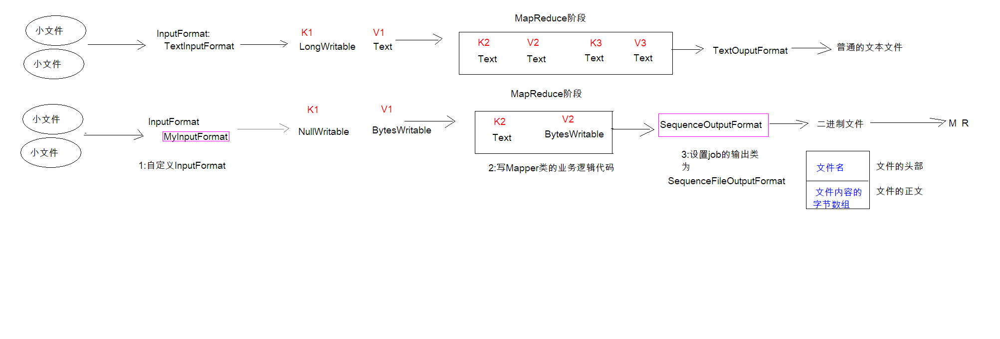
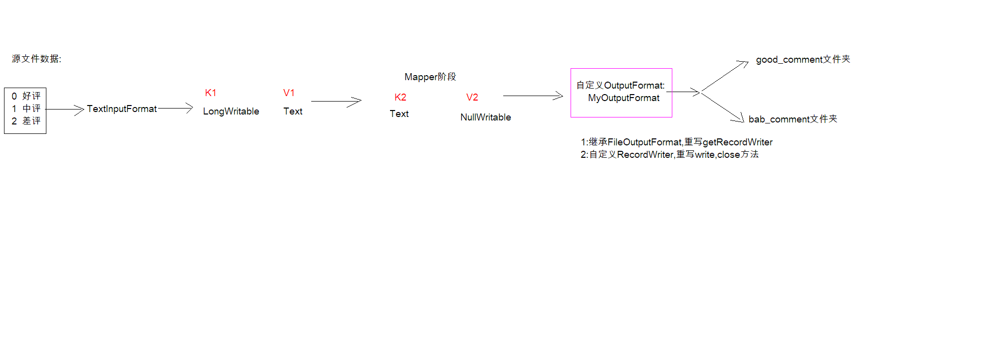

# 一、自定义InputFormat合并小文件

## 需求 

无论hdfs还是mapreduce,对于小文件都有损效率,面临处理大量小文件的场景,就需要有相应解决方案

## 分析 

小文件的优化无非以下几种方式

- 在数据采集的时候,就将小文件或小批数据合成大文件再上传HDFS
- 在业务处理之前,在HDFS上使用mapreduce程序对小文件进行合并
- 在mapreduce处理时,可采用combineInputFormat提高效率

## 思路(第二种方式)

自定义一个InputFormat,改写RecordReader,实现一次读取一个完整文件封装为KV,在输出时使用SequenceFileOutPutFormat输出合并文件



## 数据内容

`hello.txt`

```shell
helko
klwejlkwflwekjlfkwe
lwekfjwelwejfw
sldkfjsf
的就是打开电视机分解机分解
lksdjfs
我说的是说的很多话
```

`word.txt`

```shell
lsdfjksldflsdkfjskldf
sldkfjskldf
lsdkfjsldfk
lskdjflskdf
lksdjfklsdjf
了深刻的房间里快速的减肥
```

## 具体代码(本地运行)

### 1.自定义InputFromat

```java
package MyInputFormat;

import org.apache.hadoop.fs.Path;
import org.apache.hadoop.io.BytesWritable;
import org.apache.hadoop.io.NullWritable;
import org.apache.hadoop.mapreduce.InputSplit;
import org.apache.hadoop.mapreduce.JobContext;
import org.apache.hadoop.mapreduce.RecordReader;
import org.apache.hadoop.mapreduce.TaskAttemptContext;
import org.apache.hadoop.mapreduce.lib.input.FileInputFormat;

import java.io.IOException;

public class MyInputFormat extends FileInputFormat<NullWritable, BytesWritable> {
    @Override
    public RecordReader<NullWritable, BytesWritable> createRecordReader(InputSplit inputSplit, TaskAttemptContext taskAttemptContext) throws IOException, InterruptedException {
        //1:创建自定义RecordReader对象
        MyRecordReader myRecordReader = new MyRecordReader();
        //2:将inputSplit和context对象传给MyRecordReader
        myRecordReader.initialize(inputSplit, taskAttemptContext);

        return myRecordReader;
    }

    /*
    设置文件是否可以被切割
     */
    @Override
    protected boolean isSplitable(JobContext context, Path filename) {
        return false;
    }
}
```

### 2.自定义RecordReader

```java
package MyInputFormat;

import org.apache.commons.io.IOUtils;
import org.apache.hadoop.conf.Configuration;
import org.apache.hadoop.fs.FSDataInputStream;
import org.apache.hadoop.fs.FileSystem;
import org.apache.hadoop.io.BytesWritable;
import org.apache.hadoop.io.NullWritable;
import org.apache.hadoop.mapreduce.InputSplit;
import org.apache.hadoop.mapreduce.RecordReader;
import org.apache.hadoop.mapreduce.TaskAttemptContext;
import org.apache.hadoop.mapreduce.lib.input.FileSplit;

import java.io.IOException;

public class MyRecordReader extends RecordReader<NullWritable, BytesWritable> {

    private Configuration configuration = null;
    private  FileSplit fileSplit = null;
    private boolean processed = false;
    private BytesWritable bytesWritable = new BytesWritable();
    private  FileSystem fileSystem = null;
    private  FSDataInputStream inputStream = null;
    //初始化
    @Override
    public void initialize(InputSplit inputSplit, TaskAttemptContext taskAttemptContext) throws IOException, InterruptedException {
        //获取文件的切片
        fileSplit= (FileSplit)inputSplit;

        //获取Configuration对象
        configuration = taskAttemptContext.getConfiguration();
    }

    //获取K1和V1
    /*
     K1: NullWritable
     V1: BytesWritable
     */
    @Override
    public boolean nextKeyValue() throws IOException, InterruptedException {
        if(!processed){
            //1:获取源文件的字节输入流
            //1.1 获取源文件的文件系统 (FileSystem)
            fileSystem = FileSystem.get(configuration);
            //1.2 通过FileSystem获取文件字节输入流
            inputStream = fileSystem.open(fileSplit.getPath());

            //2:读取源文件数据到普通的字节数组(byte[])
            byte[] bytes = new byte[(int) fileSplit.getLength()];
            IOUtils.readFully(inputStream, bytes, 0, (int)fileSplit.getLength());

            //3:将字节数组中数据封装到BytesWritable ,得到v1
            bytesWritable.set(bytes, 0, (int)fileSplit.getLength());
            processed = true;

            return true;
        }
        return false;
    }

    //返回K1
    @Override
    public NullWritable getCurrentKey() throws IOException, InterruptedException {
        return NullWritable.get();
    }

    //返回V1
    @Override
    public BytesWritable getCurrentValue() throws IOException, InterruptedException {
        return bytesWritable;
    }

    //获取文件读取进度
    @Override
    public float getProgress() throws IOException, InterruptedException {
        return 0;
    }

    //资源释放
    @Override
    public void close() throws IOException {
        inputStream.close();
        fileSystem.close();
    }
}
```

### 3.Mapper

```java
package MyInputFormat;

import org.apache.hadoop.io.BytesWritable;
import org.apache.hadoop.io.NullWritable;
import org.apache.hadoop.io.Text;
import org.apache.hadoop.mapreduce.InputSplit;
import org.apache.hadoop.mapreduce.Mapper;
import org.apache.hadoop.mapreduce.lib.input.FileSplit;

import java.io.IOException;

public class SequenceFileMapper extends Mapper<NullWritable,BytesWritable,Text,BytesWritable> {
    @Override
    protected void map(NullWritable key, BytesWritable value, Context context) throws IOException, InterruptedException {
        //1:获取文件的名字,作为K2
        FileSplit fileSplit = (FileSplit) context.getInputSplit();
        String fileName = fileSplit.getPath().getName();

        //2:将K2和V2写入上下文中
        context.write(new Text(fileName), value);
    }
}
```

### 4.主类

```java
package MyInputFormat;

import org.apache.hadoop.conf.Configuration;
import org.apache.hadoop.conf.Configured;
import org.apache.hadoop.fs.Path;
import org.apache.hadoop.io.BytesWritable;
import org.apache.hadoop.io.Text;
import org.apache.hadoop.mapreduce.Job;
import org.apache.hadoop.mapreduce.lib.output.SequenceFileOutputFormat;
import org.apache.hadoop.util.Tool;
import org.apache.hadoop.util.ToolRunner;

public class JobMain extends Configured implements Tool {
    @Override
    public int run(String[] args) throws Exception {
        //1:获取job对象
        Job job = Job.getInstance(super.getConf(), "myinputformat");
        job.setJarByClass(JobMain.class);

        //2:设置job任务
            //第一步:设置输入类和输入的路径
            job.setInputFormatClass(MyInputFormat.class);
            MyInputFormat.addInputPath(job, new Path("file:///D:\\input\\myinputformat_input"));

            //第二步:设置Mapper类和数据类型
            job.setMapperClass(SequenceFileMapper.class);
            job.setMapOutputKeyClass(Text.class);
            job.setMapOutputValueClass(BytesWritable.class);

            //第七步: 不需要设置Reducer类,但是必须设置数据类型
            job.setOutputKeyClass(Text.class);
            job.setOutputValueClass(BytesWritable.class);

            //第八步:设置输出类和输出的路径
            job.setOutputFormatClass(SequenceFileOutputFormat.class);
            SequenceFileOutputFormat.setOutputPath(job, new Path("file:///D:\\output\\myinputformat_out"));


        //3:等待job任务执行结束
        boolean bl = job.waitForCompletion(true);
        return bl ? 0 : 1;
    }

    public static void main(String[] args) throws Exception {
        Configuration configuration = new Configuration();

        int run = ToolRunner.run(configuration, new JobMain(), args);

        System.exit(run);
    }
}
```

<br>

# 二、自定义outputFormat分组文件

## 需求 

现在有一些订单的评论数据,需求,将订单的好评与差评进行区分开来,将最终的数据分开到不同的文件夹下面去,数据内容参见资料文件夹,其中数据第九个字段表示好评,中评,差评。0:好评，1:中评，2:差评

## 分析 

程序的关键点是要在一个mapreduce程序中根据数据的不同输出两类结果到不同目录,这类灵活的输出需求可以通过自定义outputformat来实现

## 思路

在mapreduce中访问外部资源,自定义outputformat,改写其中的recordwriter,改写具体输出数据的方法write() 



## 数据内容

`ordercomment.csv`

## 具体代码(本地运行)

### 1.自定义MyOutputFormat

```java
package MyOutputFormat;

import org.apache.hadoop.fs.FSDataOutputStream;
import org.apache.hadoop.fs.FileSystem;
import org.apache.hadoop.fs.Path;
import org.apache.hadoop.io.NullWritable;
import org.apache.hadoop.io.Text;
import org.apache.hadoop.mapreduce.RecordWriter;
import org.apache.hadoop.mapreduce.TaskAttemptContext;
import org.apache.hadoop.mapreduce.lib.output.FileOutputFormat;

import java.io.IOException;

public class MyOutputFormat extends FileOutputFormat<Text,NullWritable> {
    @Override
    public RecordWriter<Text, NullWritable> getRecordWriter(TaskAttemptContext taskAttemptContext) throws IOException, InterruptedException {
        //1:获取目标文件的输出流(两个)
        FileSystem fileSystem = FileSystem.get(taskAttemptContext.getConfiguration());
        FSDataOutputStream goodCommentsOutputStream = fileSystem.create(new Path("file:///D:\\output\\good_comments\\good_comments.txt"));
        FSDataOutputStream badCommentsOutputStream = fileSystem.create(new Path("file:///D:\\output\\bad_comments\\bad_comments.txt"));

        //2:将输出流传给MyRecordWriter
        MyRecordWriter myRecordWriter = new MyRecordWriter(goodCommentsOutputStream,badCommentsOutputStream);

        return myRecordWriter;
    }
}
```

### 2.自定义RecordReader

```java
package MyOutputFormat;

import org.apache.hadoop.fs.FSDataOutputStream;
import org.apache.hadoop.io.IOUtils;
import org.apache.hadoop.io.NullWritable;
import org.apache.hadoop.io.Text;
import org.apache.hadoop.mapreduce.RecordWriter;
import org.apache.hadoop.mapreduce.TaskAttemptContext;

import java.io.IOException;

public class MyRecordWriter extends RecordWriter<Text,NullWritable> {
    private FSDataOutputStream goodCommentsOutputStream;
    private FSDataOutputStream badCommentsOutputStream;

    public MyRecordWriter() {
    }

    public MyRecordWriter(FSDataOutputStream goodCommentsOutputStream, FSDataOutputStream badCommentsOutputStream) {
        this.goodCommentsOutputStream = goodCommentsOutputStream;
        this.badCommentsOutputStream = badCommentsOutputStream;
    }

    /**
     *
     * @param text  行文本内容
     * @param nullWritable
     * @throws IOException
     * @throws InterruptedException
     */
    @Override
    public void write(Text text, NullWritable nullWritable) throws IOException, InterruptedException {
        //1:从行文本数据中获取第9个字段
        String[] split = text.toString().split("\t");
        String numStr = split[9];

        //2:根据字段的值,判断评论的类型,然后将对应的数据写入不同的文件夹文件中
        if(Integer.parseInt(numStr) <= 1){
            //好评或者中评
            goodCommentsOutputStream.write(text.toString().getBytes());
            goodCommentsOutputStream.write("\r\n".getBytes());
        }else{
            //差评
            badCommentsOutputStream.write(text.toString().getBytes());
            badCommentsOutputStream.write("\r\n".getBytes());
        }

    }

    @Override
    public void close(TaskAttemptContext taskAttemptContext) throws IOException, InterruptedException {
        IOUtils.closeStream(goodCommentsOutputStream);
        IOUtils.closeStream(badCommentsOutputStream);
    }
}
```

### 3.Mapper

```java
package MyOutputFormat;

import org.apache.hadoop.io.LongWritable;
import org.apache.hadoop.io.NullWritable;
import org.apache.hadoop.io.Text;
import org.apache.hadoop.mapreduce.Mapper;

import java.io.IOException;

public class MyOutputFormatMapper extends Mapper<LongWritable,Text,Text,NullWritable> {
    @Override
    protected void map(LongWritable key, Text value, Context context) throws IOException, InterruptedException {
        context.write(value, NullWritable.get());
    }
}
```

### 4.主类

```java
package MyOutputFormat;

import org.apache.hadoop.conf.Configuration;
import org.apache.hadoop.conf.Configured;
import org.apache.hadoop.fs.Path;
import org.apache.hadoop.io.NullWritable;
import org.apache.hadoop.io.Text;
import org.apache.hadoop.mapreduce.Job;
import org.apache.hadoop.mapreduce.lib.input.TextInputFormat;
import org.apache.hadoop.util.Tool;
import org.apache.hadoop.util.ToolRunner;

public class JobMain extends Configured implements Tool {
    @Override
    public int run(String[] args) throws Exception {
        //1:获取job对象
        Job job = Job.getInstance(super.getConf(), "myoutputformat");
        job.setJarByClass(JobMain.class);

        //2:设置job任务
            //第一步:设置输入类和输入的路径
            job.setInputFormatClass(TextInputFormat.class);
            TextInputFormat.addInputPath(job, new Path("file:///D:\\input\\myoutputformat_input"));

            //第二步:设置Mapper类和数据类型
            job.setMapperClass(MyOutputFormatMapper.class);
            job.setMapOutputKeyClass(Text.class);
            job.setMapOutputValueClass(NullWritable.class);

            //第八步:设置输出类和输出的路径
            job.setOutputFormatClass(MyOutputFormat.class);
            MyOutputFormat.setOutputPath(job, new Path("file:///D:\\output\\myoutputformat_output")); //放校验文件


        //3:等待任务结束
        boolean bl = job.waitForCompletion(true);
        return bl ? 0 : 1;
    }

    public static void main(String[] args) throws Exception {
        Configuration configuration = new Configuration();
        int run = ToolRunner.run(configuration, new JobMain(), args);
        System.exit(run);
    }
}
```

<br>

# 三、MapReduce综合案例-学生成绩排序分组

`数据内容(部分)`

```shell
1303	3001 	谢雨泽	95	96	98
1303	3002 	陈倍光	95	96	96
1303	3003 	王凭	95	96	98
1304	4005 	刘唐欣	95	70	98
1304	4006 	祁雨轩	95	96	98
1304	4007	王博	95	96	98
1305	5010	林硕	94	92	91
1305	5011 	林清怡	95	65	98
1305	5012 	成天	95	94	98
1306	6010 	刘锦然	95	96	98
1306	6011	周怡	95	75	98
1306	6012	黄子安	83	32	70
1307	7051 	蒋雨桐	84	69	83
1307	7052 	向恺	95	35	47
1307	7053	张昊	95	66	36
```

`数据字段说明`

```shell
班级   学号   姓名   语文   数学   英语
1307  7026  邝卓男   95    88    98
```

## 问题一: 求每个学生的总分和平均分,并按总分降序排序 

### 1.自定义类型和比较器

```java
package GradeRank.Question_One;

import org.apache.hadoop.io.WritableComparable;

import java.io.DataInput;
import java.io.DataOutput;
import java.io.IOException;

public class ScoreBean implements WritableComparable<ScoreBean> {
    public ScoreBean(){
        super();
    }
    public ScoreBean(String name,int sum,Double avg){
        this.name=name;
        this.sum=sum;
        this.avg=avg;
    }

    private String name;
    private int sum;
    private double avg;

    public String getName() {
        return name;
    }

    public void setName(String name) {
        this.name = name;
    }

    public int getSum() {
        return sum;
    }

    public void setSum(int sum) {
        this.sum = sum;
    }

    public double getAvg() {
        return avg;
    }

    public void setAvg(double avg) {
        this.avg = avg;
    }

    @Override
    public String toString() {
        return name +"\t"+ sum +"\t" + avg;
    }

    @Override
    public int compareTo(ScoreBean scoreBean) {
        return scoreBean.sum - this.sum;
    }

    @Override
    public void write(DataOutput dataOutput) throws IOException {
        dataOutput.writeUTF(name);
        dataOutput.writeInt(sum);
        dataOutput.writeDouble(avg);
    }

    @Override
    public void readFields(DataInput dataInput) throws IOException {
        this.name = dataInput.readUTF();
        this.sum = dataInput.readInt();
        this.avg = dataInput.readDouble();
    }
}
```

### 2.Mapper编写

```java
package GradeRank.Question_One;

import org.apache.hadoop.io.LongWritable;
import org.apache.hadoop.io.Text;
import org.apache.hadoop.mapreduce.Mapper;

import java.io.IOException;
import java.text.DecimalFormat;

public class ScoreMapper extends Mapper<LongWritable, Text, ScoreBean, Text> {
    Text text = new Text();
    @Override
    protected void map(LongWritable key, Text value, Context context) throws IOException, InterruptedException {
        String[] split = value.toString().split("\t");

        String name = split[2];
        int chinese = Integer.parseInt(split[3]);
        int math = Integer.parseInt(split[4]);
        int english = Integer.parseInt(split[5]);
        int sum = chinese+math+english;
        Double avg=(1.0)*sum/3;

        ScoreBean scoreBean = new ScoreBean(name,sum,avg);
        text.set(split[0]+"\t"+split[1]);

        context.write(scoreBean, text);
    }
}
```

### 3.Reducer编写

```java
package GradeRank.Question_One;

import org.apache.hadoop.io.Text;
import org.apache.hadoop.mapreduce.Reducer;

import java.io.IOException;

public class ScoreReducer extends Reducer<ScoreBean, Text, Text, ScoreBean> {
    @Override
    protected void reduce(ScoreBean key, Iterable<Text> values, Context context) throws IOException, InterruptedException {
        for(Text v: values){
            context.write(v,key);
        }
    }
}
```

### 4.主类编写

```java
package GradeRank.Question_One;

import org.apache.hadoop.conf.Configuration;
import org.apache.hadoop.conf.Configured;
import org.apache.hadoop.fs.Path;
import org.apache.hadoop.io.Text;
import org.apache.hadoop.mapreduce.Job;
import org.apache.hadoop.mapreduce.lib.input.TextInputFormat;
import org.apache.hadoop.mapreduce.lib.output.TextOutputFormat;
import org.apache.hadoop.util.Tool;
import org.apache.hadoop.util.ToolRunner;

public class JobMain extends Configured implements Tool {
    @Override
    public int run(String[] strings) throws Exception {
        //1:创建job任务对象
        Job job = Job.getInstance(super.getConf(), "graderank_question_one");
        //如果打包运行出错,则需要加该配置
        job.setJarByClass(JobMain.class);

        //2:对job任务进行配置(八个步骤)
        //第一步:设置输入类和输入的路径
        job.setInputFormatClass(TextInputFormat.class);
        //TextInputFormat.addInputPath(job, new Path("hdfs://node01:8020/input/graderank/question_one_input"));
        TextInputFormat.addInputPath(job, new Path("file:///D:\\input\\graderank\\question_one_input"));

        //第二步:设置Mapper类和数据类型（K2和V2）
        job.setMapperClass(ScoreMapper.class);
        job.setMapOutputKeyClass(GradeRank.Question_One.ScoreBean.class);
        job.setMapOutputValueClass(Text.class);

        //第三、四、五、六

        //第七步：设置Reducer类和类型
        job.setReducerClass(ScoreReducer.class);
        job.setOutputKeyClass(Text.class);
        job.setOutputValueClass(ScoreBean.class);

        //第八步: 设置输出类和输出的路径
        job.setOutputFormatClass(TextOutputFormat.class);
        //TextOutputFormat.setOutputPath(job, new Path("hdfs://node01:8020/output/graderank/question_one_output"));
        TextOutputFormat.setOutputPath(job, new Path("file:///D:\\output\\graderank\\question_one_output"));

             /*
        3:等待任务结束
         */
        boolean bl = job.waitForCompletion(true);

        return bl?0:1;
    }

    public static void main(String[] args) throws Exception {
        Configuration configuration = new Configuration();

        //启动job任务
        int run = ToolRunner.run(configuration, new JobMain(), args);
        System.exit(run);
    }
}
```

## 问题二:求每个班级每一门课程的平均分，不同班级的结果输出到不同的结果文件

### 1.自定义类型和比较器

```java
package GradeRank.Question_Two;

import org.apache.hadoop.io.WritableComparable;

import java.io.DataInput;
import java.io.DataOutput;
import java.io.IOException;

public class ScoreBean implements WritableComparable<ScoreBean> {

    private String classname;
    private String course;

    public ScoreBean(){
        super();
    }

    public ScoreBean(String classname, String course){
        this.classname = classname;
        this.course = course;
    }

    public String getClassname() {
        return classname;
    }

    public void setClassname(String classname) {
        this.classname = classname;
    }

    public String getCourse() {
        return course;
    }

    @Override
    public String toString() {
        return classname + "\t" + course;
    }

    public void setCourse(String course) {
        this.course = course;
    }

    @Override
    public int compareTo(ScoreBean scoreBean) {
        int temp = this.getClassname().compareTo(scoreBean.getClassname());
        if(temp==0){
            temp=this.getCourse().compareTo(scoreBean.getCourse());
        }
        return temp;
    }

    @Override
    public void write(DataOutput dataOutput) throws IOException {
        dataOutput.writeUTF(classname);
        dataOutput.writeUTF(course);
    }

    @Override
    public void readFields(DataInput dataInput) throws IOException {
        this.classname = dataInput.readUTF();
        this.course = dataInput.readUTF();
    }
}
```

### 2.Partitioner编写

```java
package GradeRank.Question_Two;

import org.apache.hadoop.io.IntWritable;
import org.apache.hadoop.mapreduce.Partitioner;

public class ScorePartition extends Partitioner<ScoreBean, IntWritable> {
    @Override
    public int getPartition(ScoreBean scoreBean, IntWritable intWritable, int i) {
        if(scoreBean.getClassname().equals("1303")){
            return 0;
        }
        if(scoreBean.getClassname().equals("1304")){
            return 1;
        }
        if(scoreBean.getClassname().equals("1305")){
            return 2;
        }
        if(scoreBean.getClassname().equals("1306")){
            return 3;
        }else{
            return 4;
        }

    }
}
```

### 3.Group编写

```java
package GradeRank.Question_Two;

import org.apache.hadoop.io.WritableComparable;
import org.apache.hadoop.io.WritableComparator;

public class ScoreGroup extends WritableComparator {
    public ScoreGroup() {
        super(ScoreBean.class,true);
    }

    @Override
    public int compare(WritableComparable a, WritableComparable b) {
        ScoreBean first = (ScoreBean)a;
        ScoreBean second = (ScoreBean)b;

        int i= first.getClassname().compareTo(second.getClassname());
        if(i==0){
            return first.getCourse().compareTo(second.getCourse());
        }
        return i;
    }
}
```

### 4.Mapper编写

```java
package GradeRank.Question_Two;

import org.apache.hadoop.io.IntWritable;
import org.apache.hadoop.io.LongWritable;
import org.apache.hadoop.io.Text;
import org.apache.hadoop.mapreduce.Mapper;

import java.io.IOException;

public class ScoreMapper extends Mapper<LongWritable, Text, ScoreBean, IntWritable> {
    ScoreBean scoreBean = new ScoreBean();
    @Override
    protected void map(LongWritable key, Text value, Context context) throws IOException, InterruptedException {
        String[] fields = value.toString().split("\t");
        int score=0;
        scoreBean.setClassname(fields[0]);
        for(int i=3;i<fields.length;i++){
            if(i==3){
                scoreBean.setCourse("语文");
                score=Integer.parseInt(fields[3]);
                context.write(scoreBean,new IntWritable(score));
            }
            if(i==4){
                scoreBean.setCourse("数学");
                score=Integer.parseInt(fields[4]);
                context.write(scoreBean,new IntWritable(score));
            }else{
                scoreBean.setCourse("英语");
                score=Integer.parseInt(fields[5]);
                context.write(scoreBean,new IntWritable(score));
            }
        }

    }
}
```

### 5.Reducer编写

```java
package GradeRank.Question_Two;

import org.apache.hadoop.io.IntWritable;
import org.apache.hadoop.io.Text;
import org.apache.hadoop.mapreduce.Reducer;

import java.io.IOException;

public class ScoreReducer extends Reducer<ScoreBean, IntWritable, ScoreBean, Text> {
    @Override
    protected void reduce(ScoreBean key, Iterable<IntWritable> values, Context context) throws IOException, InterruptedException {
        int sum=0;
        int count=0;

        for(IntWritable v: values){
            sum+=v.get();
            count++;
        }
        context.write(key,new Text(""+1.0*sum/count));
    }
}
```

### 6.主类编写

```java
package GradeRank.Question_Two;

import org.apache.hadoop.conf.Configuration;
import org.apache.hadoop.conf.Configured;
import org.apache.hadoop.fs.Path;
import org.apache.hadoop.io.IntWritable;
import org.apache.hadoop.io.Text;
import org.apache.hadoop.mapreduce.Job;
import org.apache.hadoop.mapreduce.lib.input.TextInputFormat;
import org.apache.hadoop.mapreduce.lib.output.TextOutputFormat;
import org.apache.hadoop.util.Tool;
import org.apache.hadoop.util.ToolRunner;

public class JobMain extends Configured implements Tool {
    @Override
    public int run(String[] strings) throws Exception {
        //1:创建job任务对象
        Job job = Job.getInstance(super.getConf(), "graderank_question_two");
        //如果打包运行出错,则需要加该配置
        job.setJarByClass(JobMain.class);

        //2:对job任务进行配置(八个步骤)
        //第一步:设置输入类和输入的路径
        job.setInputFormatClass(TextInputFormat.class);
        //TextInputFormat.addInputPath(job, new Path("hdfs://node01:8020/input/graderank/question_two_input"));
        TextInputFormat.addInputPath(job, new Path("file:///D:\\input\\graderank\\question_two_input"));

        //第二步:设置Mapper类和数据类型（K2和V2）
        job.setMapperClass(ScoreMapper.class);
        job.setMapOutputKeyClass(ScoreBean.class);
        job.setMapOutputValueClass(IntWritable.class);

        //第三步:设置分区
        job.setPartitionerClass(ScorePartition.class);

        //第四步:设置排序
        //已经在ScoreBean设置

        //第五步:设置规约
        //默认

        //第六步
        //设置分组
        job.setGroupingComparatorClass(ScoreGroup.class);
        job.setNumReduceTasks(5);

        //第七步：设置Reducer类和类型
        job.setReducerClass(ScoreReducer.class);
        job.setOutputKeyClass(ScoreBean.class);
        job.setOutputValueClass(Text.class);

        //第八步: 设置输出类和输出的路径
        job.setOutputFormatClass(TextOutputFormat.class);
        //TextOutputFormat.setOutputPath(job, new Path("hdfs://node01:8020/output/graderank/question_two_output"));
        TextOutputFormat.setOutputPath(job, new Path("file:///D:\\output\\graderank\\question_two_output"));

             /*
        3:等待任务结束
         */
        boolean bl = job.waitForCompletion(true);

        return bl?0:1;
    }

    public static void main(String[] args) throws Exception {
        Configuration configuration = new Configuration();

        //启动job任务
        int run = ToolRunner.run(configuration, new JobMain(), args);
        System.exit(run);
    }
}
```