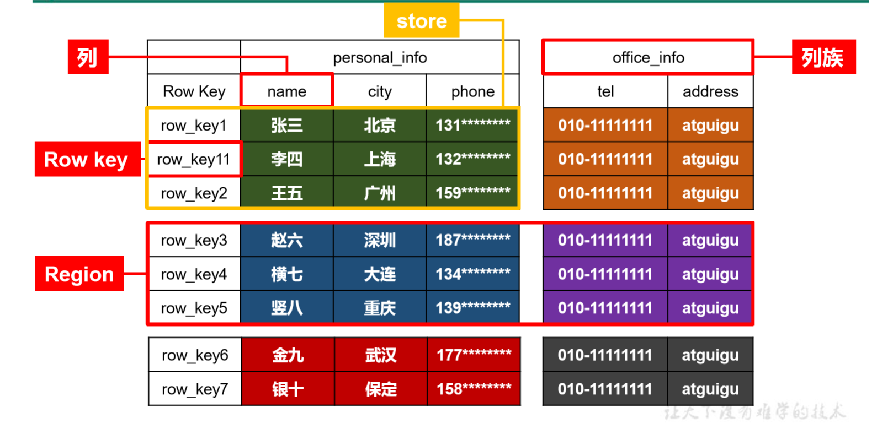
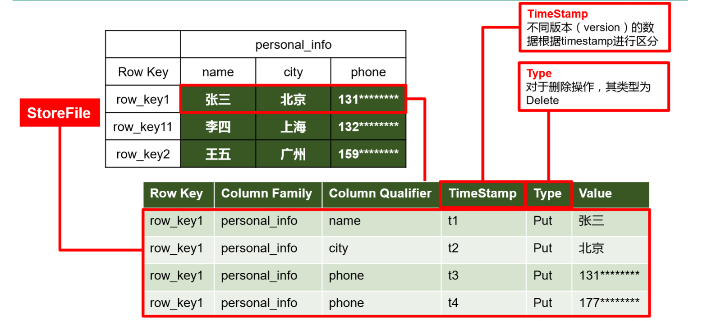
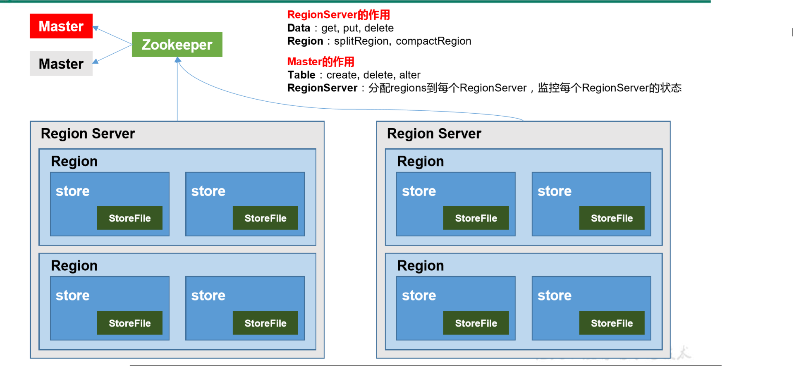
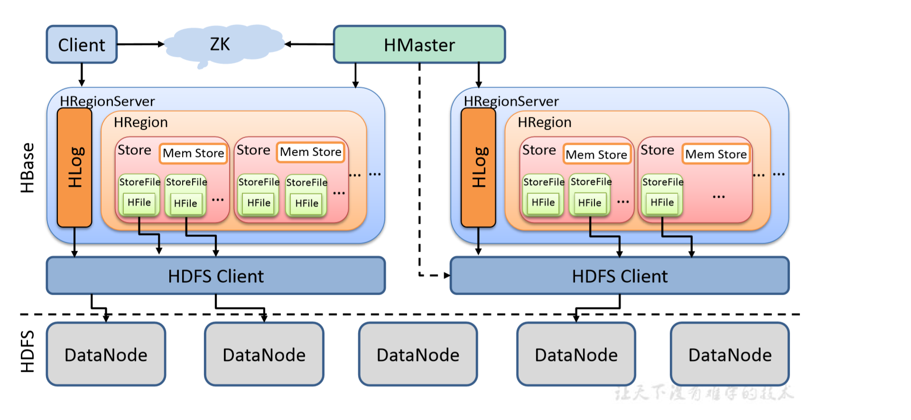
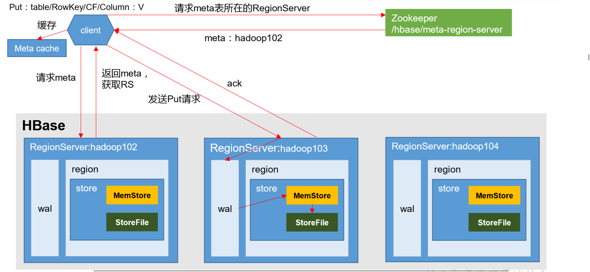
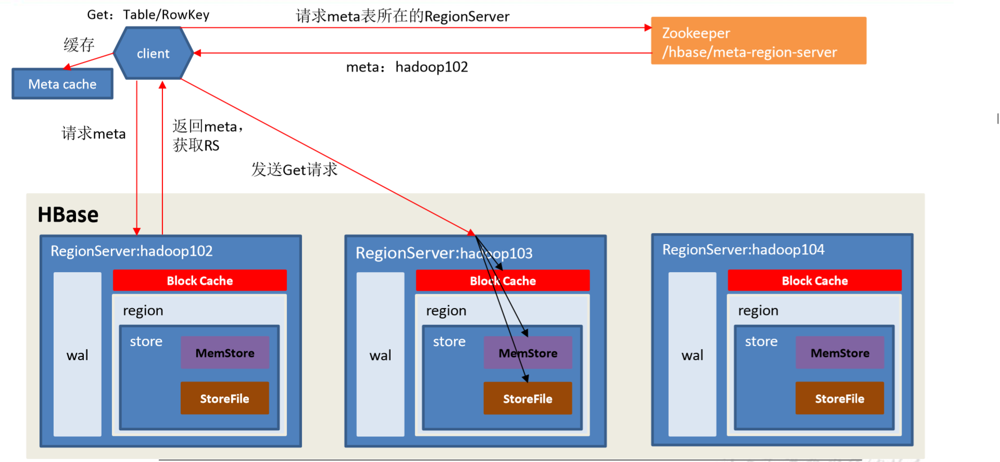
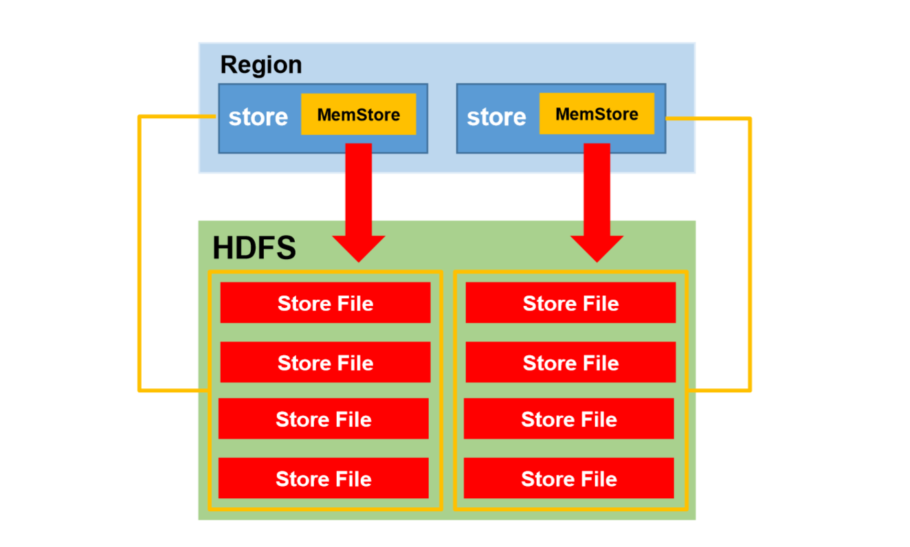
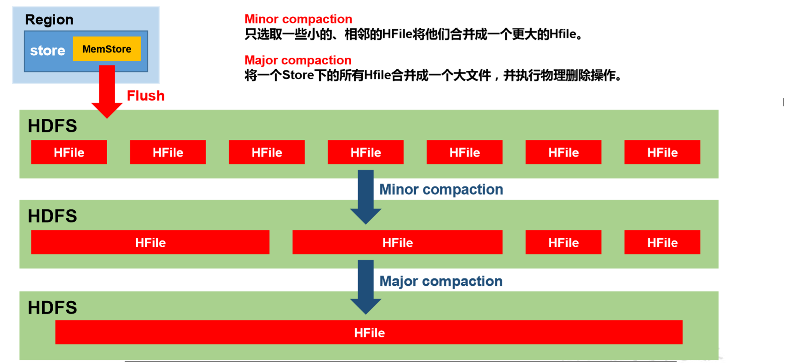
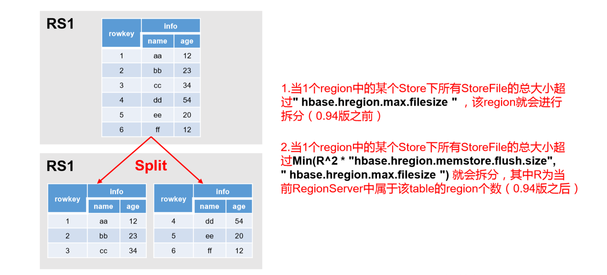

# 一、HBase简介

### 1.概述

HBase是一个**分布式**的、**面向列**的、**可扩展**的、**支持海量数据存储**的NoSQL数据库

### 2.特点

##### 2.1 海量存储 

Hbase能存储PB级别的海量数据，在PB级别的数据以及采用廉价PC存储的情况下，能在几十到百毫秒内返回数据 

##### 2.2 列式存储 

列式存储其实说的是列族存储，Hbase是根据列族来存储数据的。列族下面可以有非常多的列，列族在创建表的时候就必须指定 

##### 2.3 极易扩展 

通过横向添加RegionSever的机器，进行水平扩展，提升Hbase上层的处理能力 

##### 2.4 高并发 

目前大部分使用Hbase的架构，都是采用的廉价PC，因此单个IO的延迟其实并不小，一般在几十到上百ms之间。这里说的高并发，主要是在并发的情况下，Hbase的单个IO延迟下降并不多。能获得高并发、低延迟的服务

##### 2.5 稀疏 

稀疏主要是针对Hbase列的灵活性，在列族中，你可以指定任意多的列，在列数据为空的情况下，是不会占用存储空间的

### 3.应用

##### 3.1 对象存储

不少的头条类、新闻类的的新闻、网页、图片存储在HBase之中，一些病毒公司的病毒库也是存储在HBase之中

##### 3.2 时序数据

HBase之上有OpenTSDB模块，可以满足时序类场景的需求

##### 3.3 推荐画像

用户画像，是一个比较大的稀疏矩阵，蚂蚁金服的风控就是构建在HBase之上

##### 3.4 时空数据

主要是轨迹、气象网格之类，滴滴打车的轨迹数据主要存在HBase之中，另外在技术所有大一点的数据量的车联网企业，数据都是存在HBase之中

##### 3.5 CubeDB OLAP

Kylin一个cube分析工具，底层的数据就是存储在HBase之中，不少客户自己基于离线计算构建cube存储在hbase之中，满足在线报表查询的需求

##### 3.6 消息/订单

在电信领域、银行领域，不少的订单查询底层的存储，另外不少通信、消息同步的应用构建在HBase之上

##### 3.3 Feeds流

典型的应用就是xx朋友圈类似的应用，用户可以随时发布新内容，评论、点赞。

##### 3.8 NewSQL

有Phoenix的插件，可以满足二级索引、SQL的需求，对接传统数据需要SQL非事务的需求

##### 3.9 其他

存储爬虫数据

海量数据备份

短网址

### 4.HBase数据结构与数据模型

##### 4.1 逻辑结构



##### 4.2 物理存储结构




##### 4.3 数据模型

- **Name Space**
  命名空间，**类似于关系型数据库的DatabBase**概念，每个命名空间下有多个表。HBase
  有两个**自带的命名空间**，分别是**hbase和default**，hbase中存放的是HBase内置的表，
  default表是用户默认使用的命名空间
- **Region**
  类似于关系型数据库的表概念。不同的是，HBase定义表时只需要声明列族即可，不需
  要声明具体的列。这意味着，往HBase写入数据时，**字段可以动态、按需指定**。因此，和关
  系型数据库相比，HBase能够轻松应对字段变更的场景
- **Row**
  HBase表中的每行数据都由一个RowKey和多个Column(列)组成，数据是按照**RowKey**
  **的字典顺序存储**的，并且查询数据时只能根据RowKey进行检索，所以RowKey的设计十分重
  要
- **Column**
  HBase中的每个列都由Column Family(列族)和Column Qualifier(列限定符)进行限
  定，例如 info:name，info:age。建表时，**只需指明列族**，而**列限定符无需预先定义**
- **Time Stamp**
  用于**标识数据的不同版本(version)**，每条数据写入时，如果不指定时间戳，系统会
  自动为其加上该字段，其值为写入HBase的时间。 
- **Cell**
  由{rowkey, column Family:column Qualifier, time Stamp} 唯一确定的单元。cell中的数
  据是**没有类型**的，全部是**字节码形式存贮** 

### 5.HBase架构

##### 5.1 基本架构



##### 5.2 完整架构



`Client `

- HBase有两张特殊表
  - **META**：记录了用户所有表拆分出来的的 Region 映射信息，META可以有多个Regoin
  - **ROOT**：记录了META表的Region信息，ROOT只有一个Region，无论如何不会分裂

- Client访问用户数据前需要首先访问ZooKeeper，找到ROOT表的Region所在的位置，然后访问ROOT表，接着访问META表，最后才能找到用户数据的位置去访问，中间需要多次网络操作，不过client端会做缓存

`ZooKeeper` 

- ZooKeeper为HBase提供Failover机制，选举Master，避免Master**单点故障**问题

- 存储所有Region的寻址入口：ROOT表在哪台服务器上。ROOT这张表的位置信息

- 实时监控RegionServer的状态，将RegionServer的上线和下线信息实时通知给Master

- 存储HBase的Schema，包括有哪些Table，每个Table有哪些Column Family

`Master(HMaster)`

- 为RegionServer分配Region

- 负责RegionServer的负载均衡

- 发现失效的RegionServer并重新分配其上的Region

- HDFS上的垃圾文件(HBase)回收

- 处理Schema更新请求(表的创建，删除，修改，列簇的增加等等)

`RegionServer(HRegionServer)`

- 处理分配给它的Region

- 负责存储HBase的实际数据

- 刷新缓存到HDFS

- 维护HLog

- 执行压缩

- 负责处理Region分片

`Region(HRegion)`

- table在**行**的方向上分隔为多个Region

- Region是HBase中分布式存储和负载均衡的**最小单元**，即不同的region可以分别在不同的RegionServer上，但同一个Region不会拆分到多个RegionServer上
- Region按**大小**分隔，每个表一般是只有一个region。随着数据不断插入表，region不断增大，当region的某个列族达到一个阈值时就会分成两个新的region
- 每个region由以下信息标识
  - < 表名,startRowkey,创建时间>
  - 由目录表(ROOT和META)记录该region的endRowkey

`Store`

- 每一个Region由一个或多个Store组成，Region按**列蔟垂直划分**为Store

- 一个Store由一个MemStore和0或者多个StoreFile组成

- HBase把一起访问的数据放在一个Store里面，即每个ColumnFamily建一个Store，如果有几个ColumnFamily，也就有几个Store

- HBase以Store的大小来判断是否需要切分Region

`MemStore`

- MemStore与缓存内存类似

- 当往HBase中写入数据时，首先是写入到MemStore

- 每个列蔟将有一个MemStore

- 当MemStore存储快满的时候，整个数据将写入到HDFS中的HFile中

`StoreFile`

- 每当任何数据被写入HBASE时，首先要写入MemStore

- 当MemStore快满时，整个排序的key-value数据将被写入HDFS中的一个新的HFile中

- 写入HFile的操作是连续的，速度非常快

- 物理上存储的是**HFile**

`HFile`

- HBase中KeyValue数据的存储格式，HFile是Hadoop的 二进制格式文件

- 实际上StoreFile就是对Hfile做了轻量级包装，即StoreFile底层就是HFile

`HLog(WAL)`

- WAL全称为Write Ahead Log，它最大的作用就是故障恢复

- WAL是HBase中提供的一种高并发、持久化的日志保存与回放机制

- 每个业务数据的写入操作(PUT/DELETE/INCR)，都会保存在WAL中

- 一旦服务器崩溃，通过回放WAL，就可以实现恢复崩溃之前的数据

- 物理上存储是Hadoop的**Sequence File**

### 6.HBase写流程



- Client先访问zookeeper，获取hbase:meta表位于哪个RegionServer
- 访问对应的RegionServer，获取hbase:meta表，根据读请求的namespace:table/rowkey，查询出目标数据位于哪个RegionServer中的哪个Region中。并将该table的region信息以及meta表的位置信息缓存在客户端的meta cache，方便下次访问 
- 与目标RegionServer进行通讯
- 将数据顺序写入(追加)到WAL 
- 将数据写入对应的MemStore，数据会在MemStore进行排序 
- 向客户端发送ack 
- 等达到MemStore的刷写时机后，将数据刷写到HFile 

### 7.HBase读流程



- Client 先访问zookeeper，获取hbase:meta表位于哪个RegionServer
- 访问对应的RegionServer，获取hbase:meta表，根据读请求的namespace:table/rowkey，查询出目标数据位于哪个RegionServer中的哪个Region中。并将该table的region信息以及meta表的位置信息缓存在客户的meta cache，方便下次访问 
- 与目标RegionServer进行通讯 
- 分别在BlockCache(读缓存)，MemStore和StoreFile(HFile)中查询目标数据，并将查到的所有数据进行合并。此处所有数据是指同一条数据的不同版本(time stamp)或者不同的类型(Put/Delete) 
- 将从文件中查询到的数据块(Block，HFile数据存储单元，默认大小为64KB)缓存到Block Cache 
- 将合并后的最终结果返回给客户端 

### 8.HBase内存存储刷新(MemStore Flush)



##### 8.1 当memstroe的大小达到了

- **hbase.hregion.memstore.flush.size(默认值 128M)**

其所在region的所有memstore都会刷写

##### 8.2 当memstore的大小达到了

- **hbase.hregion.memstore.flush.size(默认值 128M)** 

- **hbase.hregion.memstore.block.multiplier(默认值 4)** 

会阻止继续往该memstore写数据 

##### 8.3 当region server中memstore的总大小达到 

- **java_heapsize**
- **hbase.regionserver.global.memstore.size(默认值 0.4)**
- **hbase.regionserver.global.memstore.size.lower.limit(默认值 0.95)**

region会按照其所有memstore的大小顺序(由大到小)依次进行刷写，直到regionserver中所有memstore的总大小减小到上述值以下

##### 8.4 region server中memstore的总大小达到 

- **java_heapsize*hbase.regionserver.global.memstore.size(默认值 0.4)**

会阻止继续往所有的memstore写数据

##### 8.5 到达自动刷写的时间，也会触发memstore flush(自动刷新的时间间隔)

- **hbase.regionserver.optionalcacheflushinterval(默认值 1小时)** 

##### 8.6 当WAL文件的数量超过

- **hbase.regionserver.max.logs**

region会按照时间顺序依次进行刷写，直到WAL文件数量减小到**hbase.regionserver.max.log**以下(该属性名已经废弃，现无需手动设置，**最大值为32**) 

### 9.HBase文件合并(StoreFile Compaction)



由于memstore每次刷写都会生成一个新的HFile，且同一个字段的不同版本(timestamp)和不同类型(Put/Delete)有可能会分布在不同的HFile中，因此查询时需要遍历所有的HFile。为了减少HFile的个数，以及清理掉过期和删除的数据，会进行StoreFile Compaction

Compaction 分为两种，分别是**Minor Compaction**和**Major Compaction**

- **Minor Compaction**
  - 会将临近的若干个较小的HFile合并成一个较大的HFile，但不会清理过期和删除的数据
  - 小范围合并，默认是3-10个文件进行合并，不会删除其他版本的数据
  - Minor Compaction则只会选择数个StoreFile文件compact为一个StoreFile
  - Minor Compaction的过程一般较快，而且IO相对较低
- **Major Compaction**
  - 会将一个Store下的所有的HFile合并成一个大HFile
  - 一般手动触发，并且会清理掉过期和删除的数据

### 10.HBase文件拆分(Region Split)



默认情况下，每个Table起初只有一个Region，随着数据的不断写入，Region会自动进行拆分。刚拆分时，两个子 Region都位于当前的RegionServer，为了负载均衡，HMaster有可能会将某个Region转移给其他的RegionServer

Region Split 时机:

- 当1个region中的某个Store下所有StoreFile的总大小超过：

  **hbase.hregion.max.filesize**，该Region就会进行拆分(0.94 版本之前)

- 当1个region中的某个Store下所有StoreFile的总大小超过：

  **Min(R^2 * "hbase.hregion.memstore.flush.size",hbase.hregion.max.filesize")**，该 Region 就会进行拆分，其中 R 为当前Region Server中属于该Table 的个数(0.94 版本之后)

<br>

# 二、HBase环境搭建

### 1.上传HBase压缩包并解压(node01)

```shell
tar -zxvf hbase-2.1.0.tar.gz -C /usr/BigData
```

### 2.进入HBase配置文件目录

```shell
cd /usr/BigData/cd /usr/BigData/conf
```

### 3.修改HBase配置文件  

##### 3.1 修改hbase-env.sh文件

```shell
#添加jdk环境(默认是注释的)
export JAVA_HOME=/usr/java/jdk1.8.0_45

#关掉HBase自带的ZooKeeper(默认是注释的)
export HBASE_MANAGES_ZK=false
```

##### 3.2 修改hbase-site.xml

```xml
<configuration>
    <!-- HBase数据在HDFS中的存放的路径 -->
    <property>
	<name>hbase.rootdir</name>
	<value>hdfs://node01:8020/hbase</value>
    </property>
    <!-- Hbase的运行模式。false是单机模式，true是分布式模式。若为false,Hbase和Zookeeper会运行在同一个JVM里面 -->
    <property>
	<name>hbase.cluster.distributed</name>
	<value>true</value>
    </property>
    <!-- ZooKeeper的地址 -->
    <property>
	<name>hbase.zookeeper.quorum</name>
	<value>node01,node02,node03</value>
    </property>
    <!-- ZooKeeper快照的存储位置 -->
    <property>
	<name>hbase.zookeeper.property.dataDir</name>
	<value>/usr/BigData/zookeeper-3.4.9/zkdatas</value>
    </property>
    <!--  V2.1版本，在分布式情况下, 设置为false -->
    <property>
	<name>hbase.unsafe.stream.capability.enforce</name>
	<value>false</value>
    </property>
</configuration>
```

##### 3.3 修改regionservers文件

```shell
node01
node02
node03
```

### 4.复制jar包到lib

```shell
cp $HBASE_HOME/lib/client-facing-thirdparty/htrace-core-3.1.0-incubating.jar
$HBASE_HOME/lib
```

### 5.分发安装包

```shell
scp -r /usr/BigData/hbase-2.1.0 node02:/usr/BigData
scp -r /usr/BigData/hbase-2.1.0 node03:/usr/BigData
```

### 6.配置环境变量(三台主机都要)

```shell
#打开环境变量配置文件
vim /etc/profile

#添加环境变量
export HBASE_HOME=/usr/BigData/hbase-2.1.0
export PATH=$HBASE_HOME/bin:$HBASE_HOME/sbin:$PATH

#刷新权限
source /etc/profile
```

### 7.启动HBase

**需要先启动ZooKeeper和HDFS,YARN可以不启动**

##### 7.1 启动ZooKeeper(三台主机)

```shell
#进入目录
cd /usr/BigData/zookeeper-3.4.9/bin/

#启动服务
./zkServer.sh start

#查看进程(只有Jps、QuorumPeerMain)
jps
```

##### 7.2 启动HDFS(node01)

```shell
cd /usr/BigData/hadoop-2.7.5

sbin/start-dfs.sh
```

**注:使用jps查看进程**

- node01

  **Jps**、**QuorumPeerMain** 、**NameNode**、**DataNode**、**SecondaryNameNode**

- node02

  **Jps**、**QuorumPeerMain** 、**DataNode**

- node03

  **Jps**、**QuorumPeerMain** 、**DataNode**

##### 7.3 关闭HDFS安全模式(node01)

```shell
cd /usr/BigData/hadoop-2.7.5

bin/hadoop dfsadmin -safemode leave
```

##### 7.4 启动历史任务记录(node01)

```shell
sbin/mr-jobhistory-daemon.sh start historyserver
```

**注:使用jps查看进程**

- node01

  **Jps**、**QuorumPeerMain** 、**NameNode**、**DataNode**、**SecondaryNameNode**、 **JobHistoryServer** 

- node02

  **Jps**、**QuorumPeerMain** 、**DataNode**

- node03

  **Jps**、**QuorumPeerMain** 、**DataNode**

##### 7.5 启动Hbase(node01)

```shell
cd /usr/BigData/hbase-2.1.0/bin

./start-hbase.sh
```

**注:使用jps查看进程**

- node01

  **Jps**、**QuorumPeerMain** 、**NameNode**、**DataNode**、**SecondaryNameNode**、**JobHistoryServer**、**HRegionServer** 、**HMaster**

- node02

  **Jps**、**QuorumPeerMain** 、**DataNode**、**HRegionServer**

- node03

  **Jps**、**QuorumPeerMain** 、**DataNode**、**HRegionServer**

##### 7.6 web界面访问HBase

http://node01:16010

### 8.常见问题及解决方法

##### 8.1 list命令失败

关闭HDFS安全模式后再重启HBase

##### 8.2 HMaster启动成功但进入shell就挂

进入ZooKeeper客户端删除hbase目录并重启HBase

```shell
#进入HBase目录
cd /usr/BigData/hbase-2.1.0/bin

#停止HBase
./stop-hbase.sh

#进入ZooKeeper目录
cd /usr/BigData/zookeeper-3.4.9/bin

#启动ZooKeeper客户端服务
./zkServer.sh start

#删除hbase目录
rmr /hbase

#重启HBase
./start-hbase.sh
```
