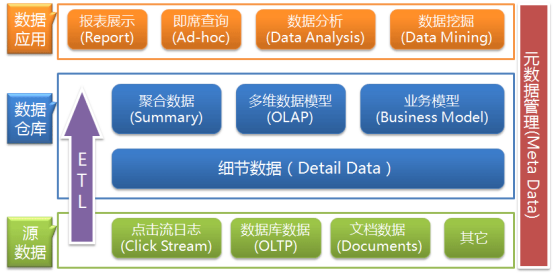

# 一、数据仓库

### 1. 基本概念

英文名称为Data Warehouse，可简写为**DW**或**DWH**。数据仓库的目的是构建**面向分析**的集成化数据环境，为企业提供决策支持

数据仓库是存数据的，企业的各种数据往里面存，主要目的是为了分析有效数据，后续会基于它产出供分析挖掘的数据，或者数据应用需要的数据，如企业的分析性报告和各类报表等

### 2. 主要特征

##### 2.1 面向主题(Subject-Oriented)

数据仓库是面向主题的,数据仓库通过一个个主题域将多个业务系统的数据加载到一起，为了各个主题(如:用户、订单、商品等)进行分析而建，操作型数据库是为了支撑各种业务而建立

##### 2.2 集成性(Integrated)

数据仓库会将不同源数据库中的数据汇总到一起,数据仓库中的综合数据不能从原有的数据库系统直接得到。因此在数据进入数据仓库之前，必然要经过统一与整合，这一步是数据仓库建设中最关键、最复杂的一步(ETL)，要**统一源数据中所有矛盾之处**，如字段的同名异义、异名同义、单位不统一、字长不一致等等

##### 2.3 非易失性(Non-Volatile)

`数据库`

主要服务于**日常的业务操作**，使得数据库需要不断地对数据实时更新，以便迅速获得当前最新数据，不至于影响正常的业务运作

`数据仓库`

只保存**过去的业务数据**，不需要每一笔业务都实时更新数据仓库，而是根据商业需要每隔一段时间把一批较新的数据导入数据仓库。 数据仓库的数据反映的是一段相当长的时间内历史数据的内容，是不同时点的数据库的集合,数据仓库中的数据一般**仅执行查询操作**，很少会有删除和更新。但是**需定期加载和刷新数据**

##### 2.4 时变性(Time-Variant)

数据仓库包含各种粒度的历史数据。数据仓库中的数据可能与某个特定日期、星期、月份、季度或者年份有关。数据仓库的目的是通过分析企业过去一段时间业务的经营状况，挖掘其中隐藏的模式。虽然数据仓库的用户不能修改数据，但并不是说数据仓库的数据是永远不变的。分析的结果只能反映过去的情况，当业务变化后，挖掘出的模式会失去时效性。因此数据仓库的数据需要定时更新，以适应决策的需要。

### 3. 数据库与数据仓库的区别

* 数据库是**面向事务**的设计，数据仓库是**面向主题**设计的
* 数据库一般存储**业务数据**，数据仓库存储的一般是**历史数据**
* 数据库设计是**尽量避免冗余**，一般针对某一业务应用进行设计，符合业务应用，但是不符合分析。数据仓库在设计是**有意引入冗余**，依照分析需求，分析维度、分析指标进行设计
* 数据库是为**捕获数据**而设计，数据仓库是为**分析数据**而设计

注:数据仓库的出现，并不是要取代数据库，是在数据库已经大量存在的情况下，为了**进一步挖掘数据资源**、为了**决策需要**而产生的，它决不是所谓的“大型数据库”

### 4.OLTP与OLAP的区别

##### 4.1 联机事务处理OLTP(On-Line Transaction Processing)

操作型处理，它是针对具体业务在数据库联机的日常操作，用做少数记录进行查询、修改

##### 4.2 联机分析处理OLAP(On-Line Analytical Processing)

分析型处理，一般针对某些主题的历史数据进行分析，用做管理决策

### 5. 数据仓库的分层架构

数据仓库的数据来源于不同的源数据，并提供多样的数据应用，数据**自下而上**流入数据仓库后向上层开放应用，而数据仓库只是中间集成化数据管理的一个平台



按照数据流入流出的过程，数据仓库架构可分为三层——**源数据**、**数据仓库**、**数据应用**

* `源数据层(ODS)`：此层数据无任何更改，直接沿用外围系统数据结构和数据，不对外开放；为临时存储层，是接口数据的**临时存储区域**，为后一步的数据处理做准备
* `数据仓库层(DW)`：也称为细节层，DW层的数据应该是**一致的、准确的、干净的**数据，即对源系统数据进行了**清洗**(去除了杂质)后的数据
* `数据应用层(DA或APP)`：前端应用直接读取的数据源；根据报表、专题分析需求而计算生成的数据

数据仓库从各数据源获取数据及在数据仓库内的数据转换和流动都可以认为是**ETL(抽取Extra, 转化Transfer, 装载Load)的过程**，ETL是数据仓库的流水线，也可以认为是数据仓库的血液，它维系着数据仓库中数据的新陈代谢，而数据仓库日常的管理和维护工作的大部分精力就是保持ETL的正常和稳定

### 6. 数据仓库的元数据管理

##### 6.1 概述

元数据(Meta Date)，主要**记录数据仓库中模型的定义、各层级间的映射关系、监控数据仓库的数据状态及ETL的任务运行状态**。一般会通过元数据资料库(Metadata Repository)来统一地存储和管理元数据，其主要目的是使数据仓库的设计、部署、操作和管理能达成协同和一致

##### 6.2 作用

* 构建数据仓库的主要步骤之一是ETL。这时元数据将发挥重要的作用，它定义了源数据系统到**数据仓库的映射、数据转换的规则、数据仓库的逻辑结构、数据更新的规则、数据导入历史记录以及装载周期**等相关内容。数据抽取和转换的专家以及数据仓库管理员正是通过元数据高效地构建数据仓库
* 用户在使用数据仓库时，通过元数据访问数据，明确数据项的含义以及定制报表
* 数据仓库的规模及其复杂性离不开正确的**元数据管理**，包括增加或移除外部数据源，改变数据清洗方法，控制出错的查询以及安排备份等


##### 6.3 分类

`技术元数据`

技术元数据为**开发和管理数据仓库的IT人员使用**，它描述了与数据仓库开发、管理和维护相关的数据，包括数据源信息、数据转换描述、数据仓库模型、数据清洗与更新规则、数据映射和访问权限等

`业务元数据`

业务元数据为**管理层和业务分析人员服务**，从业务角度描述数据，包括商务术语、数据仓库中有什么数据、数据的位置和数据的可用性等，帮助业务人员更好地理解数据仓库中哪些数据是可用的以及如何使用

##### 6.4 意义

**由上可见，元数据不仅定义了数据仓库中数据的模式、来源、抽取和转换规则等，而且是整个数据仓库系统运行的基础，元数据把数据仓库系统中各个松散的组件联系起来，组成了一个有机的整体**

# 二、Hive简介

### 1.概述

Hive是基于Hadoop的一个**数据仓库**工具，可以将结构化的数据文件映射为一张表，并提供类SQL查询功能

其本质是将SQL转换为MapReduce的任务进行运算，底层由HDFS来提供数据的存储，说白了 hive可以理解为一个将SQL转换为MapReduce的任务的工具，甚至更进一步可以说hive就是一 个MapReduce的客户端 

**注:**

- **Hive处理的数据存储在HDFS**

- **Hive分析数据底层的实现是MapReduce**

- **执行程序运行在Yarn上**

### 2.优缺点

##### 2.1 优点

- 操作接口采用**类SQL**语法，提供快速开发的能力(简单、容易上手)

- 避免了去写MapReduce，减少开发人员的学习成本

- Hive的执行**延迟比较高**，因此Hive常用于数据分析，对实时性要求不高的场合

- Hive优势在于处理大数据，对于处理小数据没有优势，因为Hive的执行延迟比较高

- Hive**支持用户自定义函数**，用户可以根据自己的需求来实现自己的函数

##### 2.2 缺点

- Hive的HQL**表达能力有限**

  - 迭代式算法无法表达

  - 数据挖掘方面不擅长

- Hive的**效率比较低**

  - Hive自动生成的MapReduce作业，通常情况下不够智能化
  - Hive调优比较困难，粒度较粗

### 3.架构


##### 3.1 用户接口(Client)

- CLI(hive shell)

- JDBC/ODBC(java访问hive)

- WEBUI(浏览器访问hive)

##### 3.2 元数据(Metastore)

- 元数据包括:表名、表所属的数据库**(默认是default)**、表的拥有者、列/分区字段、表的类型(是否是外部表)、表的数据所在目录等

- **默认**存储在自带的**derby数据库**中，推荐使用MySQL存储Metastore

##### 3.3 Hadoop

- 使用HDFS进行存储

- 使用MapReduce进行计算

##### 3.4 驱动器(Driver)

`解析器(SQL Parser)`

将SQL字符串转换成抽象语法树AST，这一步一般都用第三方工具库完成，比如antlr；对AST进行语法分析，比如表是否存在、字段是否存在、SQL语义是否有误

`编译器(Physical Plan)`

将AST编译生成逻辑执行计划

`优化器(Query Optimizer)`

对逻辑执行计划进行优化

`执行器(Execution)`

把逻辑执行计划转换成可以运行的物理计划，对于Hive来说，就是MR/Spark

### 4.Hive和数据库比较

由于Hive采用了类似SQL 的查询语言HQL(Hive Query Language)，很容易将Hive理解为数据库。其实从结构上来看，Hive和数据库只是查询语言类似。数据库可以用在Online的应用中，但是Hive是为数据仓库而设计的

##### 4.1 查询语言

由于SQL被广泛的应用在数据仓库中，因此，专门针对Hive的特性设计了类SQL的查询语言HQL。熟悉SQL开发的开发者可以很方便的使用Hive进行开发

##### 4.2 数据存储位置

Hive是建立在Hadoop 之上的，所有 Hive 的数据都是存储在HDFS 中的。而数据库则可以将数据保存在块设备或者本地文件系统中

##### 4.3 数据更新

由于Hive是针对数据仓库应用设计的，而**数据仓库**的内容是**读多写少**的。因此，Hive中**不建议对数据的改写**，所有的数据都是在加载的时候确定好的，而数据库中的数据通常是需要经常进行修改的

##### 4.4 索引

Hive在加载数据的过程中不会对数据进行任何处理，甚至不会对数据进行扫描，因此也没有对数据中的某些Key建立索引。Hive要访问数据中满足条件的特定值时，需要暴力扫描整个数据，因此访问**延迟较高**。由于MapReduce的引入，Hive可以**并行访问数据**，因此即使没有索引，对于大数据量的访问，Hive仍然可以体现出优势。由于数据的访问延迟较高，决定了**Hive不适合在线数据查询**

##### 4.5 执行

Hive中大多数查询的执行是通过Hadoop提供的MapReduce来实现的。而数据库通常有自己的执行引擎

##### 4.6 执行延迟

Hive 在查询数据的时候，由于没有索引，需要扫描整个表，因此延迟较高。另外一个导致 Hive 执行延迟高的因素是 MapReduce框架。由于MapReduce 本身具有较高的延迟，因此在利用MapReduce 执行Hive查询时，也会有较高的延迟。相对的，数据库的执行延迟较低。当然，这个低是有条件的，即数据规模较小，当数据规模大到超过数据库的处理能力的时候，Hive的并行计算显然能体现出优势。

##### 4.7 可扩展性

由于Hive是建立在Hadoop之上的，因此Hive的可扩展性是和Hadoop的可扩展性是一致的，而数据库由于 ACID 语义的严格限制，扩展行非常有限

##### 4.8 数据规模

由于Hive建立在集群上并可以利用MapReduce进行并行计算，因此可以支持很大规模的数据；对应的，数据库可以支持的数据规模较小

<br>

# 三、Hive环境搭建

### 1.Hive安装地址

##### 1.1 Hive官网地址

http://hive.apache.org

##### 1.2 文档查看地址

https://cwiki.apache.org/confluence/display/Hive/GettingStarted

##### 1.3 下载地址

http://archive.apache.org/dist/hive/

##### 1.4 github地址

https://github.com/apache/hive

### 2.上传Hive压缩包并解压(node01)

```shell
tar -zxvf apache-hive-1.2.1-bin.tar.gz -C /usr/BigData
```

### 3.修改Hive文件目录名

```shell
cd /usr/BigData

mv apache-hive-1.2.1-bin hive-1.2.1
```

### 4.安装配置Mysql

##### 4.1 检查Mysql安装情况

`删除rpm安装的mysql`

```shell
rpm -qa|grep mysql

rpm -e --nodeps 上条命令查询的名字
```

`删除mysql相关目录`

```shell
find / -name mysql

rm -rf 上条命令显示的路径
```

`删除mysql配置文件`

```shell
rm /etc/my.cnf
```

`删除系统自带的Mariadb`

```shell
rpm -qa|grep mariadb |xargs yum remove -y
```

##### 4.2 解压Mysql压缩包

`安装zip`

```shell
yum -y install zip unzip
```

`解压mysql-libs.zip`

```shell
unzip mysql-libs.zip
```

`查看解压文件内容`

```shell
MySQL-client-5.6.24-1.el6.x86_64.rpm
mysql-connector-java-5.1.27.tar.gz
MySQL-server-5.6.24-1.el6.x86_64.rpm
```

##### 4.3 Hive元数据配置到MySql

`解压驱动包`

```shell
tar -zxvf mysql-connector-java-5.1.27.tar.gz
```

`移动驱动文件`

```shell
cp mysql-connector-java-5.1.27-bin.jar /usr/BigData/hive-1.2.1/lib
```

##### 4.4 安装Mysql服务端

`安装mysql服务端`

```shell
rpm -ivh MySQL-server-5.6.24-1.el6.x86_64.rpm
```

`查看产生的随机密码`

```shell
cat /root/.mysql_secret

_wyRR_HS9QXpbkuU
```

`查看mysql状态`

```shell
service mysql status
```

`启动mysql`

```shell
service mysql start
```

##### 4.5 安装MySql客户端

```shell
rpm -ivh MySQL-client-5.6.24-1.el6.x86_64.rpm
```

`链接mysql`

```shell
mysql -uroot -p_wyRR_HS9QXpbkuU
```

`修改密码`

```mysql
SET PASSWORD=PASSWORD('123456');
```

`退出mysql`

```mysql
exit;
```

##### 4.6 MySql中user表中主机配置

**配置只要是root用户+密码，在任何主机上都能登录MySQL数据库**

`进入mysql`

```shell
mysql -uroot -p123456
```

`显示数据库`

```mysql
show databases;
```

`使用mysql数据库`

```mysql
use mysql;
```

`展示mysql数据库中的所有表`

```mysql
show tables;
```

`展示user表的结构`

```mysql
desc user;
```

`查询user表`

```mysql
select User, Host, Password from user;
```

`修改user表，把Host表内容修改为%`

```mysql
update user set host='%' where host='localhost';
```

`删除root用户的其他host`

```mysql
delete from user where Host='node01';
delete from user where Host='127.0.0.1';
delete from user where Host='::1';
```

`刷新mysql`

```mysql
flush privileges;
```

`退出mysql`

```mysql
quit;
```

**注:mysql有三种退出方式**

```mysql
exit;
quit;
\q;
```

### 5.修改Hive配置文件

##### 5.1 进入Hive配置文件目录

```shell
cd /usr/BigData/hive-1.2.1/conf
```

##### 5.2 修改hive-site.xml文件

`新建hive-site.xml`

```shell
vim hive-site.xml
```

`配置hive-site.xml`

```xml
<configuration>
	<property>
	  <name>javax.jdo.option.ConnectionURL</name>
	  <value>jdbc:mysql://node01:3306/hive?createDatabaseIfNotExist=true</value>
	  <description>JDBC connect string for a JDBC metastore</description>
	</property>

	<property>
	  <name>javax.jdo.option.ConnectionDriverName</name>
	  <value>com.mysql.jdbc.Driver</value>
	  <description>Driver class name for a JDBC metastore</description>
	</property>

	<property>
	  <name>javax.jdo.option.ConnectionUserName</name>
	  <value>root</value>
	  <description>username to use against metastore database</description>
	</property>

	<property>
	  <name>javax.jdo.option.ConnectionPassword</name>
	  <value>123456</value>
	  <description>password to use against metastore database</description>
	</property>
    
	<property>
		<name>hive.cli.print.header</name>
		<value>true</value>
	</property>

	<property>
		<name>hive.cli.print.current.db</name>
		<value>true</value>
	</property>
</configuration>
```

##### 5.3 修改hive-env.sh文件

`重命名hive-env.sh.template`

```shell
mv hive-env.sh.template hive-env.sh
```

`配置hive-env.sh`

```sh
export HADOOP_HOME=/usr/BigData/hadoop-2.7.5 #配置HADOOP_HOME路径

export HIVE_CONF_DIR=/usr/BigData/hive-1.2.1/conf #配置HIVE_CONF_DIR路径
```

##### 5.4 修改hive-log4j.properties文件

`重命名hive-log4j.properties.template`

```shell
mv hive-log4j.properties.template hive-log4j.properties
```

`配置hive-log4j.properties`

```properties
hive.log.dir=/usr/BigData/hive-1.2.1/logs
```

**注:Hive的log默认存放在/tmp/root/hive.log目录下(当前用户名下)**

### 6.Hive启动

##### 6.1 启动zookeeper(三台主机)

```shell
#进入目录
cd /usr/BigData/zookeeper-3.4.9/bin

#启动服务
./zkServer.sh start

#查看进程(只有Jps、QuorumPeerMain)
jps
```

##### 6.2 进入hadoop目录(node01)

```shell
cd /usr/BigData/hadoop-2.7.5
```

##### 6.3 启动hdfs(node01)

```shell
sbin/start-dfs.sh
```

**注:使用jps查看进程**

- node01

  **Jps**、**QuorumPeerMain** 、**NameNode**、**DataNode**、**SecondaryNameNode**

- node02

  **Jps**、**QuorumPeerMain** 、**DataNode**

- node03

  **Jps**、**QuorumPeerMain** 、**DataNode**

##### 6.4 启动yarn(node01)

```shell
sbin/start-yarn.sh
```

**注:使用jps查看进程**

- node01

  **Jps**、**QuorumPeerMain** 、**NameNode**、**DataNode**、**SecondaryNameNode**、**NodeManager** 、**ResourceManager** 

- node02

  **Jps**、**QuorumPeerMain** 、**DataNode**、 **NodeManager** 

- node03

  **Jps**、**QuorumPeerMain** 、**DataNode**、 **NodeManager** 

##### 6.5 启动历史任务记录(node01)

```shell
sbin/mr-jobhistory-daemon.sh start historyserver
```

**注:使用jps查看进程**

- node01

  **Jps**、**QuorumPeerMain** 、**NameNode**、**DataNode**、**SecondaryNameNode**、**NodeManager** 、**ResourceManager** 、 **JobHistoryServer** 

- node02

  **Jps**、**QuorumPeerMain** 、**DataNode**、 **NodeManager** 

- node03

  **Jps**、**QuorumPeerMain** 、**DataNode**、 **NodeManager** 

##### 6.6 关闭HDFS安全模式(node01)

```shell
bin/hadoop dfsadmin -safemode leave
```

##### 6.7 启动Hive(node01)

```shell
cd /usr/BigData/hive-1.2.1

bin/hive
```

##### 6.8 常见问题及解决方法

`无法启动多个客户端`

Metastore默认存储在自带的**derby**数据库中，需要使用MySQL存储Metastore，**按照4，5步骤执行**

`修改配置信息后没有生效`

重新启动hive

### 7.Hive基本操作

##### 7.1 启动hive

```shell
cd /usr/BigData/hive-1.2.1

bin/hive
```

##### 7.2 查看数据库

```mysql
show databases;
```

##### 7.3 打开默认数据库

```mysql
use default;
```

##### 7.4 显示default数据库中的表

```mysql
show tables;
```

##### 7.5 创建一张表

```mysql
create table student(id int, name string);
```

##### 7.6 显示数据库中有几张表

```mysql
show tables;
```

##### 7.7 查看表的结构

```mysql
desc student;
```

##### 7.8 向表中插入数据

```mysql
insert into student values(1000,"ss");
```

##### 7.9 查询表中数据

```mysql
select * from student;
```

##### 7.10 将本地文件导入Hive案例

`创建文件`

```shell
vim /usr/BigData/hadoop-2.7.5/testdata/student.txt
```

`添加数据`

```shell
1001  zhangshan
1002  lishi
1003  zhaoliu
```

**注:数据以tab键间隔**

`创建students表, 并声明文件分隔符’\t’`

```mysql
create table students(id int, name string) ROW FORMAT DELIMITED FIELDS TERMINATED BY '\t';
```

`加载文件到student数据库表中`

```mysql
load data local inpath '/usr/BigData/hadoop-2.7.5/testdata/student.txt' into table student;
```

**注:如果加载数据在HDFS上，去除inpath直接写HDFS路径即可**

`Hive查询结果`

```mysql
select * from student;
```

##### 7.11 退出hive

```mysql
quit;
```