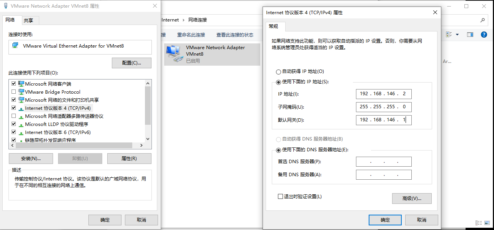
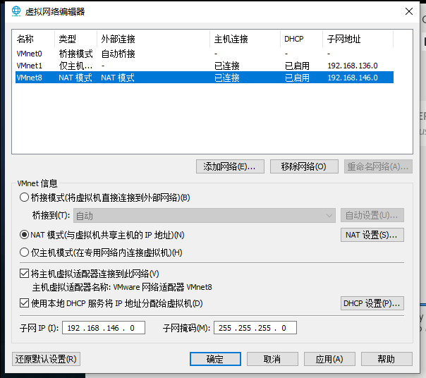
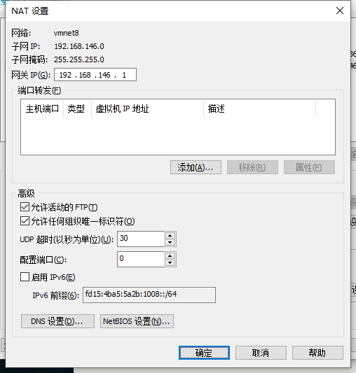
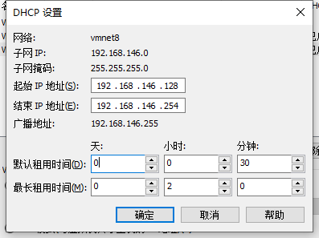

### 一、配置VMware Network Adapter VMnet8

##### 1.双击Internet 协议版本4 (TCP/IPv4)

##### 2.点击使用下面的IP地址(S):



### 二、配置虚拟网络编辑器

##### 1.子网IP和子网掩码配置



##### 2.NAT 设置(S)...配置



##### 3.DHCP 设置(S)...配置



### 三、配置ifcfg=ens33文件

##### 1.打开ifcfg-ens33文件

```shell
vi /etc/sysconfig/network-scripts/ifcfg-ens33
```

##### 2.修改配置(如果有多台计算机，修改IP即可)

```shell
TYPE="Ethernet"
PROXY_METHOD="none"
BROWSER_ONLY="no"
BOOTPROTO="static"
IPADDR=192.168.146.121
GATEWAY=192.168.146.1
NETMASK=255.255.255.0
DNS1=192.168.146.1
DEFROUTE="yes"
IPV4_FAILURE_FATAL="no"
IPV6INIT="yes"
IPV6_AUTOCONF="yes"
IPV6_DEFROUTE="yes"
IPV6_FAILURE_FATAL="no"
IPV6_ADDR_GEN_MODE="stable-privacy"
NAME="ens33"
UUID="4d11f51a-2ff4-4d74-9b67-0de00f4baaa3"
DEVICE="ens33"
ONBOOT="yes"
```

##### 3.重启服务

```shell
service network restart
```

##### 4.安装vim

```shell
yum -y install vim
```

### 四、配置主机名和域名映射

##### 1.配置三台主机主机名为:node01,node02,node03

```shell
hostnamectl set-hostname node01

hostnamectl set-hostname node02

hostnamectl set-hostname node03
```

##### 2.打开三台主机hosts配置文件

```shell
vim /etc/hosts
```

##### 3.配置三台主机域名映射

```shell
192.168.146.121 node01
192.168.146.122 node02
192.168.146.123 node03
```

##### 4.互相尝试ping

```shell
ping node02

ping 192.168.146.123
```

### 五、关闭防火墙和selinux

##### 1.关闭防火墙

```shell
systemctl stop firewalld #停止防火墙

systemctl disable firewalld #禁止防火墙

iptables -L #查看防火墙规则

iptables -F #清空防火墙规则
```

##### 2.打开selinux配置文件

```shell
vim /etc/selinux/config
```

##### 3.找到selinux行，将其禁用

```she
SELINUX=disabled
```

### 六、设置ssh免密登录

##### 1.三台主机生成公钥与私钥

```shell
ssh-keygen -t rsa
```

##### 2.三台主机拷贝公钥到同一主机(node01)

```shell
ssh-copy-id node01 #保存在/root/.ssh/id_rsa.pub文件里
```

##### 3.复制第一台主机(node01)的认证到其他机器(node01)

```shell
scp /root/.ssh/authorized_keys node02:/root/.ssh

scp /root/.ssh/authorized_keys node03:/root/.ssh
```

### 七、时区与时钟同步

##### 1.时区同步

```shell
timedatectl #查看时区

timedatectl list-timezones #查看时区表

timedatectl sett-timezone Asia/Shanghai #设置时区
```

##### 2.时钟同步

```shell
yum -y install ntp #安装

crontab -e #启动定时任务

*/1 * * * * /usr/sbin/ntpdate ntp4.aliyun.com #设置定时任务

crontab -l #查看定时任务

systemctl start ntpd #重启服务

systemctl status ntpd #查看服务是否成功启动
```

##### 3.关闭邮件提示(You have new mail in /var/spool/mail/root )

关闭提示

```shell
vim /etc/profile #打开配置文件

unset MAILCHECK #关闭邮件提示

source /etc/profile #刷新权限
```

查看

```shell
ls -lth /var/spool/mail/
```

清空

```shell
cat /dev/null > /var/spool/mail/root
```

