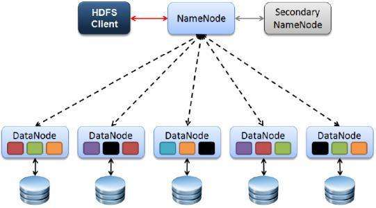
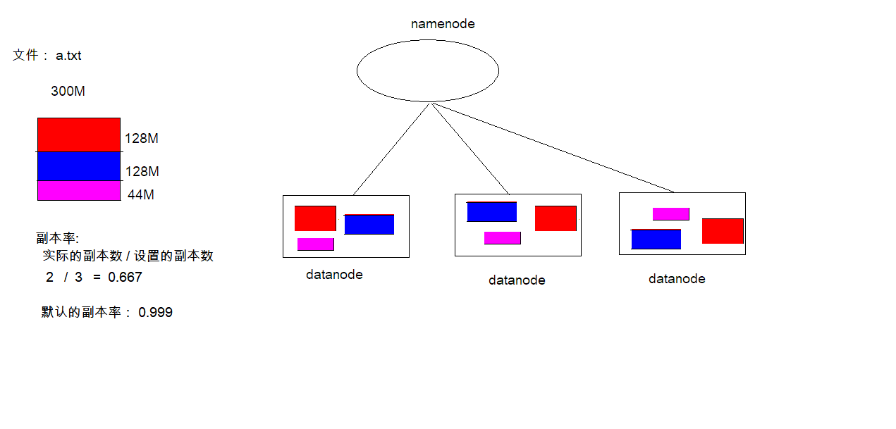
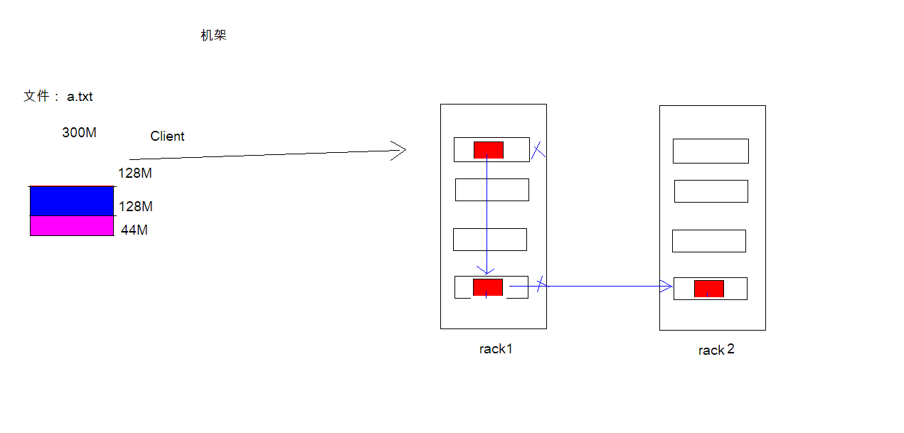
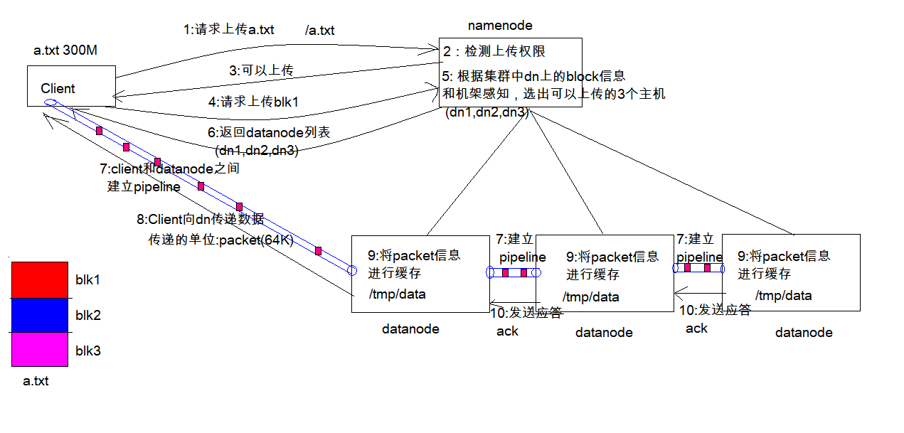
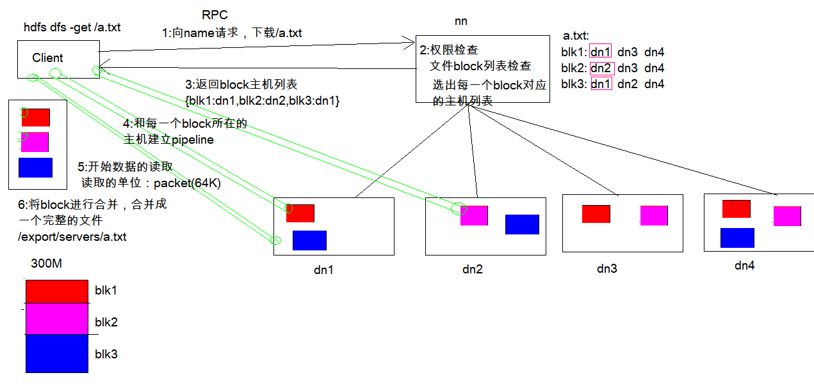
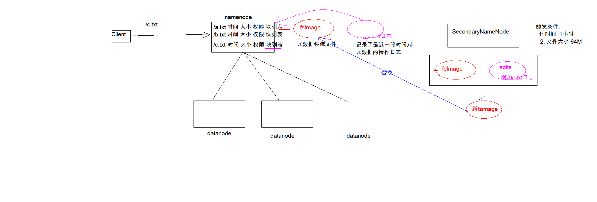
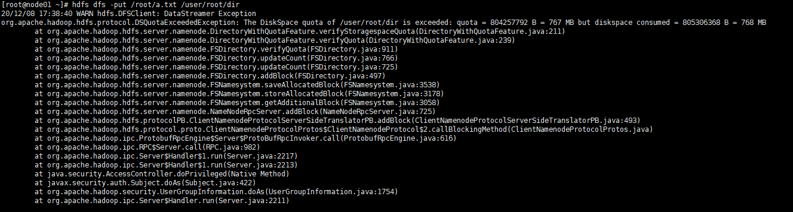
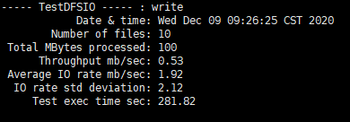
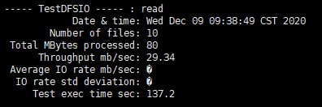
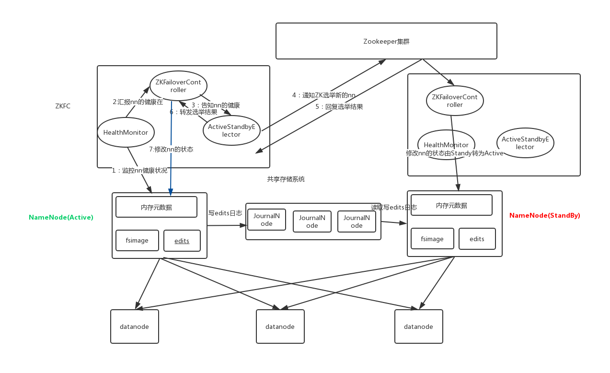

# 一、HDFS概述

### 1.HDFS介绍

HDFS（**Hadoop Distributed File System**）是 Apache Hadoop 项目的一个子项目.。Hadoop非常适于存储大型数据 (比如 TB 和 PB), 其就是使用 HDFS 作为**存储系统**。HDFS使用**多台计算机存储文件**, 并且提供统一的访问接口, 像是访问一个普通文件系统一样使用分布式文件系统.

### 2.HDFS优点

##### 2.1高容错性

1) 数据自动保存多个副本。它通过增加副本的形式，提高容错性。

2) 某一个副本丢失以后，它可以自动恢复，这是由 HDFS 内部机制实现的，我们不必关心。

##### 2.2适合批处理

1) 它是通过移动计算而不是移动数据。

2) 它会把数据位置暴露给计算框架。

##### 2.3适合大数据处理

1) 数据规模：能够处理数据规模达到 GB、TB、甚至PB级别的数据。

2) 文件规模：能够处理百万规模以上的文件数量，数量相当之大。

3) 节点规模：能够处理10K节点的规模。

##### 2.4流式数据访问

1) 一次写入，多次读取，不能修改，只能追加。

2) 它能保证数据的一致性。

##### 2.5可构建在廉价机器上

1) 它通过多副本机制，提高可靠性。

2) 它提供了容错和恢复机制。比如某一个副本丢失，可以通过其它副本来恢复。

### 3.HDFS缺点

##### 3.1不适合低延时数据访问

1) 比如毫秒级的来存储数据，这是不行的，它做不到。

2) 它适合高吞吐率的场景，就是在某一时间内写入大量的数据。但是它在低延时的情况  下是不行的，比如毫秒级以内读取数据，这样它是很难做到的。

##### 3.2无法高效的对大量小文件进行存储

1) 存储大量小文件的话，它会占用  NameNode大量的内存来存储文件、目录和块信息。这样是不可取的，因为NameNode的内存总是有限的。

2) 小文件存储的寻道时间会超过读取时间，它违反了HDFS的设计目标。 改进策略

##### 3.3并发写入、文件随机修改

1) 一个文件只能有一个写，不允许多个线程同时写。

2) 仅支持数据 append（追加），不支持文件的随机修改。

### 4.HDFS的架构



##### 4.1Client：就是客户端

- 文件切分：文件上传 HDFS 的时候，Client 将文件切分成 一个一个的Block，然后进行存储
- 与 NameNode 交互：获取文件的位置信息
- 与 DataNode 交互：读取或者写入数据
- 管理和访问HDFS：比如启动或者关闭HDFS。 

##### 4.2NameNode：就是 master，它是一个主管、管理者

- 管理HDFS 的名称空间
- 管理数据块（Block）映射信息
- 配置副本策略
- 处理客户端读写请求

##### 4.3DataNode：就是Slave。NameNode 下达命令，DataNode 执行实际的操作

- 存储实际的数据块
- 执行数据块的读/写操作

##### 4.4Secondary NameNode：并非 NameNode 的热备，当NameNode 挂掉的时候，它并不能马上替换 NameNode 并提供服务。

- 辅助NameNode，分担其工作量
- 定期合并 fsimage和fsedits，并推送给NameNode
- 在紧急情况下，可辅助恢复 NameNode

### 5.NameNode和DataNode作用

#### 5.1NameNode作用

- NameNode在内存中保存着整个文件系统的名称空间和文件数据块的地址映射

- 整个HDFS可存储的文件数受限于NameNode的内存大小 
  

##### 5.1.1NameNode存储元数据信息

文件名，文件目录结构，文件属性(生成时间，副本数，权限)每个文件的块列表，以及列表中的块与块所在的DataNode之间的地址映射关系。并且会**定期保存到本地磁盘（fsImage文件和edits文件）**

##### 5.1.2NameNode文件操作

NameNode负责文件**元数据**的操作，DataNode负责处理文件内容的**读写请求**，数据流不经过NameNode，会询问它跟那个DataNode联系

##### 5.1.3NameNode副本

文件数据块到底**存放到**哪些**DataNode**上，是由NameNode决定的，根据全局情况做出放置副本的决定

##### 5.1.4NameNode心跳机制

全权管理**数据块的复制**，周期性的**接受心跳和块的状态报告信息**，若接受到了心跳信息，则NameNode认为DataNode工作正常，如果在10分钟后还接受到不到DN的心跳，那么NameNode认为DataNode已经宕机 ,这时候 NameNode准备要把DN上的数据块进行重新的复制

#### 5.2DataNode作用

##### 5.2.1Data Node 以数据块的形式存储HDFS文件

##### 5.2.2Data Node 响应HDFS 客户端读写请求

##### 5.2.3Data Node 周期性向NameNode汇报心跳信息

##### 5.2.4Data Node 周期性向NameNode汇报数据块信息

##### 5.2.5Data Node 周期性向NameNode汇报缓存数据块信息

### 6.HDFS的副本机制和机架感知 

##### 6.1HDFS 文件副本机制 

在**Hadoop1**当中, 文件的**block块默认大小是64M**, **Hadoop2**当中, 文件的 **block块大小默认是128M**, block 块的大小可以通过 hdfs-site.xml 当中的配置文件进行指定

```xml
<property>    
    <name>dfs.block.size</name>    
    <value>块大小 以字节为单位</value> 
</property>

```



##### 6.2机架感知

HDFS分布式文件系统的内部有一个副本存放策略：以默认的副本数=3为例：
1、第一个副本块存本机
2、第二个副本块存跟本机同机架内的其他服务器节点
3、第三个副本块存不同机架的一个服务器节点上



### 7.HDFS文件写入过程



**7.1 **Client发起文件上传请求, 通过RPC与NameNode建立通讯, NameNode检查目标文件是否已存在, 父目录是否存在, 返回是否可以上传 。

**7.2** Client请求第一个block 该传输到哪些DataNode服务器上。

**7.3 **NameNode根据配置文件中指定的备份数量及机架感知原理进行文件分配, 返回可用的 DataNode 的地址如: A, B, C 。

- 数据文件默认在HDFS上存放三份, 本地一份, 同机架内其它某一节点上一份, 不同机架的某一节点上一份。

**7.4 **Client请求3台DataNode中的一台 A 上传数据（本质上是一个 RPC 调用，建立pipeline ）, A收到请求会继续调用B, 然后B调用C, 将整个pipeline建立完成, 后逐级返回client 。

**7.5** Client开始往A上传第一个block（先从磁盘读取数据放到一个本地内存缓存）, 以packet为单位（默认64K）,A 收到一个packet就会传给B, B传给C。A 每传一个packet会放入一个应答队列等待应答。

**7.6** 数据被分割成一个个packet数据包在pipeline上依次传输, 在pipeline反方向上, 逐个发送 ack（命令正确应答）, 终由pipeline中第一个DataNode节点A将pipelineack发送给Client。

**7.7** 当一个block传输完成之后, Client再次请求NameNode上传第二个block到服务1。

### 8.HDFS文件读取过程



**8.1** Client向NameNode发起RPC请求，来确定请求文件block所在的位置 。

**8.2** NameNode会视情况返回文件的部分或者全部block列表，对于每个block，NameNode 都 会返回含有该 block 副本的 DataNode 地址；  这些返回的 DN 地址，会按照集群拓扑结构 得出 DataNode 与客户端的距离，然后进行排序，排序两个规则：网络拓扑结构中距离 Client 近的排靠前；心跳机制中超时汇报的 DN 状态为 STALE，这样的排靠后。

**8.3** Client 选取排序靠前的 DataNode 来读取 block，如果客户端本身就是DataNode,那么将从 本地直接获取数据(短路读取特性)。

**8.4** 底层上本质是建立 Socket Stream（FSDataInputStream），重复的调用父类 DataInputStream 的 read 方法，直到这个块上的数据读取完毕。

**8.5** 当读完列表的 block 后，若文件读取还没有结束，客户端会继续向NameNode 获取下一 批的 block 列表。

**8.6** 读取完一个 block 都会进行 checksum 验证，如果读取 DataNode 时出现错误，客户端会 通知 NameNode，然后再从下一个拥有该 block 副本的DataNode 继续读。

**8.7** read 方法是并行的读取 block 信息，不是一块一块的读取；NameNode 只是返回Client请 求包含块的DataNode地址，并不是返回请求块的数据。

**8.8** 最终读取来所有的 block 会合并成一个完整的终文件。

### 9.HDFS的元数据管理(FsImage文件与Eidts文件)

NameNode的所有**元数据信息**都保存在了**FsImage与Eidts文件**当中, 这两个文件就记录了所有的数据的元数据信息, 元数据信息的保存目录配置在了**hdfs-site.xml**当中

```xml
<property>
		<name>dfs.namenode.name.dir</name>
		<value>file:///usr/BigData/hadoop-2.7.5/hadoopDatas/namenodeDatas,file:///usr/BigData/hadoop-2.7.5/hadoopDatas/namenodeDatas2</value>
</property>
<property>
		<name>dfs.namenode.edits.dir</name>
		<value>file:///usr/BigData/hadoop-2.7.5/hadoopDatas/nn/edits</value>
</property>
```

#### 9.1FsImage和Eidts详解

##### Fslmage

- NameNode中关于元数据的镜像, 一般称为检查点, fsimage存放了一份比较完整的 元数据信息

- fsimage是NameNode的完整的镜像, 如果每次都加载到内存生成树状拓扑结构，这是非常耗内存和CPU, 所以一般开始时对NameNode的操作都放在edits 中
- fsimage包含了NameNode管理下的所有DataNode文件及文件block及block所在的DataNode的元数据信息
- 随着edits内容增大, 就需要在一定时间点和fsimage合并 

##### Eidts

- edits存放了客户端近一段时间的操作日志

- 客户端对HDFS进行写文件时会首先被记录在edits 文件中

- edits 修改时元数据也会更新 

#### 9.2 FsImage和Eidts详细信息查看

##### Fslmage(使用命令 hdfs oiv)

```shell
cd /usr/BigData/hadoop2.7.5/hadoopDatas/namenodeDatas hdfs oiv -i 

fsimage_0000000000000000864 -p XML -o hello.xml
```

##### Eidts(使用命令 hdfs oev)

```shell
cd /usr/BigData/hadoop2.7.5/hadoopDatas/namenodeDatas hdfs oev -i  

edits_0000000000000000865-0000000000000000866 -p XML -o myedit.xml 
```

### 10.HDFS的元数据管理( SecondaryNameNode)

- SecondaryNameNode定期合并fsimage和edits, 把edits控制在一个范围内

- 配置SecondaryNameNode

  - SecondaryNameNode 在conf/masters中指定

  - 在masters指定的机器上, 修改hdfs-site.xml 

    ```xml
    <property>  
        <name>dfs.http.address</name> 
        <value>host:50070</value> 
    </property>
    ```

  - 修改core-site.xml , 这一步不做配置保持默认也可以

    ```xml
    <!-- 多久记录一次 HDFS 镜像, 默认 1小时 --> 
    <property> 
        <name>fs.checkpoint.period</name>  
        <value>3600</value> 
    </property> 
    <!-- 一次记录多大, 默认 64M -->
    <property>  
        <name>fs.checkpoint.size</name> 
        <value>67108864</value> 
    </property>
    ```

    



**10.1** SecondaryNameNode通知NameNode切换editlog 

**10.2** SecondaryNameNode从NameNode中获得 fsimage 和 editlog(通过http方式) 

**10.3** SecondaryNameNode将fsimage 载入内存, 然后开始合并editlog, 合并之后成为新的fsimage 

**10.4** SecondaryNameNode将新的fsimage发回给NameNode

**10.5** NameNode用新的fsimage替换旧的fsimage

<br>

# 二、HDFS操作

## 1.基本命令操作

`ls` 

~~~shell
格式：  hdfs dfs -ls  URI
作用：类似于Linux的ls命令，显示文件列表
~~~

~~~shell
 hdfs  dfs   -ls  /
~~~

`lsr`  

~~~shell
格式  :   hdfs  dfs -lsr URI
作用  : 在整个目录下递归执行ls, 与UNIX中的ls-R类似
~~~

~~~shell
 hdfs  dfs   -lsr  /
~~~

`mkdir` 

~~~shell
格式 ： hdfs  dfs [-p] -mkdir <paths>
作用 :   以<paths>中的URI作为参数，创建目录。使用-p参数可以递归创建目录
~~~

`put`  

~~~shell
格式   ： hdfs dfs -put <localsrc >  ... <dst>
作用 ：  将单个的源文件src或者多个源文件srcs从本地文件系统拷贝到目标文件系统中（<dst>对应的路径）。也可以从标准输入中读取输入，写入目标文件系统中
~~~

~~~shell
hdfs dfs -put  /rooot/a.txt  /dir1
~~~


`moveFromLocal`  

~~~shell
格式： hdfs  dfs -moveFromLocal  <localsrc>   <dst>
作用:   和put命令类似，但是源文件localsrc拷贝之后自身被删除
~~~

~~~shell
hdfs  dfs -moveFromLocal  /root/install.log  /
~~~

`moveToLocal`  

~~~shell
未实现
~~~

`get` 

~~~shell
格式   hdfs dfs  -get [-ignorecrc ]  [-crc]  <src> <localdst>

作用：将文件拷贝到本地文件系统。 CRC 校验失败的文件通过-ignorecrc选项拷贝。 文件和CRC校验和可以通过-CRC选项拷贝
~~~

```shell
hdfs dfs  -get   /install.log  /export/servers
```

`mv`

~~~shell
格式  ： hdfs  dfs -mv URI   <dest>
作用： 将hdfs上的文件从原路径移动到目标路径（移动之后文件删除），该命令不能夸文件系统
~~~

~~~shell
hdfs  dfs  -mv  /dir1/a.txt   /dir2
~~~

`rm`

~~~she
格式： hdfs dfs -rm [-r] 【-skipTrash】 URI 【URI 。。。】
作用：   删除参数指定的文件，参数可以有多个。   此命令只删除文件和非空目录。
如果指定-skipTrash选项，那么在回收站可用的情况下，该选项将跳过回收站而直接删除文件；
否则，在回收站可用时，在HDFS Shell 中执行此命令，会将文件暂时放到回收站中。
~~~

~~~shell
hdfs  dfs  -rm  -r  /dir1
~~~

`cp`

~~~shell
格式:     hdfs  dfs  -cp URI [URI ...] <dest>
作用：    将文件拷贝到目标路径中。如果<dest>  为目录的话，可以将多个文件拷贝到该目录下。
-f
选项将覆盖目标，如果它已经存在。
-p
选项将保留文件属性（时间戳、所有权、许可、ACL、XAttr）。
~~~

~~~shell
hdfs dfs -cp /dir1/a.txt  /dir2/b.txt
~~~


`cat`  

~~~shell
hdfs dfs  -cat  URI [uri  ...]
作用：将参数所指示的文件内容输出到stdout
~~~

~~~shell
hdfs dfs  -cat /install.log
~~~

`chmod`  

~~~shell
格式:      hdfs   dfs  -chmod  [-R]  URI[URI  ...]
作用：    改变文件权限。如果使用  -R 选项，则对整个目录有效递归执行。使用这一命令的用户必须是文件的所属用户，或者超级用户。
~~~

~~~shell
hdfs dfs -chmod -R 777 /install.log
~~~

`chown`    

~~~shell
格式:      hdfs   dfs  -chmod  [-R]  URI[URI  ...]
作用：    改变文件的所属用户和用户组。如果使用  -R 选项，则对整个目录有效递归执行。使用这一命令的用户必须是文件的所属用户，或者超级用户。
~~~

~~~shell
hdfs  dfs  -chown  -R hadoop:hadoop  /install.log
~~~

`appendToFile`

~~~shell
格式: hdfs dfs -appendToFile <localsrc> ... <dst>
作用: 追加一个或者多个文件到hdfs指定文件中.也可以从命令行读取输入.
~~~

~~~shell
 hdfs dfs -appendToFile  a.xml b.xml  /big.xml
~~~

## 2.高级命令操作

#### 2.1文件限额配置

##### 2.1.1数量大小限额

创建文件夹和查看配额信息

```shell
hdfs dfs  -mkdir -p /user/root/dir    #创建dir文件夹

hdfs dfs -count -q -h /user/root/dir  #查看配额信息
```


设置数量限额

```shell
hdfs dfsadmin -setQuota 2  dir      # 给该文件夹下面设置最多上传两个文件(使用相对路径)
```

##### 注:发现只能上传一个文件，原因是dir本身占用1个文件


```shell
hdfs dfsadmin -clrQuota /user/root/dir  # 清除文件数量限制
```

##### 2.1.2空间大小限额

 在设置空间配额时，设置的空间至少是block_size * 3大小(本环境位128M*3=384M)

```shell
hdfs dfsadmin -setSpaceQuota 4k /user/root/dir   # 限制空间大小4KB(错误)

hdfs dfsadmin -setSpaceQuota 767M /user/root/dir #上传文件大小为129M，需要2个block，即128*2*3
```

生成任意大小文件

```shell
dd if=/dev/zero of=1.txt  bs=1M count=2     #生成2M的文件

dd if=/dev/zero of=a.txt  bs=129M count=1     #生成129M的文件
```

上传报错

```shell
hdfs dfs -put  /root/a.txt  /user/root/dir #上传文件
```



解除清除空间配额限制

```shell
hdfs dfsadmin -clrSpaceQuota /user/root/dir
```

#### 2.2HDFS安全模式

安全模式是hadoop的一种**保护机制**，用于保证集群中的数据块的安全性。当集群启动的时候，会首先进入安全模式。当系统处于安全模式时会检查数据块的完整性。

**在安全模式状态下，文件系统只接受读数据请求，而不接受删除、修改等变更请求**。整个系统达到安全标准时，HDFS自动离开安全模式。


`安全模式操作命令`

```shell
hdfs  dfsadmin  -safemode  get #查看安全模式状态
hdfs  dfsadmin  -safemode  enter #进入安全模式
hdfs  dfsadmin  -safemode  leave #离开安全模式
```

#### 2.3HDFS基准测试

##### 2.3.1测试写入速度

`向HDFS文件系统中写入数据,10个文件,每个文件10MB,文件存放到/benchmarks/TestDFSIO中`

~~~shell
hadoop jar /usr/BigData/hadoop-2.7.5/share/hadoop/mapreduce/hadoop-mapreduce-client-jobclient-2.7.5.jar TestDFSIO -write -nrFiles 10 -fileSize 10MB
~~~

`查看写入速度结果`

~~~shell
hdfs dfs -text  /benchmarks/TestDFSIO/io_write/part-00000 #HDFS生成位置

cat TestDFSIO_results.log #本地查看(在那执行就在那) 
~~~



##### 2.3.2 测试读取速度

`测试hdfs的读取文件性能在HDFS文件系统中读入10个文件,每个文件10M`

~~~shell
hadoop jar /usr/BigData/hadoop-2.7.5/share/hadoop/mapreduce/hadoop-mapreduce-client-jobclient-2.7.5.jar TestDFSIO -read -nrFiles 10 -fileSize 10MB
~~~

`查看读取速度结果`

~~~shell
hdfs dfs -text /benchmarks/TestDFSIO/io_read/part-00000 #HDFS生成位置

cat TestDFSIO_results.log #本地查看(在那执行就在那)
~~~



##### 2.3.3 清除测试数据

~~~shell
hadoop jar /usr/BigData/hadoop-2.7.5/share/hadoop/mapreduce/hadoop-mapreduce-client-jobclient-2.7.5.jar TestDFSIO -clean #清除benchmarks下所有文件，但生成的本地日志不清除
~~~

## 3.JavaAPI操作
<<<<<<< HEAD

#### 3.1.创建工程和导入jar包(Maven配置)

```xml
<dependencies>
        <dependency>
            <groupId>org.apache.hadoop</groupId>
            <artifactId>hadoop-common</artifactId>
            <version>2.7.5</version>
        </dependency>
        <dependency>
            <groupId>org.apache.hadoop</groupId>
            <artifactId>hadoop-client</artifactId>
            <version>2.7.5</version>
        </dependency>
        <dependency>
            <groupId>org.apache.hadoop</groupId>
            <artifactId>hadoop-hdfs</artifactId>
            <version>2.7.5</version>
        </dependency>
        <dependency>
            <groupId>org.apache.hadoop</groupId>
            <artifactId>hadoop-mapreduce-client-core</artifactId>
            <version>2.7.5</version>
        </dependency>
        <dependency>
            <groupId>junit</groupId>
            <artifactId>junit</artifactId>
            <version>RELEASE</version>
        </dependency>
    </dependencies>
    <build>
        <plugins>
            <plugin>
                <groupId>org.apache.maven.plugins</groupId>
                <artifactId>maven-compiler-plugin</artifactId>
                <version>3.1</version>
                <configuration>
                    <source>1.8</source>
                    <target>1.8</target>
                    <encoding>UTF-8</encoding>
                    <!--    <verbal>true</verbal>-->
                </configuration>
            </plugin>
            <plugin>
                <groupId>org.apache.maven.plugins</groupId>
                <artifactId>maven-shade-plugin</artifactId>
                <version>2.4.3</version>
                <executions>
                    <execution>
                        <phase>package</phase>
                        <goals>
                            <goal>shade</goal>
                        </goals>
                        <configuration>
                            <minimizeJar>true</minimizeJar>
                        </configuration>
                    </execution>
                </executions>
            </plugin>

        </plugins>
    </build>
```

#### 3.2去除日志警告信息

导入**log4j.properties**至对应项目的**resources**中

```properties
# Configure logging for testing: optionally with log file

#log4j.rootLogger=debug,appender
log4j.rootLogger=info,appender  
#log4j.rootLogger=error,appender

#\u8F93\u51FA\u5230\u63A7\u5236\u53F0
log4j.appender.appender=org.apache.log4j.ConsoleAppender  
#\u6837\u5F0F\u4E3ATTCCLayout
log4j.appender.appender.layout=org.apache.log4j.TTCCLayout
```

#### 3.3url访问

```java
@Test
public void urlHDFS() throws IOException {
    //1:注册url
    URL.setURLStreamHandlerFactory(new FsUrlStreamHandlerFactory());
    //2:获取hdfs文件的输入流
    InputStream inputStream = new URL("hdfs://node01:8020/a.txt").openStream();

    //3:获取本地文件的输出流
    FileOutputStream outputStream = new FileOutputStream(new File("D:\\urlHDFS.txt"));

    //4:实现文件的拷贝
    IOUtils.copy(inputStream, outputStream);

    //5:关闭流
    IOUtils.closeQuietly(inputStream);
    IOUtils.closeQuietly(outputStream);
}
```

#### 3.4FileSystem访问

```java
//获取FileSystem:方式1
@Test
public void getFileSystem1() throws IOException {
    //创建Configuration对象
    Configuration configuration = new Configuration();

    //设置文件系统的类型
    configuration.set("fs.defaultFS", "hdfs://node01:8020");

    //获取指定的文件系统
    FileSystem fileSystem = FileSystem.get(configuration);

    //输出
    System.out.println(fileSystem);
}

//获取FileSystem:方式2
@Test
public void getFileSystem2() throws URISyntaxException, IOException {
    //获取FileSystem对象
    FileSystem fileSystem = FileSystem.get(new URI("hdfs://node01:8020"), new Configuration());

    //输出
    System.out.println(fileSystem);
}

//获取FileSystem:方式3
@Test
public void getFileSystem3() throws IOException {
    //创建Configuration对象
    Configuration configuration = new Configuration();

    //指定文件系统类型
    configuration.set("fs.defaultFS", "hdfs://node01:8020");

    //获取指定的文件系统
    FileSystem fileSystem = FileSystem.newInstance(configuration);

    //输出
    System.out.println(fileSystem);
}

//获取FileSystem:方式4
@Test
public void getFileSystem4() throws URISyntaxException, IOException {
    //获取FileSystem对象
    FileSystem fileSystem = FileSystem.newInstance(new URI("hdfs://node01:8020"), new Configuration());

    //输出
    System.out.println(fileSystem);
}
```

#### 3.5遍历所有文件

```java
@Test
public void listFiles() throws URISyntaxException, IOException {
    //1:获取FileSystem实例
    FileSystem fileSystem = FileSystem.get(new URI("hdfs://node01:8020"), new Configuration());

    //2:调用方法listFiles 获取 /目录下所有的文件信息
    RemoteIterator<LocatedFileStatus> iterator = fileSystem.listFiles(new Path("/"), true);

    //3:遍历迭代器
    while (iterator.hasNext()){
        LocatedFileStatus fileStatus = iterator.next();

        //获取文件的绝对路径 : hdfs://node01:8020/xxx
        System.out.println(fileStatus.getPath() + "----" +fileStatus.getPath().getName());

        //文件的block信息
        BlockLocation[] blockLocations = fileStatus.getBlockLocations();
        System.out.println("block数:"+blockLocations.length);
    }
}
```

#### 3.6创建文件夹与文件

```java
@Test
public void mkdirsTest() throws URISyntaxException, IOException {
    //1:获取FileSystem实例
    FileSystem fileSystem = FileSystem.get(new URI("hdfs://node01:8020"), new Configuration());

    //2:创建文件夹
    boolean bl = fileSystem.mkdirs(new Path("/aaa/bbb/ccc")); //递归创建文件夹
    fileSystem.create(new Path("/aaa2/bbb/ccc/test.txt")); //递归创建文件
    System.out.println(bl);

    //3:关闭流
    fileSystem.close();
}
```

#### 3.7文件上传

```java
@Test
public void uploadFile() throws URISyntaxException, IOException {
    //1:获取FileSystem
    FileSystem fileSystem = FileSystem.get(new URI("hdfs://node01:8020"), new Configuration());

    //2:调用方法,实现上传
    fileSystem.copyFromLocalFile(new Path("D:\\apache-maven-3.6.3\\README.txt"), new Path("/"));

    //3:关闭FileSystem
    fileSystem.close();
```

#### 3.8文件下载

```java
//文件下载:方式1
@Test
public void downloadFile1() throws URISyntaxException, IOException {
    //1:获取FileSystem
    FileSystem fileSystem = FileSystem.get(new URI("hdfs://node01:8020"), new Configuration());

    //2:获取hdfs的输入流
    FSDataInputStream inputStream = fileSystem.open(new Path("/README.txt"));

    //3:获取本地路径的输出流
    FileOutputStream outputStream = new FileOutputStream("D://README1.txt");

    //4:文件的拷贝
    IOUtils.copy(inputStream, outputStream);

    //5:关闭流
    IOUtils.closeQuietly(inputStream);
    IOUtils.closeQuietly(outputStream);
    fileSystem.close();
}

//文件下载:方式2
@Test
public void downloadFile2() throws URISyntaxException, IOException {
    //1:获取FileSystem
    FileSystem fileSystem = FileSystem.get(new URI("hdfs://node01:8020"), new Configuration());

    //2:调用方法,实现文件的下载
    fileSystem.copyToLocalFile(new Path("/README.txt"), new Path("D://README2.txt"));

    //3:关闭流
    fileSystem.close();
}
```

#### 3.9HDFS的权限访问控制

##### 3.9.1配置hdfs-site.xml

```xml
<!-- 设置HDFS的文件权限-->
<property>
    <name>dfs.permissions</name>
    <value>true</value>
</property>
```

##### 3.9.2伪造用户测试下载

```java
@Test
public void accessRight() throws URISyntaxException, IOException, InterruptedException {
    //1:获取FileSystem(伪造用户)
    FileSystem fileSystem = FileSystem.get(new URI("hdfs://node01:8020"), new Configuration(),"root");

    //2:调用方法,实现文件的下载
    fileSystem.copyToLocalFile(new Path("/README.txt"), new Path("D://accessRight.txt"));

    //3:关闭流
    fileSystem.close();
}
```

#### 3.10小文件合并(本地小文件合并到HDFS系统)

##### 3.10.1命令实现

```shell
cd /usr/BigData

hdfs dfs -getmerge /config/*.xml ./hello.xml
```

##### 3.10.2JavaApi实现

```java
@Test
public void mergeFile() throws URISyntaxException, IOException, InterruptedException {
    //1:获取FileSystem(分布式文件系统)
    FileSystem fileSystem = FileSystem.get(new URI("hdfs://node01:8020"), new Configuration(),"root");

    //2:获取hdfs大文件的输出流
    FSDataOutputStream outputStream = fileSystem.create(new Path("/Big.txt"));

    //3:获取一个本地文件系统
    LocalFileSystem localFileSystem = FileSystem.getLocal(new Configuration());

    //4:获取本地文件夹下所有文件的详情
    FileStatus[] fileStatuses = localFileSystem.listStatus(new Path("D:\\TXT"));

    //5:遍历每个文件，获取每个文件的输入流
    for (FileStatus fileStatus : fileStatuses) {
        FSDataInputStream inputStream = localFileSystem.open(fileStatus.getPath());

        //6:将小文件的数据复制到大文件
        IOUtils.copy(inputStream, outputStream);
        IOUtils.closeQuietly(inputStream);
    }

    //7:关闭流
    IOUtils.closeQuietly(outputStream);
    localFileSystem.close();
    fileSystem.close();
}
```

<br>

# 三、HDFS高可用机制与联邦机制

## 1.HDFS高可用机制

#### 1.1高可用机制介绍

- 在Hadoop中，NameNode所处的位置是非常重要的，整个HDFS文件系统的元数据信息都由NameNode 来管理，**NameNode的可用性直接决定了Hadoop的可用性**，一旦NameNode进程 不能工作了，就会影响整个集群的正常使用
- 在典型的HA集群中，两台独立的机器被配置为NameNode。在工作集群中，NameNode机器中的一个处于**Active状态**，另一个处于**Standby状态**。**Active NameNode**负责群集中的所有**客户端操作**，而**Standby**充当从**服务器**。Standby机器保持足够的状态以提供快速故障切换

#### 1.2组件介绍



##### `ZKFailoverController`

是基于Zookeeper的故障转移控制器，它负责控制NameNode的主备切换，ZKFailoverController会监测NameNode的健康状态，当发现Active NameNode出现异常时会通 过Zookeeper进行一次新的选举，完成Active和Standby状态的切换

##### `HealthMonitor`

周期性调用NameNode的HAServiceProtocol RPC接口（monitorHealth 和 getServiceStatus）， 监控NameNode的健康状态并向ZKFailoverController反馈

##### `ActiveStandbyElector`

接收ZKFC的选举请求，通过Zookeeper自动完成主备选举，选举完成后回调 ZKFailoverController的主备切换方法对NameNode进行Active和Standby状态的切换

##### `DataNode`

NameNode包含了HDFS的元数据信息和数据块信息（blockmap），其中数据块信息通过 DataNode主动向Active NameNode和Standby NameNode上报

##### `共享存储系统`

共享存储系统负责存储HDFS的元数据（EditsLog），Active NameNode（写入）和 Standby NameNode（读取）通过共享存储系统实现元数据同步，在主备切换过程中，新的Active NameNode必须确保元数据同步完成才能对外提供服务

## 2.HDFS联邦机制

#### 2.1联邦机制介绍

单NameNode的架构使得HDFS在集群扩展性和性能上都有潜在的问题，当集群大到一定程度后，NameNode进程使用的内存会达到上百G，NameNode成为了性能的瓶颈。因而提出了namenode水平扩展方案-- Federation

#### 2.2架构


注:HDFS Federation并没有完全解决单点故障。虽然namenode/namespace存在多个，但是从单个namenode/namespace看，仍然存在单点故障:如果某个namenode挂掉了，其管理的相应的文件便不可以访问
