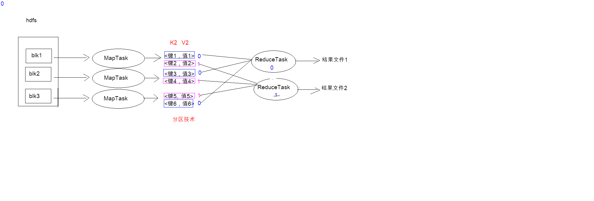
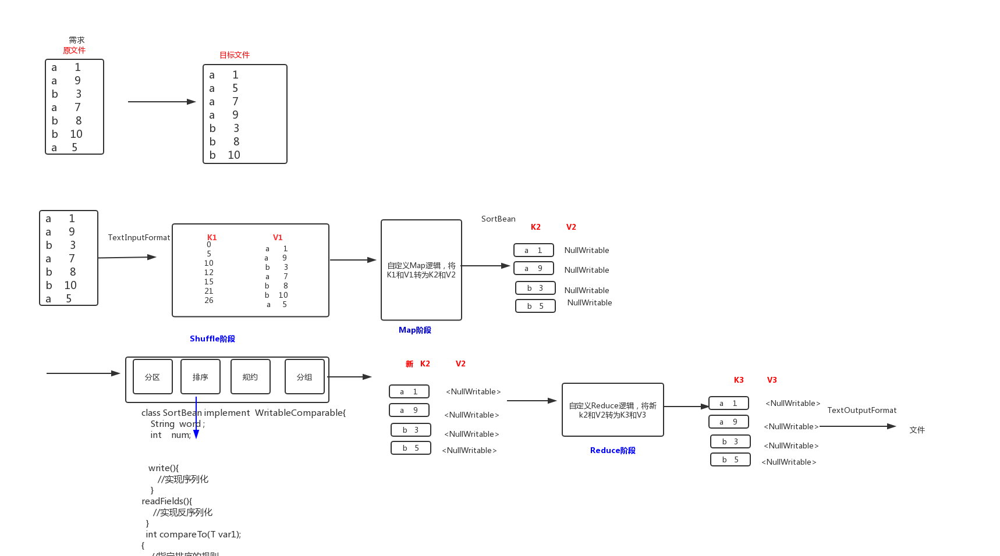

# 一、MapReduce概述

### 1.MapReduce介绍

MapReduce是一种编程模型，用于大规模数据集的并行运算。概念"**Map（映射）**"和"**Reduce（归约）**"，是它们的主要思想。它极大地方便了编程人员在不会分布式并行编程的情况下，将自己的程序运行在**分布式系统**上。 当前的软件实现是指定一个Map（映射）函数，用来把**一组键值对映射成一组新的键值对**，指定并发的Reduce（归约）函数，用来保证所有映射的键值对中的每一个共享相同的键组。 

- Map负责“分”，即把复杂的任务分解为若干个“简单的任务”来并行处理,可以进行拆分的前提是这些小任务可以并行计算，彼此间几乎没有依赖关系。 

- Reduce负责“合”，即对map阶段的结果进行全局汇总。 

- MapReduce运行在yarn集群 

  - ResourceManager

  - NodeManager


### 2.MapReduce设计构思 

MapReduce是一个分布式运算程序的编程框架，核心功能是将用户编写的业务逻辑代码和自带默认组件整合成一个完整的分布式运算程序，并发运行在Hadoop集群上。
MapReduce设计并提供了统一的计算框架，为程序员隐藏了绝大多数系统层面的处理细节。 为程序员提供一个抽象和高层的编程接口和框架。程序员仅需要关心其应用层的具体计算问 题，仅需编写少量的处理应用本身计算问题的程序代码。如何具体完成这个并行计算任务所 相关的诸多系统层细节被隐藏起来,交给计算框架去处理：
Map和Reduce为程序员提供了一个清晰的操作接口抽象描述。MapReduce中定义了如下的Map 和Reduce两个抽象的编程接口，由用户去编程实现.Map和Reduce,MapReduce处理的数据类型 是<key,value>键值对。

- Map: (k1; v1) → [(k2; v2)] 
- Reduce: (k2; [v2]) → [(k3; v3)]  

**一个完整的mapreduce程序在分布式运行时有三类实例进程**：

- MRAppMaster 负责整个程序的过程调度及状态协调

- MapTask 负责map阶段的整个数据处理流程 

- ReduceTask 负责reduce阶段的整个数据处理流程


### 3.MapReduce思想


### 4.MapReduce编程规范

##### 4.1 Map阶段2个步骤 

- 设置InputFormat类, 将数据切分为Key-Value(K1和V1) 对, 输入到第二步
- 自定义Map逻辑, 将第一步的结果转换成另外的Key-Value(K2和V2)对, 输出结果

##### 4.2 Shule阶段4个步骤 

- 对输出的Key-Value对进行分区
- 对不同分区的数据按照相同的Key排序
- (可选) 对分组过的数据初步规约, 降低数据的网络拷贝
- 对数据进行分组, 相同Key的Value放入一个集合中

##### 4.3 Reduce阶段2个步骤 

- 对多个Map任务的结果进行排序以及合并, 编写Reduce函数实现自己的逻辑, 对输入的Key-Value进行处理, 转为新的Key-Value(K3和V3)输出 
- 设置OutputFormat处理并保存Reduce输出的Key-Value数据


### 5.WordCount案例

##### 5.1 数据准备

`创建文件`

```shell
cd /export/servers 
vim wordcount.txt
```

`往文件放入内容`

```shell
hello,world,hadoop
hive,sqoop,flume,hello
kitty,tom,jerry,world
hadoop
```

`在HDFS创建输入文件夹并上传文件`

```shell
hdfs dfs -mkdir -p /input/wordcount_input
hdfs dfs -put wordcount.txt /input/wordcount_input
```

##### 5.2 Mapper编写

```java
package WordCount;

import org.apache.hadoop.io.LongWritable;
import org.apache.hadoop.io.Text;
import org.apache.hadoop.mapreduce.Mapper;

import java.io.IOException;

/*
    四个泛型解释
        KEYIN:K1的类型
        VALUEIN:V1的类型

        KEYOUT:K2的类型
        VALUEOUT:V2的类型
 */
public class WordCountMapper extends Mapper<LongWritable, Text, Text, LongWritable> {
    //map方法将 K1 和 V1 转为 k2 和 V2
    /*
        参数:
            key:    K1 行偏移量
            value:  V1 每一行文本数据
            context:   表示上下文对象
     */
    @Override
    protected void map(LongWritable key, Text value, Context context) throws IOException, InterruptedException {
        Text text = new Text(); //转换数据类型,不写在循环里，否则每次都创建对象
        LongWritable longWritable = new LongWritable(); //转换数据类型,不写在循环里，否则每次都创建对象

        //1:将文本数据进行拆分
        String[] split = value.toString().split(",");

        //2:遍历数组,组装 K2 和 V2
        for (String word : split){
            //3:将 K2 和 V2 写入上下文
            text.set(word);
            longWritable.set(1);
            context.write(text, longWritable);
        }
    }
}
```

##### 5.3 Reducer编写

```java
package WordCount;

import org.apache.hadoop.io.LongWritable;
import org.apache.hadoop.io.Text;
import org.apache.hadoop.mapreduce.Reducer;

import java.io.IOException;

/*
    四个泛型解释
        KEYIN:K2的类型
        VALUEIN:V2的类型

        KEYOUT:K3的类型
        VALUEOUT:V3的类型
 */
public class WordCountReducer extends Reducer<Text, LongWritable, Text, LongWritable> {
    //reduce方法将 K2 和 V2 转为 k3 和 V3
    /*
        参数:
            key:    K2  分割出的文本
            value:  V2  集合
            context:    表示上下文对象
    */

    @Override
    protected void reduce(Text key, Iterable<LongWritable> values, Context context) throws IOException, InterruptedException {
        long count = 0;
        //1:遍历集合,将集合中的数字相加，得到 V3
        for (LongWritable value :values){
            count += value.get();
        }
        //2:将 K3 和 V3 写入上下文
        context.write(key, new LongWritable(count));
    }
}
```

##### 5.4 主类JobMain编写

```java
package WordCount;

import org.apache.hadoop.conf.Configuration;
import org.apache.hadoop.conf.Configured;
import org.apache.hadoop.fs.FileSystem;
import org.apache.hadoop.fs.Path;
import org.apache.hadoop.io.LongWritable;
import org.apache.hadoop.io.Text;
import org.apache.hadoop.mapreduce.Job;
import org.apache.hadoop.mapreduce.lib.input.TextInputFormat;
import org.apache.hadoop.mapreduce.lib.output.TextOutputFormat;
import org.apache.hadoop.util.Tool;
import org.apache.hadoop.util.ToolRunner;

import java.net.URI;

public class JobMain extends Configured implements Tool {
    @Override
    public int run(String[] strings) throws Exception {
        /*
        1:创建一个job任务对象
         */
        Job job = Job.getInstance(super.getConf(), "wordcount");
        //如果打包运行出错,则需要加该配置
        job.setJarByClass(JobMain.class);

        /*
        2:配置job任务对象(八个步骤)
         */
        //第一步:指定文件的读取方式和读取路径
        job.setInputFormatClass(TextInputFormat.class);
        TextInputFormat.addInputPath(job, new Path("hdfs://node01:8020/input/wordcount_input")); //集群运行模式读取路径
        //TextInputFormat.addInputPath(job, new Path("file:///D:\\input\\wordcount_input")); //本地运行模式读取路径


        //第二步:指定Map阶段的处理方式和数据类型
        job.setMapperClass(WordCountMapper.class);
        //设置Map阶段K2的类型
        job.setMapOutputKeyClass(Text.class);
        //设置Map阶段V2的类型
        job.setMapOutputValueClass(LongWritable.class);


        //第三、四、五、六 采用默认的方式

        //第七步:指定Reduce阶段的处理方式和数据类型
        job.setReducerClass(WordCountReducer.class);
        //设置K3的类型
        job.setOutputKeyClass(Text.class);
        //设置V3的类型
        job.setOutputValueClass(LongWritable.class);

        //第八步: 设置输出类型
        job.setOutputFormatClass(TextOutputFormat.class);
        //设置输出的路径
        Path path = new Path("hdfs://node01:8020/output/wordcount_output"); //集群运行模式输出路径
        TextOutputFormat.setOutputPath(job, path);
        //TextOutputFormat.setOutputPath(job, new Path("file:///D:\\mapreduce\\output\\wordcount_output")); //本地运行模式输出路径

        //获取FileSystem
        FileSystem fileSystem = FileSystem.get(new URI("hdfs://node01:8020"), new Configuration());

        //判断目录是否存在
        boolean bl2 = fileSystem.exists(path);
        if(bl2){
            //删除目标目录
            fileSystem.delete(path, true);
        }

        //等待任务结束
        boolean bl = job.waitForCompletion(true);

        return bl ? 0:1;
    }

    public static void main(String[] args) throws Exception {
        Configuration configuration = new Configuration();

        //启动job任务
        int run = ToolRunner.run(configuration, new JobMain(), args);
        System.exit(run);
    }
}
```

##### 5.5 运行

`idea打jar包`

点击idea右侧的Maven，选择要打包的项目，双击对应项目的Lifecycle下的package即可

`上传jar包`

在target目录找到**MapReduce-1.0-SNAPSHOT.jar**包

`运行jar包`

```shell
hadoop jar MapReduce-1.0-SNAPSHOT.jar WordCount.JobMain
```

**注:主类路径(WordCount.JobMain)获取方式为右键点击主类Copy里的Copy Reference**

`读取生成的文件`

```shell
hdfs dfs -cat /output/wordcount_output/part-r-00000
```

<br>

# 二、MapReduce分区

### 1.分区概述

在 MapReduce 中, 通过我们指定分区, 会将同一个分区的数据发送到同一个 Reduce 当中进行 处理

例如: 为了数据的统计, 可以把一批类似的数据发送到同一个 Reduce 当中, 在同一个 Reduce 当 中统计相同类型的数据, 就可以实现类似的数据分区和统计等

##### 注:Reduce 当中默认的分区只有一个

### 2.Shuffle阶段分区概述



编写分区代码(对彩票中大于等于15和小于15的进行分组)

### 3.分区案例

##### 3.1 数据准备

`在HDFS创建输入文件夹并上传文件`

```shell
hdfs dfs -mkdir /input/partition_input
hdfs dfs -put partition.csv /input/partition_input
```

##### 3.2 Mapper编写

```java
package Partition;

import org.apache.hadoop.io.LongWritable;
import org.apache.hadoop.io.NullWritable;
import org.apache.hadoop.io.Text;
import org.apache.hadoop.mapreduce.Mapper;

import java.io.IOException;

/*
    K1: 行偏移量     LongWritable
    V1: 行文本数据   Text

    K2: 行文本数据   Text
    V2: LongWritable
 */
public class PartitionMapper extends Mapper<LongWritable, Text,Text, NullWritable> {
    @Override
    protected void map(LongWritable key, Text value, Context context) throws IOException, InterruptedException {
        context.write(value,NullWritable.get()); //NullWritable无法直接写入
    }
}
```

##### 3.3 Partitioner编写

```java
package Partition;

import org.apache.hadoop.io.NullWritable;
import org.apache.hadoop.io.Text;
import org.apache.hadoop.mapreduce.Partitioner;

public class MyPartitioner extends Partitioner<Text,NullWritable> {
    @Override
    public int getPartition(Text text, NullWritable nullWritable, int i) {
        //1:拆分行文本数据(K2),获取中奖字段的值
        String[] split = text.toString().split("\t");
        String numStr = split[5];

        //2:判断中奖字段的值和15的关系,然后返回对应的分区编号
        if(Integer.parseInt(numStr) > 15){
            return  1;
        }else{
            return  0;
        }
    }
}
```

##### 3.4 Reducer编写

```java
package Partition;

import org.apache.hadoop.io.NullWritable;
import org.apache.hadoop.io.Text;
import org.apache.hadoop.mapreduce.Reducer;

import java.io.IOException;

/*
  K2:   Text
  V2:   NullWritable

  K3:   Text
  V3:   NullWritable
 */
public class PartitionerReducer extends Reducer<Text,NullWritable,Text,NullWritable> {
    @Override
    protected void reduce(Text key, Iterable<NullWritable> values, Context context) throws IOException, InterruptedException {
        context.write(key, NullWritable.get());
    }
}
```

##### 3.5主类JobMain编写

```java
package Partition;

import org.apache.hadoop.conf.Configuration;
import org.apache.hadoop.conf.Configured;
import org.apache.hadoop.fs.FileSystem;
import org.apache.hadoop.fs.Path;
import org.apache.hadoop.io.NullWritable;
import org.apache.hadoop.io.Text;
import org.apache.hadoop.mapreduce.Job;
import org.apache.hadoop.mapreduce.lib.input.TextInputFormat;
import org.apache.hadoop.mapreduce.lib.output.TextOutputFormat;
import org.apache.hadoop.util.Tool;
import org.apache.hadoop.util.ToolRunner;

import java.net.URI;

public class JobMain extends Configured implements Tool {
    @Override
    public int run(String[] args) throws Exception {
        //1:创建job任务对象
        Job job = Job.getInstance(super.getConf(), "partition");
        //如果打包运行出错,则需要加该配置
        job.setJarByClass(JobMain.class);

        //2:对job任务进行配置(八个步骤)
        //第一步:设置输入类和输入的路径
        job.setInputFormatClass(TextInputFormat.class);
        TextInputFormat.addInputPath(job, new Path("hdfs://node01:8020/input/partition_input"));
        //TextInputFormat.addInputPath(job, new Path("file:///D:\\input\\partition_input"));

        //第二步:设置Mapper类和数据类型（K2和V2）
        job.setMapperClass(PartitionMapper.class);
        job.setMapOutputKeyClass(Text.class);
        job.setMapOutputValueClass(NullWritable.class);

        //第三步，指定分区类
        job.setPartitionerClass(MyPartitioner.class);

        //第四、五、六步

        //第七步:指定Reducer类和数据类型(K3和V3)
        job.setReducerClass(PartitionerReducer.class);
        job.setOutputValueClass(Text.class);
        job.setOutputValueClass(NullWritable.class);
        //设置ReduceTask的个数
        job.setNumReduceTasks(2);

        //第八步:指定输出类和输出路径
        job.setOutputFormatClass(TextOutputFormat.class);
        TextOutputFormat.setOutputPath(job, new Path("hdfs://node01:8020/output/partition_output"));
        //TextOutputFormat.setOutputPath(job, new Path("file:///D:\\output\\partition_output"));

        //获取FileSystem
        FileSystem fileSystem = FileSystem.get(new URI("hdfs://node01:8020"), new Configuration());

        //判断目录是否存在
        Path path = new Path("hdfs://node01:8020/output/partition_output");
        boolean bl2 = fileSystem.exists(path);
        if(bl2){
            //删除目标目录
            fileSystem.delete(path, true);
        }

        //3:等待任务结束
        boolean bl = job.waitForCompletion(true);

        return bl?0:1;
    }

    public static void main(String[] args) throws Exception {
        Configuration configuration = new Configuration();

        //启动job任务
        int run = ToolRunner.run(configuration, new JobMain(), args);
        System.exit(run);
    }
}
```

##### 3.6运行

`idea打jar包`

点击idea右侧的Maven，选择要打包的项目，双击对应项目的Lifecycle下的**clean**后再点击**package**

`上传jar包`

在target目录找到**MapReduce-1.0-SNAPSHOT.jar**包

`运行jar包`

```shell
hadoop jar MapReduce-1.0-SNAPSHOT.jar Partition.JobMain
```

**注:主类路径(Partition.JobMain)获取方式为右键点击主类Copy里的Copy Reference**

`读取生成的文件`

```shell
hdfs dfs -cat /output/partition_output/part-r-00000 #小于15

hdfs dfs -cat /output/partition_output/part-r-00001 #大于15
```

<br>

# 三、MapReduce的计数器

### 1.概述

计数器是收集作业统计信息的有效手段之一，用于质量控制或应用级统计。计数器还可辅助 诊断系统故障。如果需要将日志信息传输到 map 或 reduce 任务， 更好的方法通常是看能否 用一个计数器值来记录某一特定事件的发生。对于大型分布式作业而言，使用计数器更为方 便。除了因为获取计数器值比输出日志更方便，还有根据计数器值统计特定事件的发生次数 要比分析一堆日志文件容易得多。

### 2.hadoop内置计数器列表

| MapReduce任务计数器    | org.apache.hadoop.mapreduce.TaskCounter                      |
| ---------------------- | ------------------------------------------------------------ |
| 文件系统计数器         | org.apache.hadoop.mapreduce.FileSystemCounter                |
| FileInputFormat计数器  | org.apache.hadoop.mapreduce.lib.input.FileInputFormatCounter |
| FileOutputFormat计数器 | org.apache.hadoop.mapreduce.lib.output.FileOutputFormatCounter |
| 作业计数器             | org.apache.hadoop.mapreduce.JobCounter                       |

### 3.自定义计数器

##### 3.1 方式一:通过context上下文对象获取计数器，通过context上下文对象，在map端使用计数器进行统计

```java
public class PartitionMapper  extends Mapper<LongWritable,Text,Text,NullWritable>{    
    @Override   
    protected void map(LongWritable key, Text value, Context context) throws Exception{   
        Counter counter = context.getCounter("MR_COUNT", "MyRecordCounter");   		              counter.increment(1L);
        context.write(value,NullWritable.get());   
    }
}
```

##### 3.2 方式二:通过enum枚举类型来定义计数器统计reduce端数据的输入的key有多少个

```java
public class PartitionerReducer extends Reducer<Text,NullWritable,Text,NullWritable> {   	public static enum Counter{       
    MY_REDUCE_INPUT_RECORDS,MY_REDUCE_INPUT_BYTES   
	}                                                                              			@Override                                                                                 protected void reduce(Text key, Iterable<NullWritable> values, Context context) throws IOException, InterruptedException {
       context.getCounter(Counter.MY_REDUCE_INPUT_RECORDS).increment(1L);                        context.write(key, NullWritable.get());        
   }                                                                                      }
```

<br>

# 四、MapReduce序列化和排序

### 1.序列化概述

- 序列化(Serialization)是指把结构化对象转化为字节流

- 反序列化 (Deserialization) 是序列化的逆过程,把字节流转为结构化对象. 当要在进程间传递对象或持久化对象的时候, 就需要序列化对象成字节流, 反之当要将接收到或从磁盘读取 的字节流转换为对象, 就要进行反序列化

- Java 的序列化 (Serializable) 是一个重量级序列化框架, 一个对象被序列化后, 会附带很多额 外的信息(各种校验信息, header, 继承体系等, 不便于在网络中高效传输. 所以, Hadoop 自己开发了一套序列化机制(Writable), 精简高效,不用像 Java 对象类一样传输多层的父子 关系, 需要哪个属性就传输哪个属性值, 大大的减少网络传输的开销 

- Writable是Hadoop的序列化格式, Hadoop定义了这样一个Writable接口,一个类要支持可序列化只需实现这个接口即可

- 另外Writable有一个子接口是WritableComparable,WritableComparable是既可实现序列化, 也可以对key进行比较, 我们这里可以通过自定义Key实现WritableComparable来实现 我们的排序功能

### 2.排序案例概述

##### 2.1数据格式

```shell
a   1 
a   9
b   3
a   7 
b   8
b   10
a   5
```

##### 2.2要求

- 第一列按照字典顺序进行排列
- 第一列相同的时候, 第二列按照升序进行排列

##### 2.3流程



### 3.排序案例代码编写

##### 3.1 数据准备

`在HDFS创建输入文件夹并上传文件`

```shell
hdfs dfs -mkdir /input/sort_input
hdfs dfs -put sort.txt /input/sort_input
```

##### 3.2 自定义类型和比较器

```java
package SortData;

import org.apache.hadoop.io.WritableComparable;

import java.io.DataInput;
import java.io.DataOutput;
import java.io.IOException;

public class SortBean implements WritableComparable<SortBean> {

    private String word;
    private int num;

    public String getWord() {
        return word;
    }

    public void setWord(String word) {
        this.word = word;
    }

    public int getNum() {
        return num;
    }

    public void setNum(int num) {
        this.num = num;
    }

    @Override
    public String toString() {
        return word + "\t" + num;
    }

    //实现比较器，指定排序的规则
    /*
      规则:快速排序  归并排序
        第一列(word)按照字典顺序进行排列  aac   aad
        第一列相同的时候, 第二列(num)按照升序进行排列
     */
    @Override
    public int compareTo(SortBean sortBean) {
        int result = this.word.compareTo(sortBean.word); //对第一列:word排序
        if(result == 0){ //如果第一列相同，对第二列:num排序
            return this.num - sortBean.num;
        }
        return result;
    }

    //实现序列化
    @Override
    public void write(DataOutput dataOutput) throws IOException {
        dataOutput.writeUTF(word);
        dataOutput.writeInt(num);
    }

    //实现反序列化
    @Override
    public void readFields(DataInput dataInput) throws IOException {
        this.word = dataInput.readUTF();
        this.num = dataInput.readInt();
    }
}
```

##### 3.3 Mapper编写

```java
package SortData;

import org.apache.hadoop.io.LongWritable;
import org.apache.hadoop.io.NullWritable;
import org.apache.hadoop.io.Text;
import org.apache.hadoop.mapreduce.Mapper;

import java.io.IOException;

public class SortMapper extends Mapper<LongWritable, Text, SortBean, NullWritable> {
    /*
      map方法将K1和V1转为K2和V2:

      K1            V1
      0            a  3
      5            b  7
      ----------------------
      K2                         V2
      SortBean(a  3)         NullWritable
      SortBean(b  7)         NullWritable
     */
    @Override
    protected void map(LongWritable key, Text value, Context context) throws IOException, InterruptedException {
        //1:将行文本数据(V1)拆分,并将数据封装到SortBean对象,就可以得到K2
        String[] split = value.toString().split("\t");

        SortBean sortBean = new SortBean();
        sortBean.setWord(split[0]);
        sortBean.setNum(Integer.parseInt(split[1])); //string类型转int类型

        //2:将K2和V2写入上下文中
        context.write(sortBean, NullWritable.get());
    }
}
```

##### 3.4 Reducer编写

```java
package SortData;

import org.apache.hadoop.io.NullWritable;
import org.apache.hadoop.mapreduce.Reducer;

import java.io.IOException;

public class SortReducer extends Reducer<SortBean,NullWritable,SortBean,NullWritable> {
    //reduce方法将新的K2和V2转为K3和V3
    @Override
    protected void reduce(SortBean key, Iterable<NullWritable> values, Context context) throws IOException, InterruptedException {
       context.write(key, NullWritable.get());
    }
}
```

##### 3.5 主类JobMain编写

```java
package SortData;

import org.apache.hadoop.conf.Configuration;
import org.apache.hadoop.conf.Configured;
import org.apache.hadoop.fs.FileSystem;
import org.apache.hadoop.fs.Path;
import org.apache.hadoop.io.NullWritable;
import org.apache.hadoop.mapreduce.Job;
import org.apache.hadoop.mapreduce.lib.input.TextInputFormat;
import org.apache.hadoop.mapreduce.lib.output.TextOutputFormat;
import org.apache.hadoop.util.Tool;
import org.apache.hadoop.util.ToolRunner;

import java.net.URI;

public class JobMain extends Configured implements Tool {
    @Override
    public int run(String[] args) throws Exception {
        /*
        1:创建job对象
         */
        Job job = Job.getInstance(super.getConf(), "sortdata");
        //如果打包运行出错,则需要加该配置
        job.setJarByClass(JobMain.class);

        /*
        2:配置job任务(八个步骤)
         */
        //第一步:设置输入类和输入的路径
        job.setInputFormatClass(TextInputFormat.class);
        TextInputFormat.addInputPath(job, new Path("hdfs://node01:8020/input/sort_input"));
        //TextInputFormat.addInputPath(job, new Path("file:///D:\\input\\input\\sort_input"));

        //第二步: 设置Mapper类和数据类型
        job.setMapperClass(SortMapper.class);
        job.setMapOutputKeyClass(SortBean.class);
        job.setMapOutputValueClass(NullWritable.class);

        //第三、四(第四步排序不用在主类设置)、五、六

        //第七步：设置Reducer类和类型
        job.setReducerClass(SortReducer.class);
        job.setOutputKeyClass(SortBean.class);
        job.setOutputValueClass(NullWritable.class);


        //第八步: 设置输出类和输出的路径
        job.setOutputFormatClass(TextOutputFormat.class);
        TextOutputFormat.setOutputPath(job, new Path("hdfs://node01:8020/output/sort_output"));
        //TextOutputFormat.setOutputPath(job, new Path("file:///D:\\output\\sort_output"));

        //获取FileSystem
        FileSystem fileSystem = FileSystem.get(new URI("hdfs://node01:8020"), new Configuration());

        //判断目录是否存在
        Path path = new Path("hdfs://node01:8020/output/sort_output");
        boolean bl2 = fileSystem.exists(path);
        if(bl2){
            //删除目标目录
            fileSystem.delete(path, true);
        }

        /*
        3:等待任务结束
         */
        boolean bl = job.waitForCompletion(true);

        return bl?0:1;
    }

    public static void main(String[] args) throws Exception {
        Configuration configuration = new Configuration();

        //启动job任务
        int run = ToolRunner.run(configuration, new JobMain(), args);
        System.exit(run);
    }
}
```

##### 3.6 运行

`idea打jar包`

点击idea右侧的Maven，选择要打包的项目，双击对应项目的Lifecycle下的**clean**后再点击**package**

`上传jar包`

在target目录找到**MapReduce-1.0-SNAPSHOT.jar**包

`运行jar包`

```shell
hadoop jar MapReduce-1.0-SNAPSHOT.jar SortData.JobMain
```

**注:主类路径(Partition.JobMain)获取方式为右键点击主类Copy里的Copy Reference**

`读取生成的文件`

```shell
hdfs dfs -cat /output/sort_output/part-r-00000
```

<br>

# 五、MapReduce规约

### 1.概念

每一个map都可能会产生大量的本地输出，Combiner的作用就是**对map端的输出先做一次合并**，以减少在map 和reduce节点之间的数据传输量，以提高网络IO性能，是MapReduce的一种优化手段之一

- combiner是MR程序中Mapper和Reducer之外的一种组件

- combiner组件的父类就是Reducer

- combiner和reducer的区别在于运行的位置
  - Combiner是在每一个maptask所在的节点运行
  - Reducer是接收全局所有Mapper的输出结果

- combiner的意义就是对每一个maptask的输出进行局部汇总，以减小网络传输量


### 2.实现步骤(WordCount案例改编)

##### 2.1 Combiner编写

```java
public class MyCombiner extends Reducer<Text, LongWritable, Text, LongWritable> {
    @Override
    protected void reduce(Text key, Iterable<LongWritable> values, Context context) throws IOException, InterruptedException {
        long count = 0;
        //1:遍历集合,将集合中的数字相加，得到 V3
        for (LongWritable value :values){
            count += value.get();
        }
        //2:将 K3 和 V3 写入上下文
        context.write(key, new LongWritable(count));
    }
}
```

##### 2.2 主类JobMain编写

```java
//第三、四步采用默认设置

//第五步:规约(Combiner)
job.setCombinerClass(MyCombiner.class);

//第六步采用默认设置
```

<br>

# 六、MapReduce综合案例-流量统计


## 需求一:统计求和 

`具体需求`

统计每个手机号的**上行数据包总和**，**下行数据包总和**，**上行总流量之和**，**下行总流量之和** 

`分 析`

以手机号码作为key值，上行流量，下行流量，上行总流量，下行总流量四个字段作为value值，然后以这个key，和value作为map阶段的输出，reduce阶段的输入

### 1.自定义map的输出value对象FlowBean 

```java
package FlowCount_Statistics;

import org.apache.hadoop.io.Writable;

import java.io.DataInput;
import java.io.DataOutput;
import java.io.IOException;

public class FlowBean implements Writable {
    private Integer upFlow;  //上行数据包数
    private Integer downFlow;  //下行数据包数
    private Integer upCountFlow; //上行流量总和
    private Integer downCountFlow;//下行流量总和

    public Integer getUpFlow() {
        return upFlow;
    }

    public void setUpFlow(Integer upFlow) {
        this.upFlow = upFlow;
    }

    public Integer getDownFlow() {
        return downFlow;
    }

    public void setDownFlow(Integer downFlow) {
        this.downFlow = downFlow;
    }

    public Integer getUpCountFlow() {
        return upCountFlow;
    }

    public void setUpCountFlow(Integer upCountFlow) {
        this.upCountFlow = upCountFlow;
    }

    public Integer getDownCountFlow() {
        return downCountFlow;
    }

    public void setDownCountFlow(Integer downCountFlow) {
        this.downCountFlow = downCountFlow;
    }

    @Override
    public String toString() {
        return  upFlow +
                "\t" + downFlow +
                "\t" + upCountFlow +
                "\t" + downCountFlow;
    }

    //序列化方法
    @Override
    public void write(DataOutput dataOutput) throws IOException {
        dataOutput.writeInt(upFlow);
        dataOutput.writeInt(downFlow);
        dataOutput.writeInt(upCountFlow);
        dataOutput.writeInt(downCountFlow);
    }

    //反序列化
    @Override
    public void readFields(DataInput dataInput) throws IOException {
        this.upFlow = dataInput.readInt();
        this.downFlow = dataInput.readInt();
        this.upCountFlow = dataInput.readInt();
        this.downCountFlow = dataInput.readInt();
    }
}
```

### 2.定义FlowMapper

```java
package FlowCount_Statistics;

import org.apache.hadoop.io.LongWritable;
import org.apache.hadoop.io.Text;
import org.apache.hadoop.mapreduce.Mapper;

import java.io.IOException;

public class FlowCountMapper extends Mapper<LongWritable,Text,Text,FlowBean> {
    /*
      将K1和V1转为K2和V2:
      K1              V1
      0               1363157985059 	13600217502	00-1F-64-E2-E8-B1:CMCC	120.196.100.55	www.baidu.com	综合门户	19	128	1177	16852	200
     ------------------------------
      K2              V2
      13600217502     FlowBean(19	128	1177	16852)
     */
    @Override
    protected void map(LongWritable key, Text value, Context context) throws IOException, InterruptedException {
        //1:拆分行文本数据,得到手机号--->K2
        String[] split = value.toString().split("\t");
        String phoneNum = split[1];

        //2:创建FlowBean对象,并从行文本数据拆分出流量的四个四段,并将四个流量字段的值赋给FlowBean对象
        FlowBean flowBean = new FlowBean();

        flowBean.setUpFlow(Integer.parseInt(split[6]));
        flowBean.setDownFlow(Integer.parseInt(split[7]));
        flowBean.setUpCountFlow(Integer.parseInt(split[8]));
        flowBean.setDownCountFlow(Integer.parseInt(split[9]));

        //3:将K2和V2写入上下文中
        context.write(new Text(phoneNum), flowBean);

    }
}
```

### 3.定义FlowReducer

```java
package FlowCount_Statistics;

import org.apache.hadoop.io.Text;
import org.apache.hadoop.mapreduce.Reducer;

import java.io.IOException;

public class FlowCountReducer extends Reducer<Text,FlowBean,Text,FlowBean> {
    @Override
    protected void reduce(Text key, Iterable<FlowBean> values, Context context) throws IOException, InterruptedException {
        //1:遍历集合,并将集合中的对应的四个字段累计
         Integer upFlow = 0;  //上行数据包数
         Integer downFlow = 0;  //下行数据包数
         Integer upCountFlow = 0; //上行流量总和
         Integer downCountFlow = 0;//下行流量总和

        for (FlowBean value : values) {
            upFlow += value.getUpFlow();
            downFlow += value.getDownFlow();
            upCountFlow += value.getUpCountFlow();
            downCountFlow += value.getDownCountFlow();
        }

        //2:创建FlowBean对象,并给对象赋值  V3
        FlowBean flowBean = new FlowBean();
        flowBean.setUpFlow(upFlow);
        flowBean.setDownFlow(downFlow);
        flowBean.setUpCountFlow(upCountFlow);
        flowBean.setDownCountFlow(downCountFlow);

        //3:将K3和V3下入上下文中
        context.write(key, flowBean);
    }
}
```

### 4.程序main函数入口JobMain

```java
package FlowCount_Statistics;

import org.apache.hadoop.conf.Configuration;
import org.apache.hadoop.conf.Configured;
import org.apache.hadoop.fs.FileSystem;
import org.apache.hadoop.fs.Path;
import org.apache.hadoop.io.Text;
import org.apache.hadoop.mapreduce.Job;
import org.apache.hadoop.mapreduce.lib.input.TextInputFormat;
import org.apache.hadoop.mapreduce.lib.output.TextOutputFormat;
import org.apache.hadoop.util.Tool;
import org.apache.hadoop.util.ToolRunner;

import java.net.URI;

public class JobMain extends Configured implements Tool {
    @Override
    public int run(String[] args) throws Exception {
        //1:创建job任务对象
        Job job = Job.getInstance(super.getConf(), "flowcount_statistics");
        //如果打包运行出错,则需要加该配置
        job.setJarByClass(JobMain.class);

        //2:对job任务进行配置(八个步骤)
        //第一步:设置输入类和输入的路径
        job.setInputFormatClass(TextInputFormat.class);
        TextInputFormat.addInputPath(job, new Path("hdfs://node01:8020/input/flowcount_statistics"));
        //TextInputFormat.addInputPath(job, new Path("file:///D:\\input\\flowcount_statistics"));

        //第二步:设置Mapper类和数据类型（K2和V2）
        job.setMapperClass(FlowCountMapper.class);
        job.setMapOutputKeyClass(Text.class);
        job.setMapOutputValueClass(FlowBean.class);

        //第三、四、五、六步

        //第七步:指定Reducer类和数据类型(K3和V3)
        job.setReducerClass(FlowCountReducer.class);
        job.setOutputValueClass(Text.class);
        job.setOutputValueClass(FlowBean.class);

        //第八步:指定输出类和输出路径
        job.setOutputFormatClass(TextOutputFormat.class);
        TextOutputFormat.setOutputPath(job, new Path("hdfs://node01:8020/output/flowcount_statistics"));
        //TextOutputFormat.setOutputPath(job, new Path("file:///D:\\output\\flowcount_statistics"));

        //获取FileSystem
        FileSystem fileSystem = FileSystem.get(new URI("hdfs://node01:8020"), new Configuration());

        //判断目录是否存在
        Path path = new Path("hdfs://node01:8020/output/flowcount_statistics");
        boolean bl2 = fileSystem.exists(path);
        if(bl2){
            //删除目标目录
            fileSystem.delete(path, true);
        }

        //3:等待任务结束
        boolean bl = job.waitForCompletion(true);

        return bl?0:1;
    }

    public static void main(String[] args) throws Exception {
        Configuration configuration = new Configuration();

        //启动job任务
        int run = ToolRunner.run(configuration, new JobMain(), args);
        System.exit(run);
    }
}
```

### 5.数据准备与运行

```shell
hdfs dfs -mkdir /input/flowcount_statistics
hdfs dfs -put data_flow.dat /input/flowcount_statistics

hadoop jar MapReduce-1.0-SNAPSHOT.jar FlowCount_Statistics.JobMain
```

## 需求二: 上行流量倒序排序(递减排序)

`分析`

以需求一的输出数据作为排序的输入数据，**自定义FlowBean**,以FlowBean为map输出的 key，以手机号作为Map输出的value，因为MapReduce程序会对Map阶段输出的key进行排序

### 1.定义FlowBean实现WritableComparable实现比较排序

```java
package FlowCount_Sort;

import org.apache.hadoop.io.WritableComparable;

import java.io.DataInput;
import java.io.DataOutput;
import java.io.IOException;

public class FlowBean implements WritableComparable<FlowBean> {
    private Integer upFlow;  //上行数据包数
    private Integer downFlow;  //下行数据包数
    private Integer upCountFlow; //上行流量总和
    private Integer downCountFlow;//下行流量总和

    public Integer getUpFlow() {
        return upFlow;
    }

    public void setUpFlow(Integer upFlow) {
        this.upFlow = upFlow;
    }

    public Integer getDownFlow() {
        return downFlow;
    }

    public void setDownFlow(Integer downFlow) {
        this.downFlow = downFlow;
    }

    public Integer getUpCountFlow() {
        return upCountFlow;
    }

    public void setUpCountFlow(Integer upCountFlow) {
        this.upCountFlow = upCountFlow;
    }

    public Integer getDownCountFlow() {
        return downCountFlow;
    }

    public void setDownCountFlow(Integer downCountFlow) {
        this.downCountFlow = downCountFlow;
    }

    @Override
    public String toString() {
        return  upFlow +
                "\t" + downFlow +
                "\t" + upCountFlow +
                "\t" + downCountFlow;
    }

    //序列化方法
    @Override
    public void write(DataOutput out) throws IOException {
        out.writeInt(upFlow);
        out.writeInt(downFlow);
        out.writeInt(upCountFlow);
        out.writeInt(downCountFlow);
    }

    //反序列化
    @Override
    public void readFields(DataInput in) throws IOException {
        this.upFlow = in.readInt();
        this.downFlow = in.readInt();
        this.upCountFlow = in.readInt();
        this.downCountFlow = in.readInt();
    }

    //指定排序的规则
    @Override
    public int compareTo(FlowBean flowBean) {
       // return this.upFlow.compareTo(flowBean.getUpFlow()) * -1;
       return flowBean.upFlow - this.upFlow ;
    }
}
```

### 2.定义FlowMappe

```java
package FlowCount_Sort;

import org.apache.hadoop.io.LongWritable;
import org.apache.hadoop.io.Text;
import org.apache.hadoop.mapreduce.Mapper;

import java.io.IOException;

/*
   K1: LongWritable 行偏移量
   V1: Text         行文本数据

   K2: FLowBean
   V2: Text       手机号
 */

public class FlowSortMapper extends Mapper<LongWritable,Text,FlowBean,Text> {
    //map方法:将K1和V1转为K2和V2
    @Override
    protected void map(LongWritable key, Text value, Context context) throws IOException, InterruptedException {
        //1:拆分行文本数据(V1),得到四个流量字段,并封装FlowBean对象---->K2
        String[] split = value.toString().split("\t");

        FlowBean flowBean = new FlowBean();

        flowBean.setUpFlow(Integer.parseInt(split[1]));
        flowBean.setDownFlow(Integer.parseInt(split[2]));
        flowBean.setUpCountFlow(Integer.parseInt(split[3]));
        flowBean.setDownCountFlow(Integer.parseInt(split[4]));

        //2:通过行文本数据,得到手机号--->V2
        String phoneNum = split[0];

        //3:将K2和V2下入上下文中
        context.write(flowBean, new Text(phoneNum));

    }
}
```

### 3. 定义FlowReducer 

```java
package FlowCount_Sort;

import org.apache.hadoop.io.Text;
import org.apache.hadoop.mapreduce.Reducer;


import java.io.IOException;

/*
  K2: FlowBean
  V2: Text  手机号

  K3: Text  手机号
  V3: FlowBean
 */

public class FlowSortReducer extends Reducer<FlowBean,Text,Text,FlowBean> {
    @Override
    protected void reduce(FlowBean key, Iterable<Text> values, Context context) throws IOException, InterruptedException {
        //1:遍历集合,取出 K3,并将K3和V3写入上下文中
        for (Text value : values) {
            context.write(value, key);
        }

    }
}
```

### 4.程序main函数入口JobMain

```java
package FlowCount_Sort;

import org.apache.hadoop.conf.Configuration;
import org.apache.hadoop.conf.Configured;
import org.apache.hadoop.fs.FileSystem;
import org.apache.hadoop.fs.Path;
import org.apache.hadoop.io.Text;
import org.apache.hadoop.mapreduce.Job;
import org.apache.hadoop.mapreduce.lib.input.TextInputFormat;
import org.apache.hadoop.mapreduce.lib.output.TextOutputFormat;
import org.apache.hadoop.util.Tool;
import org.apache.hadoop.util.ToolRunner;

import java.net.URI;

public class JobMain extends Configured implements Tool {
    @Override
    public int run(String[] args) throws Exception {
        //1:创建job任务对象
        Job job = Job.getInstance(super.getConf(), "flowcount_sort");
        //如果打包运行出错,则需要加该配置
        job.setJarByClass(JobMain.class);

        //2:对job任务进行配置(八个步骤)
        //第一步:设置输入类和输入的路径
        job.setInputFormatClass(TextInputFormat.class);
        TextInputFormat.addInputPath(job, new Path("hdfs://node01:8020/input/flowcount_sort"));
        //TextInputFormat.addInputPath(job, new Path("file:///D:\\input\\flowcount_sort"));

        //第二步:设置Mapper类和数据类型（K2和V2）
        job.setMapperClass(FlowSortMapper.class);
        job.setMapOutputKeyClass(FlowBean.class);
        job.setMapOutputValueClass(Text.class);

        //第三、四、五、六步

        //第七步:指定Reducer类和数据类型(K3和V3)
        job.setReducerClass(FlowSortReducer.class);
        job.setOutputValueClass(Text.class);
        job.setOutputValueClass(FlowBean.class);

        //第八步:指定输出类和输出路径
        job.setOutputFormatClass(TextOutputFormat.class);
        TextOutputFormat.setOutputPath(job, new Path("hdfs://node01:8020/output/flowcount_sort"));
        //TextOutputFormat.setOutputPath(job, new Path("file:///D:\\output\\flowcount_sort"));

        //获取FileSystem
        FileSystem fileSystem = FileSystem.get(new URI("hdfs://node01:8020"), new Configuration());

        //判断目录是否存在
        Path path = new Path("hdfs://node01:8020/output/flowcount_sort");
        boolean bl2 = fileSystem.exists(path);
        if(bl2){
            //删除目标目录
            fileSystem.delete(path, true);
        }

        //3:等待任务结束
        boolean bl = job.waitForCompletion(true);

        return bl?0:1;
    }

    public static void main(String[] args) throws Exception {
        Configuration configuration = new Configuration();

        //启动job任务
        int run = ToolRunner.run(configuration, new JobMain(), args);
        System.exit(run);
    }
}
```

### 5.数据准备与运行

```shell
hdfs dfs -mkdir /input/flowcount_sort
hdfs dfs -put part-r-00000 /input/flowcount_sort

hadoop jar MapReduce-1.0-SNAPSHOT.jar FlowCount_Sort.JobMain
```

## 需求三: 手机号码分区 (需求一改进)

`具体需求`

在需求一的基础上，继续完善，将不同的手机号分到不同的数据文件的当中去，需要**自定义分区**来实现，这里我们自定义来模拟分区，将以下数字开头的手机号进行分开

```shell
135 开头数据到一个分区文件 
136 开头数据到一个分区文件 
137 开头数据到一个分区文件 
其他分区
```

### 1.自定义分区

```java
package FlowCount_Partition;

import org.apache.hadoop.io.Text;
import org.apache.hadoop.mapreduce.Partitioner;

public class FlowCountPartition extends Partitioner<Text,FlowBean> {

    /*
      该方法用来指定分区的规则:
        135 开头数据到一个分区文件
        136 开头数据到一个分区文件
        137 开头数据到一个分区文件
        其他分区

       参数:
         text : K2   手机号
         flowBean: V2
         i   : ReduceTask的个数
     */
    @Override
    public int getPartition(Text text, FlowBean flowBean, int i) {
        //1:获取手机号
        String phoneNum = text.toString();

        //2:判断手机号以什么开头,返回对应的分区编号(0-3)
        if(phoneNum.startsWith("135")){
            return  0;
        }else if(phoneNum.startsWith("136")){
            return  1;
        }else if(phoneNum.startsWith("137")){
            return  2;
        }else{
            return 3;
        }

    }
}
```

### 2.程序main函数入口JobMain

```java
package FlowCount_Partition;

import org.apache.hadoop.conf.Configuration;
import org.apache.hadoop.conf.Configured;
import org.apache.hadoop.fs.FileSystem;
import org.apache.hadoop.fs.Path;
import org.apache.hadoop.io.Text;
import org.apache.hadoop.mapreduce.Job;
import org.apache.hadoop.mapreduce.lib.input.TextInputFormat;
import org.apache.hadoop.mapreduce.lib.output.TextOutputFormat;
import org.apache.hadoop.util.Tool;
import org.apache.hadoop.util.ToolRunner;

import java.net.URI;

public class JobMain extends Configured implements Tool {
    @Override
    public int run(String[] args) throws Exception {
        //1:创建job任务对象
        Job job = Job.getInstance(super.getConf(), "flowcount_partition");
        //如果打包运行出错,则需要加该配置
        job.setJarByClass(JobMain.class);

        //2:对job任务进行配置(八个步骤)
        //第一步:设置输入类和输入的路径
        job.setInputFormatClass(TextInputFormat.class);
        TextInputFormat.addInputPath(job, new Path("hdfs://node01:8020/input/flowcount_partition"));
        //TextInputFormat.addInputPath(job, new Path("file:///D:\\input\\flowcount_partition"));

        //第二步:设置Mapper类和数据类型（K2和V2）
        job.setMapperClass(FlowCountMapper.class);
        job.setMapOutputKeyClass(Text.class);
        job.setMapOutputValueClass(FlowBean.class);

        //第三、五、六步默认

        //第四步
        job.setPartitionerClass(FlowCountPartition.class);

        //第七步:指定Reducer类和数据类型(K3和V3)
        job.setReducerClass(FlowCountReducer.class);
        job.setOutputValueClass(Text.class);
        job.setOutputValueClass(FlowBean.class);

        //设置reduce个数
        job.setNumReduceTasks(4);

        //第八步:指定输出类和输出路径
        job.setOutputFormatClass(TextOutputFormat.class);
        TextOutputFormat.setOutputPath(job, new Path("hdfs://node01:8020/output/flowcount_partition"));
        //TextOutputFormat.setOutputPath(job, new Path("file:///D:\\output\\flowcount_partition"));

        //获取FileSystem
        FileSystem fileSystem = FileSystem.get(new URI("hdfs://node01:8020"), new Configuration());

        //判断目录是否存在
        Path path = new Path("hdfs://node01:8020/output/flowcount_partition");
        boolean bl2 = fileSystem.exists(path);
        if(bl2){
            //删除目标目录
            fileSystem.delete(path, true);
        }

        //3:等待任务结束
        boolean bl = job.waitForCompletion(true);

        return bl?0:1;
    }

    public static void main(String[] args) throws Exception {
        Configuration configuration = new Configuration();

        //启动job任务
        int run = ToolRunner.run(configuration, new JobMain(), args);
        System.exit(run);
    }
}
```

### 4.数据准备与运行

```shell
hdfs dfs -mkdir /input/flowcount_partition
hdfs dfs -put data_flow.dat /input/flowcount_partition

hadoop jar MapReduce-1.0-SNAPSHOT.jar FlowCount_Partition.JobMain
```

<br>

# 七、Hadoop运行机制