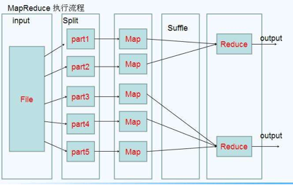
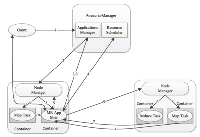
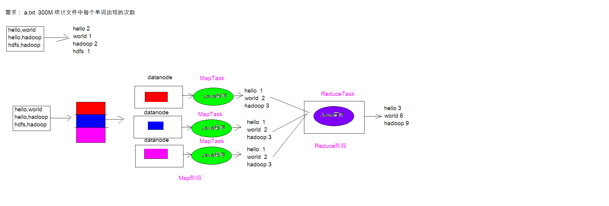
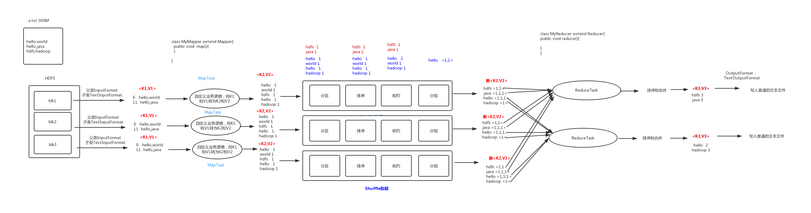

# 一、MapReduce概述

### 1.MapReduce介绍

MapReduce是一种编程模型，用于大规模数据集的并行运算。概念"**Map（映射）**"和"**Reduce（归约）**"，是它们的主要思想。它极大地方便了编程人员在不会分布式并行编程的情况下，将自己的程序运行在**分布式系统**上。 当前的软件实现是指定一个Map（映射）函数，用来把**一组键值对映射成一组新的键值对**，指定并发的Reduce（归约）函数，用来保证所有映射的键值对中的每一个共享相同的键组。 

- Map负责“分”，即把复杂的任务分解为若干个“简单的任务”来并行处理,可以进行拆分的前提是这些小任务可以并行计算，彼此间几乎没有依赖关系。 

- Reduce负责“合”，即对map阶段的结果进行全局汇总。 

- MapReduce运行在yarn集群 

  - ResourceManager

  - NodeManager



### 2.MapReduce设计构思 

MapReduce是一个分布式运算程序的编程框架，核心功能是将用户编写的业务逻辑代码和自带默认组件整合成一个完整的分布式运算程序，并发运行在Hadoop集群上。
MapReduce设计并提供了统一的计算框架，为程序员隐藏了绝大多数系统层面的处理细节。 为程序员提供一个抽象和高层的编程接口和框架。程序员仅需要关心其应用层的具体计算问 题，仅需编写少量的处理应用本身计算问题的程序代码。如何具体完成这个并行计算任务所 相关的诸多系统层细节被隐藏起来,交给计算框架去处理：
Map和Reduce为程序员提供了一个清晰的操作接口抽象描述。MapReduce中定义了如下的Map 和Reduce两个抽象的编程接口，由用户去编程实现.Map和Reduce,MapReduce处理的数据类型 是<key,value>键值对。

- Map: (k1; v1) → [(k2; v2)] 
- Reduce: (k2; [v2]) → [(k3; v3)]  

**一个完整的mapreduce程序在分布式运行时有三类实例进程**：

- MRAppMaster 负责整个程序的过程调度及状态协调

- MapTask 负责map阶段的整个数据处理流程 

- ReduceTask 负责reduce阶段的整个数据处理流程



### 3.MapReduce思想



### 4.MapReduce编程规范

##### 4.1 Map阶段2个步骤 

- 设置InputFormat类, 将数据切分为Key-Value(K1和V1) 对, 输入到第二步
- 自定义Map逻辑, 将第一步的结果转换成另外的Key-Value(K2和V2)对, 输出结果

##### 4.2 Shule阶段4个步骤 

- 对输出的Key-Value对进行分区
- 对不同分区的数据按照相同的Key排序
- (可选) 对分组过的数据初步规约, 降低数据的网络拷贝
- 对数据进行分组, 相同Key的Value放入一个集合中

##### 4.3 Reduce阶段2个步骤 

- 对多个Map任务的结果进行排序以及合并, 编写Reduce函数实现自己的逻辑, 对输入的Key-Value进行处理, 转为新的Key-Value(K3和V3)输出 
- 设置OutputFormat处理并保存Reduce输出的Key-Value数据



# 二、WordCount案例
### 1.数据格式准备

##### 1.1创建文件

```shell
cd /export/servers 
vim wordcount.txt
```

##### 1.2往文件放入内容

```shell
hello,world,hadoop
hive,sqoop,flume,hello
kitty,tom,jerry,world
hadoop
```

##### 1.3上传到HDFS

```shell
hdfs dfs -mkdir /wordcount_in/
hdfs dfs -put wordcount.txt /wordcount_in/
```

### 2.Mapper编写

```java
package WordCount;

import org.apache.hadoop.io.LongWritable;
import org.apache.hadoop.io.Text;
import org.apache.hadoop.mapreduce.Mapper;

import java.io.IOException;

/*
    四个泛型解释
        KEYIN:K1的类型
        VALUEIN:V1的类型

        KEYOUT:K2的类型
        VALUEOUT:V2的类型
 */
public class WordCountMapper extends Mapper<LongWritable, Text, Text, LongWritable> {
    //map方法将 K1 和 V1 转为 k2 和 V2
    /*
        参数:
            key:    K1 行偏移量
            value:  V1 每一行文本数据
            context:   表示上下文对象
     */
    @Override
    protected void map(LongWritable key, Text value, Context context) throws IOException, InterruptedException {
        Text text = new Text(); //转换数据类型,不写在循环里，否则每次都创建对象
        LongWritable longWritable = new LongWritable(); //转换数据类型,不写在循环里，否则每次都创建对象

        //1:将文本数据进行拆分
        String[] split = value.toString().split(",");

        //2:遍历数组,组装 K2 和 V2
        for (String word : split){
            //3:将 K2 和 V2 写入上下文
            text.set(word);
            longWritable.set(1);
            context.write(text, longWritable);
        }
    }
}
```

### 3.Reducer编写

```java
package WordCount;

import org.apache.hadoop.io.LongWritable;
import org.apache.hadoop.io.Text;
import org.apache.hadoop.mapreduce.Reducer;

import java.io.IOException;

/*
    四个泛型解释
        KEYIN:K2的类型
        VALUEIN:V2的类型

        KEYOUT:K3的类型
        VALUEOUT:V3的类型
 */
public class WordCountReducer extends Reducer<Text, LongWritable, Text, LongWritable> {
    //reduce方法将 K2 和 V2 转为 k3 和 V3
    /*
        参数:
            key:    K2  分割出的文本
            value:  V2  集合
            context:    表示上下文对象
    */

    @Override
    protected void reduce(Text key, Iterable<LongWritable> values, Context context) throws IOException, InterruptedException {
        long count = 0;
        //1:遍历集合,将集合中的数字相加，得到 V3
        for (LongWritable value :values){
            count += value.get();
        }
        //2:将 K3 和 V3 写入上下文
        context.write(key, new LongWritable(count));
    }
}
```

### 4.主类编写(提交job)

```java
package WordCount;

import org.apache.hadoop.conf.Configuration;
import org.apache.hadoop.conf.Configured;
import org.apache.hadoop.fs.FileSystem;
import org.apache.hadoop.fs.Path;
import org.apache.hadoop.io.LongWritable;
import org.apache.hadoop.io.Text;
import org.apache.hadoop.mapreduce.Job;
import org.apache.hadoop.mapreduce.lib.input.TextInputFormat;
import org.apache.hadoop.mapreduce.lib.output.TextOutputFormat;
import org.apache.hadoop.util.Tool;
import org.apache.hadoop.util.ToolRunner;

import java.net.URI;

public class JobMain extends Configured implements Tool {
    @Override
    public int run(String[] strings) throws Exception {
        /*
        1:创建一个job任务对象
         */
        Job job = Job.getInstance(super.getConf(), "wordcount");
        //如果打包运行出错,则需要加该配置
        job.setJarByClass(JobMain.class);

        /*
        2:配置job任务对象(八个步骤)
         */
        //第一步:指定文件的读取方式和读取路径
        job.setInputFormatClass(TextInputFormat.class);
        TextInputFormat.addInputPath(job, new Path("hdfs://node01:8020/wordcount_in")); //集群运行模式读取路径
        //TextInputFormat.addInputPath(job, new Path("file:///D:\\mapreduce\\input")); //本地运行模式读取路径


        //第二步:指定Map阶段的处理方式和数据类型
        job.setMapperClass(WordCountMapper.class);
        //设置Map阶段K2的类型
        job.setMapOutputKeyClass(Text.class);
        //设置Map阶段V2的类型
        job.setMapOutputValueClass(LongWritable.class);


        //第三、四、五、六 采用默认的方式

        //第七步:指定Reduce阶段的处理方式和数据类型
        job.setReducerClass(WordCountReducer.class);
        //设置K3的类型
        job.setOutputKeyClass(Text.class);
        //设置V3的类型
        job.setOutputValueClass(LongWritable.class);

        //第八步: 设置输出类型
        job.setOutputFormatClass(TextOutputFormat.class);
        //设置输出的路径
        Path path = new Path("hdfs://node01:8020/wordcount_out"); //集群运行模式输出路径
        TextOutputFormat.setOutputPath(job, path);
        //TextOutputFormat.setOutputPath(job, new Path("file:///D:\\mapreduce\\output")); //本地运行模式输出路径

        //获取FileSystem
        FileSystem fileSystem = FileSystem.get(new URI("hdfs://node01:8020"), new Configuration());
        //判断目录是否存在
        boolean bl2 = fileSystem.exists(path);
        if(bl2){
            //删除目标目录
            fileSystem.delete(path, true);
        }

        //等待任务结束
        boolean bl = job.waitForCompletion(true);

        return bl ? 0:1;
    }

    public static void main(String[] args) throws Exception {
        Configuration configuration = new Configuration();
        int run = ToolRunner.run(configuration, new JobMain(), args);
        System.exit(run);
    }
}
```

### 5.运行

##### 5.1idea打jar包

点击idea右侧的Maven，选择要打包的项目，双击对应项目的Lifecycle下的package即可

##### 5.2上传jar包

在target目录找到**MapReduce-1.0-SNAPSHOT.jar**包

##### 5.3运行jar包

```shell
hadoop jar MapReduce-1.0-SNAPSHOT.jar WordCount.JobMain
```

##### 注:主类路径(WordCount.JobMain)获取方式为右键点击主类Copy里的Copy Reference

##### 5.4读取生成的文件

```shell
hdfs dfs -cat /wordcount_out/part-r-00000
```

<br>

# 三、MapReduce分区

### 1.分区概述

在 MapReduce 中, 通过我们指定分区, 会将同一个分区的数据发送到同一个 Reduce 当中进行 处理

例如: 为了数据的统计, 可以把一批类似的数据发送到同一个 Reduce 当中, 在同一个 Reduce 当 中统计相同类型的数据, 就可以实现类似的数据分区和统计等

##### 注:Reduce 当中默认的分区只有一个

### 2.Shuffle阶段分区概述


编写分区代码(对彩票中大于等于15和小于15的进行分组)

### 3.Mapper编写

```java
package Partition;

import org.apache.hadoop.io.LongWritable;
import org.apache.hadoop.io.NullWritable;
import org.apache.hadoop.io.Text;
import org.apache.hadoop.mapreduce.Mapper;

import java.io.IOException;

/*
    K1: 行偏移量     LongWritable
    V1: 行文本数据   Text

    K2: 行文本数据   Text
    V2: LongWritable
 */
public class PartitionMapper extends Mapper<LongWritable, Text,Text, NullWritable> {
    @Override
    protected void map(LongWritable key, Text value, Context context) throws IOException, InterruptedException {
        context.write(value,NullWritable.get()); //NullWritable无法直接写入
    }
}
```

### 4.Partitioner编写

```java
package Partition;

import org.apache.hadoop.io.NullWritable;
import org.apache.hadoop.io.Text;
import org.apache.hadoop.mapreduce.Partitioner;

public class MyPartitioner extends Partitioner<Text,NullWritable> {
    @Override
    public int getPartition(Text text, NullWritable nullWritable, int i) {
        //1:拆分行文本数据(K2),获取中奖字段的值
        String[] split = text.toString().split("\t");
        String numStr = split[5];

        //2:判断中奖字段的值和15的关系,然后返回对应的分区编号
        if(Integer.parseInt(numStr) > 15){
            return  1;
        }else{
            return  0;
        }
    }
}
```

### 5.Reducer编写

```java
package Partition;

import org.apache.hadoop.io.NullWritable;
import org.apache.hadoop.io.Text;
import org.apache.hadoop.mapreduce.Reducer;

import java.io.IOException;

/*
  K2:   Text
  V2:   NullWritable

  K3:   Text
  V3:   NullWritable
 */
public class PartitionerReducer extends Reducer<Text,NullWritable,Text,NullWritable> {
    @Override
    protected void reduce(Text key, Iterable<NullWritable> values, Context context) throws IOException, InterruptedException {
        context.write(key, NullWritable.get());
    }
}
```

### 6.主类编写(提交job)

```java
package Partition;

import org.apache.hadoop.conf.Configuration;
import org.apache.hadoop.conf.Configured;
import org.apache.hadoop.fs.FileSystem;
import org.apache.hadoop.fs.Path;
import org.apache.hadoop.io.NullWritable;
import org.apache.hadoop.io.Text;
import org.apache.hadoop.mapreduce.Job;
import org.apache.hadoop.mapreduce.lib.input.TextInputFormat;
import org.apache.hadoop.mapreduce.lib.output.TextOutputFormat;
import org.apache.hadoop.util.Tool;
import org.apache.hadoop.util.ToolRunner;

import java.net.URI;

public class JobMain extends Configured implements Tool {
    @Override
    public int run(String[] args) throws Exception {
        //1:创建job任务对象
        Job job = Job.getInstance(super.getConf(), "partition");
        //如果打包运行出错,则需要加该配置
        job.setJarByClass(WordCount.JobMain.class);

        //2:对job任务进行配置(八个步骤)
        //第一步:设置输入类和输入的路径
        job.setInputFormatClass(TextInputFormat.class);
        TextInputFormat.addInputPath(job, new Path("hdfs://node01:8020/partition_in"));
        //TextInputFormat.addInputPath(job, new Path("file:///D:\\partition_in"));

        //第二步:设置Mapper类和数据类型（K2和V2）
        job.setMapperClass(PartitionMapper.class);
        job.setMapOutputKeyClass(Text.class);
        job.setMapOutputValueClass(NullWritable.class);

        //第三步，指定分区类
        job.setPartitionerClass(MyPartitioner.class);

        //第四、五、六步

        //第七步:指定Reducer类和数据类型(K3和V3)
        job.setReducerClass(PartitionerReducer.class);
        job.setOutputValueClass(Text.class);
        job.setOutputValueClass(NullWritable.class);
        //设置ReduceTask的个数
        job.setNumReduceTasks(2);

        //第八步:指定输出类和输出路径
        job.setOutputFormatClass(TextOutputFormat.class);
        TextOutputFormat.setOutputPath(job, new Path("hdfs://node01:8020/partition_out"));
        //TextOutputFormat.setOutputPath(job, new Path("file:///D:\\partition_out"));

        //获取FileSystem
        FileSystem fileSystem = FileSystem.get(new URI("hdfs://node01:8020"), new Configuration());
        //判断目录是否存在
        boolean bl2 = fileSystem.exists(new Path("hdfs://node01:8020/partition_out"));
        if(bl2){
            //删除目标目录
            fileSystem.delete(new Path("hdfs://node01:8020/partition_out"), true);
        }

        //3:等待任务结束
        boolean bl = job.waitForCompletion(true);

        return bl?0:1;
    }

    public static void main(String[] args) throws Exception {
        Configuration configuration = new Configuration();
        //启动job任务
        int run = ToolRunner.run(configuration, new JobMain(), args);
        System.exit(run);
    }
}
```

### 7.运行

##### 7.1idea打jar包

点击idea右侧的Maven，选择要打包的项目，双击对应项目的Lifecycle下的clean后再再点击package

##### 7.2上传jar包

在target目录找到**MapReduce-1.0-SNAPSHOT.jar**包

##### 5.3运行jar包

```shell
hadoop jar MapReduce-1.0-SNAPSHOT.jar Partition.JobMain
```

##### 注:主类路径(Partition.JobMain)获取方式为右键点击主类Copy里的Copy Reference

##### 5.4读取生成的文件

```shell
hdfs dfs -cat /partition_out/part-r-00000 #小于15

hdfs dfs -cat /partition_out/part-r-00001 #大于15
```

<br>

# 四、MapReduce的计数器

### 1.概述

计数器是收集作业统计信息的有效手段之一，用于质量控制或应用级统计。计数器还可辅助 诊断系统故障。如果需要将日志信息传输到 map 或 reduce 任务， 更好的方法通常是看能否 用一个计数器值来记录某一特定事件的发生。对于大型分布式作业而言，使用计数器更为方 便。除了因为获取计数器值比输出日志更方便，还有根据计数器值统计特定事件的发生次数 要比分析一堆日志文件容易得多。

### 2.hadoop内置计数器列表

| MapReduce任务计数器    | org.apache.hadoop.mapreduce.TaskCounter                      |
| ---------------------- | ------------------------------------------------------------ |
| 文件系统计数器         | org.apache.hadoop.mapreduce.FileSystemCounter                |
| FileInputFormat计数器  | org.apache.hadoop.mapreduce.lib.input.FileInputFormatCounter |
| FileOutputFormat计数器 | org.apache.hadoop.mapreduce.lib.output.FileOutputFormatCounter |
| 作业计数器             | org.apache.hadoop.mapreduce.JobCounter                       |

### 3.自定义计数器

##### 3.1方式一:通过context上下文对象获取计数器，通过context上下文对象，在map端使用计数器进行统计

```java
public class PartitionMapper  extends Mapper<LongWritable,Text,Text,NullWritable>{    
    @Override   
    protected void map(LongWritable key, Text value, Context context) throws Exception{   
        Counter counter = context.getCounter("MR_COUNT", "MyRecordCounter");   		              counter.increment(1L);
        context.write(value,NullWritable.get());   
    }
}
```

##### 3.2方式二:通过enum枚举类型来定义计数器统计reduce端数据的输入的key有多少个

```java
public class PartitionerReducer extends Reducer<Text,NullWritable,Text,NullWritable> {   	public static enum Counter{       
    MY_REDUCE_INPUT_RECORDS,MY_REDUCE_INPUT_BYTES   
	}                                                                              			@Override                                                                                 protected void reduce(Text key, Iterable<NullWritable> values, Context context) throws IOException, InterruptedException {
       context.getCounter(Counter.MY_REDUCE_INPUT_RECORDS).increment(1L);                        context.write(key, NullWritable.get());        
   }                                                                                      }
```

